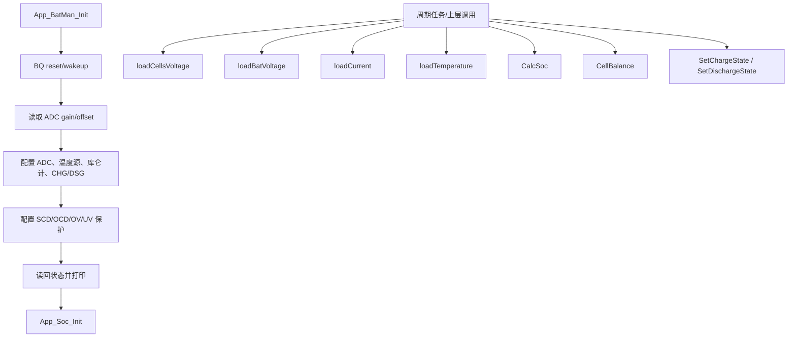

# 旧项目 BQ 分层封装与 App_BatMan 业务逻辑梳理

本文只梳理旧 UPS 项目中 BQ76930 相关代码的分层、方法和业务流程，用来理解旧项目风格。旧项目寄存器地址、ADC 换算公式、均衡 bit 写法不适合直接搬到新 BQ76952 项目。

## 1. 旧项目相关文件

| 层级 | 文件 | 主要职责 |
| --- | --- | --- |
| BSP | `旧项目信息/旧项目代码/ups/ups001/MDK-ARM/Int/Int_BQ769_BSP.h` | 定义 BQ76930 寄存器地址、阈值宏、保护延时枚举、`RegisterGroup` 位域结构 |
| INT | `旧项目信息/旧项目代码/ups/ups001/MDK-ARM/Int/Int_BQ769.h/.c` | 直接操作 GPIO/I2C/CRC，提供寄存器读写、唤醒、休眠、复位 |
| COM | `旧项目信息/旧项目代码/ups/ups001/MDK-ARM/Com/Com_Bq769.h/.c` | 提供热敏电阻-温度表、OCV-SOC 表，以及两个查表换算函数 |
| APP | `旧项目信息/旧项目代码/ups/ups001/MDK-ARM/App/App_BatMan.h/.c` | 编排 BQ 初始化、采样、电压/电流/温度换算、SOC、均衡、充放电控制 |
| APP-SOC | `旧项目信息/旧项目代码/ups/ups001/MDK-ARM/App/App_Soc.h/.c` | 独立 SOC EKF 模块，被 `App_BatMan_CalcSoc()` 调用 |

## 2. BSP 层封装内容

`Int_BQ769_BSP.h` 不是函数层，但旧项目大量依赖它。

它封装了：

| 类型 | 内容 |
| --- | --- |
| 系统阈值宏 | `TLB_OV_PROTECT`、`TLB_UV_PROTECT`、`TLB_SHUTDOWN_VOLTAGE`、均衡电压/压差/温度阈值 |
| BQ76930 寄存器地址 | `BQ_SYS_STAT`、`BQ_CELLBAL1/2`、`BQ_SYS_CTRL1/2`、`BQ_PROTECT1/2/3`、`BQ_OV_TRIP`、`BQ_UV_TRIP`、`BQ_VC1_HI` 等 |
| 位域结构 | `struct _Register_Group`，把状态、均衡、控制、保护寄存器拆成 bit 字段 |
| 延时枚举 | `BMS_SCDDelayTypedef`、`BMS_OCDDelayTypedef`、`BMS_OVDelayTypedef`、`BMS_UVDelayTypedef` |
| cell mask 枚举 | `BQ_CellIndexTypedef` |

旧 APP 能写出类似 `BQ769_RegisterGroup.SysCtrl2.SysCtrl2Bit.CHG_ON = 1` 的代码，就是因为 BSP 层把寄存器 bit 做成了 C 位域结构。

## 3. INT 层封装方法

INT 层是最底层硬件访问层，直接依赖 `gpio.h`、`i2c.h`、FreeRTOS、HAL。

| 方法 | 职责 | 说明 |
| --- | --- | --- |
| `Int_BQ769_WakeUp()` | 唤醒 BQ | 拉高 `BQ769_WAKEUP`，延时后拉低，再等待芯片启动 |
| `Int_BQ769_Ship()` | 进入休眠/关断序列 | 通过 `SYS_CTRL1.SHUT_A/SHUT_B` 组合写寄存器 |
| `Int_BQ769_Reset()` | 复位 BQ | 先 `Ship()`，再 `WakeUp()` |
| `Int_BQ769_WriteReg(uint8_t reg, uint8_t data)` | 写单字节寄存器 | 计算 I2C CRC 后，用 `HAL_I2C_Mem_Write()` 写 `data + crc` |
| `Int_BQ769_ReadReg(uint8_t reg, uint8_t *buff, uint16_t read_len)` | 连续读寄存器 | 一次读 `read_len * 2` 字节，即每个数据字节后跟一个 CRC 字节；逐字节校验 |
| `Int_BQ769_Read(uint8_t reg, uint8_t *read_buff, uint8_t read_len)` | 声明存在 | 头文件声明了，但当前 `.c` 中没有对应实现 |
| `crc8_calculate()` | 文件内 CRC 工具 | 多项式 `0x07`，用于 I2C CRC |

INT 层的特点：

- 直接知道 I2C 地址：写 `0x10`，读 `0x11`。
- 直接使用 `hi2c2`。
- 读写时进入 FreeRTOS 临界区。
- 读失败或 CRC 错误只 `printf`，没有状态码返回。
- INT 层里还持有全局 `struct _Register_Group BQ769_RegisterGroup;`，这让 APP 可以直接操作寄存器位域。

## 4. COM 层封装方法

旧 COM 层非常薄，主要做查表换算，不负责 I2C，也不负责寄存器读写。

| 方法/数据 | 职责 | 说明 |
| --- | --- | --- |
| `resist_temper_table[181]` | 热敏电阻表 | 电阻值覆盖约 `125℃` 到 `-55℃` |
| `voltage_soc_ocv_table[101]` | OCV-SOC 表 | 每节电芯 `0%~100%` 对应 OCV(mV) |
| `getTableIndexByValue()` | 通用查表索引 | 以上次索引作为起点，按值增减方向搜索，带极值处理 |
| `Com_BQ769_getTemperByResist(uint32_t resistance)` | 电阻转温度 | 查 `resist_temper_table`，返回温度 |
| `Com_BQ769_getPercentByVoltage(uint16_t voltage)` | 单体电压转 SOC | 查 `voltage_soc_ocv_table`，返回百分比索引 |

COM 层的特点：

- 不碰 I2C。
- 不知道 `BQ_SYS_CTRL1` 等寄存器。
- 用静态 `last_index_*` 和 `last_value_*` 保存上次查表位置，提高连续查询效率。
- `voltage_soc_ocv_table` 用 `extern` 暴露给 `App_Soc`，SOC 算法会复用这张表。

## 5. APP 层封装方法

`App_BatMan` 是旧项目 BQ 业务主入口。它直接调用 INT 和 COM，因此旧项目 APP 并不是严格三层隔离。

### 5.1 文件内状态

| 变量 | 含义 |
| --- | --- |
| `gain_uv` | 从 BQ ADCGAIN 寄存器读出的 ADC 增益 |
| `offset_mv` | 从 BQ ADCOFFSET 寄存器读出的偏移 |
| `cell_mv[UPS_CELL_NUM]` | 6 串电芯电压，单位 mV，全局暴露 |
| `cell_reg_indexes[6] = {0, 1, 4, 5, 6, 9}` | 旧硬件物理 6S 对应 BQ76930 电压寄存器下标 |
| `bat_mv` | 电池包总电压，单位 mV |
| `current_a` | 电流，单位 A，约定大于 0 表示充电 |
| `tempr` | 热敏温度 |
| `soc_percent` / `display_soc_percent` | 真实 SOC 与显示 SOC |
| `cur_coulomb_mas` | 库仑积分累计量 |

### 5.2 初始化相关方法

| 方法 | 职责 |
| --- | --- |
| `App_Batman_Init()` | BQ 初始化总流程 |
| `loadGainAndOffset()` | 读取 ADC gain/offset |
| `configParameters()` | 开 ADC、选温度源、开库仑计、打开 CHG/DSG |
| `configProtectSet()` | 写短路、过流、过压、欠压保护相关寄存器 |

`App_BatMan_Init()` 的实际流程：

1. `Int_BQ769_Reset()`：通过休眠再唤醒实现复位。
2. `loadGainAndOffset()`：读取 `BQ_ADCGAIN1`、`BQ_ADCGAIN2`、`BQ_ADCOFFSET`。
3. `configParameters()`：写 `BQ_SYS_CTRL1`、`BQ_SYS_CTRL2`、`BQ_CC_CFG`。
4. `configProtectSet()`：写 `BQ_PROTECT1/2/3`、`BQ_OV_TRIP`、`BQ_UV_TRIP`。
5. 读回 `BQ_SYS_CTRL1` 起始的一段寄存器和 `BQ_SYS_STAT`，打印调试信息。
6. `App_Soc_Init()`：初始化 SOC EKF。

### 5.3 采样与换算方法

| 方法 | 职责 | 关键逻辑 |
| --- | --- | --- |
| `App_Batman_loadCellsVoltage()` | 读取 6 串单体电压 | 按 `cell_reg_indexes[]` 逐个读 `BQ_VC1_HI + index * 2`，用 `cell_adc * gain_uv / 1000 + offset_mv` 换算 |
| `App_Batman_loadBatVoltage()` | 读取电池包总压 | 读 `BQ_BAT_HI`，用 `4 * bat_adc * gain_uv / 1000 + UPS_CELL_NUM * offset_mv` 换算 |
| `App_Batman_loadCurrent()` | 读取电流 | 读 `BQ_CC_HI`，用 `cc_adc * 8.44 / 1000 / 5.0` 换算成 A |
| `App_BatMan_loadTemperature()` | 读取热敏温度 | 读 `BQ_TS1_HI`，先算 TS1 电压，再算热敏电阻，再查表转温度 |

这些函数的共同风格：

- 每个物理量单独一个函数。
- 函数内按“读寄存器 -> 拼 ADC -> 换算 -> printf”展开。
- 调试输出比较多，适合 bring-up 阶段观察。

### 5.4 SOC 相关方法

| 方法 | 职责 | 说明 |
| --- | --- | --- |
| `App_Batman_loadBatSocPercent()` | 旧的电压查表 SOC | 代码整体被注释掉，不再作为主路径 |
| `App_Batman_CalcCoulomb(uint16_t delta_ms)` | 库仑积分 | 用 `current_a * delta_ms` 累加 |
| `App_Batman_CalcSocByCC()` | 按库仑累计估算 SOC | 用 `cur_coulomb_mas / default_coulomb_mas` |
| `App_Batman_SocFilter()` | 显示 SOC IIR 滤波 | 充电和放电使用不同 alpha，并限制显示方向 |
| `App_Batman_CalcSoc(uint16_t interval_ms)` | 当前主 SOC 更新 | 调用 `App_Soc_Update(interval_ms, bat_mv, current_a)`，再做显示滤波 |

当前主路径是 `App_BatMan_CalcSoc()`：

1. 把 `bat_mv` 和 `current_a` 传给 `App_Soc_Update()`。
2. 得到 `soc_percent`。
3. 调用 `App_BatMan_SocFilter()` 平滑显示值。
4. 大于 `99%` 时显示为 `100%`。
5. 打印最终 SOC 和显示 SOC。

### 5.5 均衡方法

`App_BatMan_CellBalance()` 是旧项目均衡策略核心。

流程：

1. 遍历 `cell_mv[]`，找到最低单体电压 `min_voltage_mv`。
2. 对每串电芯生成候选标志 `cell_to_balance[i]`：
   - 温度在 `TLB_BALANCE_MIN_TEMPR ~ TLB_BALANCE_MAX_TEMPR`。
   - 当前单体和最低单体压差超过 `TLB_BALANCE_DIFF_VOLTAGE`。
   - 当前单体电压超过 `TLB_BALANCE_VOLTAGE`。
3. 再次扫描相邻候选：
   - 若相邻两串都候选，只保留电压更高的一串。
4. 把 6 个物理候选写到旧 BQ76930 的均衡位：
   - physical 1 -> `CB1`
   - physical 2 -> `CB2`
   - physical 3 -> `CB5`
   - physical 4 -> `CB6`
   - physical 5 -> `CB7`
   - physical 6 -> `CB10`
5. 写 `BQ_CELLBAL1`、`BQ_CELLBAL2`。
6. 读回两个均衡寄存器并打印每个 bit 状态。

这段逻辑值得继承的是“业务策略结构”：

- 先找最低电压。
- 再按温度、电压、压差筛候选。
- 相邻电芯不能同时均衡。
- 最后写入芯片均衡控制。

不能继承的是旧 BQ76930 的 `BQ_CELLBAL1/2` 寄存器和 `CB1/CB2/CB5/CB6/CB7/CB10` 写法。

### 5.6 充放电控制方法

| 方法 | 职责 | 关键逻辑 |
| --- | --- | --- |
| `App_Batman_SetChargeState(uint8_t charge_state)` | 设置充电 MOS 状态 | 读 `BQ_SYS_CTRL2`，改 `CHG_ON`，写回 |
| `App_Batman_SetDischargeState(uint8_t discharge_state)` | 设置放电 MOS 状态 | 读 `BQ_SYS_CTRL2`，改 `DSG_ON`，写回 |

旧项目中 APP 直接控制 BQ76930 的 `SYS_CTRL2.CHG_ON / DSG_ON`。这种“APP 直接写寄存器 bit”的方式在新项目里不应继承；新项目 APP 应只输出“允许充电/允许放电”的策略结果，由 COM 翻译成 BQ76952 的 FET 控制。

## 6. APP 业务逻辑总览

旧 `App_BatMan` 不是一个统一状态机，而是一组可被上层任务分别调用的业务函数。整体业务可理解为：

典型周期顺序应该是：

1. `App_Batman_loadCellsVoltage()` 更新 `cell_mv[]`。
2. `App_Batman_loadBatVoltage()` 更新 `bat_mv`。
3. `App_Batman_loadCurrent()` 更新 `current_a`。
4. `App_Batman_loadTemperature()` 更新 `tempr`。
5. `App_Batman_CalcSoc(interval_ms)` 更新 SOC。
6. `App_BatMan_CellBalance()` 根据电压和温度更新均衡。
7. 需要时调用 `App_BatMan_SetChargeState()` / `App_BatMan_SetDischargeState()`。

## 7. 旧项目代码风格特征

值得继承：

- 函数粒度接近业务动作，例如“读单体电压”“读总压”“读电流”“均衡”。
- 注释说明了操作步骤，适合硬件 bring-up。
- 文件内静态变量保存状态，不引入复杂框架。
- `printf` 调试输出直接、密集，适合初期联调。
- 均衡策略流程清楚：找最低值、筛候选、相邻互斥、写入芯片。

不应继承到 BQ76952 新项目：

- APP 直接调用 INT 层。
- APP 直接写 BQ 寄存器地址和位域。
- 旧 BQ76930 的寄存器地址、ADC gain/offset 公式、电流公式、TS 热敏公式。
- `cell_reg_indexes[6] = {0, 1, 4, 5, 6, 9}` 这个旧硬件映射。
- `BQ769_RegisterGroup` 全局寄存器镜像。
- `BQ_CELLBAL1/2` 均衡寄存器写法。
- `SYS_CTRL2.CHG_ON / DSG_ON` 作为充放电 MOS 控制方式。

## 8. 对新三层封装的启发

旧项目的“风格”可以继承，但“寄存器实现”不能继承。

建议新项目按下面方式吸收旧逻辑：

| 旧项目做法 | 新项目应如何继承 |
| --- | --- |
| INT 负责 I2C、CRC、底层读写 | 保留，但换成 BQ76952 direct/subcommand/Data Memory 访问 |
| COM 负责查表换算 | 扩展为 BQ76952 硬件语义层：cell 映射、物理量读取、FET 命令、均衡 mask |
| APP 编排初始化流程 | 继承初始化步骤，但 APP 只调用 COM |
| APP 分函数采样电压/电流/温度 | 继承函数粒度，但不直接读寄存器 |
| APP 做 SOC 和显示滤波 | 可继续调用 `App_Soc_Update()` |
| APP 做均衡策略 | 继承策略结构，最后通过 COM 写 BQ76952 16-bit host balancing mask |
| APP 直接写 CHG/DSG | 不继承，改为输出 `charge_allowed` / `discharge_allowed` |

