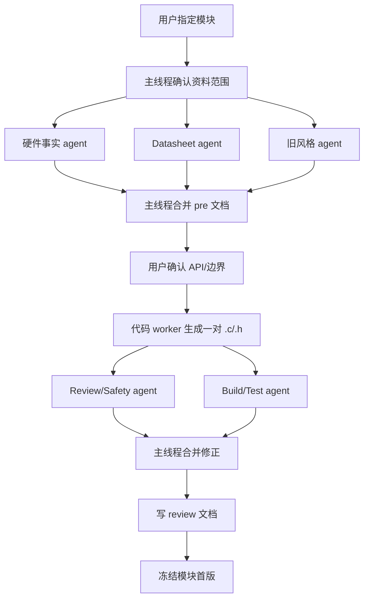

# 新 BMS 项目需求与多 Agent 协作开发方案

记录日期：2026-06-22

本文档用于重启当前 BMS 项目的开发方式。目标不是继续修补某一个 `Int_SC8815.c`，而是重新读取新旧项目资料后，先固定需求、硬件事实、分层边界和协作流程，再逐层向上写代码。

## 1. 已读取资料

当前真实项目根目录是 `C:\Users\lst\Desktop\bms`，不是 `C:\Users\lst\Desktop\硬件信息`。

已读取的新项目资料：

- `full_netlist (5).csv`：主控板/SC8815/OLED/EEPROM/CAN/调试口/电源路径等网表。
- `full_netlist (4).csv`：BQ/BMS 采样保护板、6 串电芯接口、BMS 子板接口等网表。
- `SCH_Schematic1_2026-06-17.pdf`、`SCH_机器人BMS板_2026-06-17.pdf`：新板原理图文件，当前未做全文 PDF 抽取。
- `official_chip_docs_files/`：SC8815、BQ76952、LM7480-Q1 官方资料。
- `official_chip_docs_files/Southchip_SC8815_Product_Page.html`：已确认 SC8815 的 I2C、1~6S、buck-boost、10-bit ADC、OTG/反向输出能力等产品级事实。

已读取的旧项目资料：

- `旧项目信息/旧项目代码/ups/ups001/ups001.ioc`：旧工程是 STM32F103C8Tx，I2C2/CAN/USART1/HAL/FreeRTOS。
- `旧项目信息/旧项目代码/ups/ups001/MDK-ARM/Int`：旧 INT 层，包括 BQ769、CAN、OLED。
- `旧项目信息/旧项目代码/ups/ups001/MDK-ARM/Com`：旧换算层，包括温度表、OCV-SOC 表。
- `旧项目信息/旧项目代码/ups/ups001/MDK-ARM/App`：旧业务层，包括采样、SOC、均衡、显示、CAN 控制、UPS 电源管理。
- `旧项目信息/Common_Debug.c/.h`：用户提供的调试封装。

当前项目状态：

- `README.md` 已写入项目启动要求，明确提出按旧项目风格、从 INT -> COM -> APP 分层推进，并使用多 agent 并行协作以防止上下文跑偏。
- 新项目没有 `Int/`、`Com/`、`App/` 代码目录。
- 新项目原先没有 `docs/`，本次已建立 `docs/pre`、`docs/review`、`docs/logic`、`docs/rules`。
- 当前不应继续假设已有 `Int_SC8815.c/.h`、`sc8815_pre.md` 或其它旧对话产物已经在文件系统中存在。

## 2. 新项目总目标

新项目是面向 6 串三元锂 21700 电池包的 BMS/UPS 类控制板，底层驱动由 CubeMX/HAL 生成，然后按 `HAL/Core -> INT -> COM -> APP` 逐层向上编写。

项目需要完成：

- 6S 电池采样、保护、均衡、SOC 估算。
- 24V 输入给 6S 电池充电。
- SC8815 只作为充电方向控制器使用，不开放 OTG、反向输出、反向供电。
- OLED 本地显示。
- EEPROM 参数/记录存储。
- FDCAN 外部通信。
- 按键、蜂鸣器、LED、调试串口等基础交互。
- FreeRTOS 任务化运行时，由 App 层统一管理任务调度、互斥和业务状态机。

## 3. 新硬件模块清单

### 3.1 MCU

网表器件：`U14 STM32G0B1CBT6`。

硬件 explorer 已从原理图/网表交叉确认 MCU 为 `STM32G0B1CBT6`。如果后续 CubeMX `.ioc` 或 BOM 与此不同，以 `.ioc/BOM/实物丝印` 复核结果为准，并记录冲突。

关键引脚：

| 功能 | MCU 引脚/网名 |
| --- | --- |
| SC8815 INT | `PA5 / MCU_EXTI5_PA5_SC8815_INT` |
| SC8815 SCL | `PA7 / MCU_I2C3_SCL_PA7_SC8815` |
| SC8815 SDA | `PA6 / MCU_I2C3_SDA_PA6_SC8815` |
| SC8815 PSTOP | `PB0 / MCU_GPIO_PB0_SC8815_PSTOP` |
| SC8815 #CE | `PB1 / MCU_GPIO_PB1_SC8815_#CE` |
| Debug TX/RX | `PA9 / PA10` |
| OLED/EEPROM I2C2 | `PA11 SCL / PA12 SDA` |
| BMS button/mux | `PD3` |
| BMS wake | `PB3` |
| BMS INT | `PB4` |
| BMS I2C1 | `PB6 SCL / PB7 SDA` |
| Buzzer | `PB5 / TIM3_CH2` |
| LED | `PB13 RED / PB14 GREEN` |
| FDCAN1 | `PB8 RX / PB9 TX` |

### 3.2 SC8815 充电控制器

网表器件：`U4 SC8815QDER`。

硬件事实：

- SC8815 是 I2C 控制的同步升降压充电控制器，芯片本身支持 1~6S、buck-boost、10-bit ADC、OTG/反向输出。
- 本项目硬约束：SC8815 只允许用于 6S 三元锂充电方向。
- 本项目禁止 OTG、反向输出、反向供电相关功能。
- SC8815 7-bit I2C 地址按用户已确认规则固定为 `0x74`。
- 网表命名是 `I2C3`，但用户已确认硬件 IIC3 线接反/不可用，SC8815 必须使用 `PA6/PA7` GPIO 软件模拟 IIC。
- `#CE = PB1`，低有效。
- `PSTOP = PB0`，高电平 standby。
- `INT = PA5`，开漏低脉冲，ISR 只能置标志，不得访问 IIC。
- SCL/SDA 外部上拉：`R53=2k`、`R52=2k`。
- INT 外部上拉：`R20=10k`。
- PSTOP/#CE 外部上拉：`R46=10k`、`R19=10k`。
- 功率级电感：`L1=3.3uH`，大电流外置 MOSFET 参与同步升降压功率级。
- 输入电流采样：`R5=10mΩ`。
- 电池电流采样：`R14=10mΩ`。
- `IBUS_RATIO=3`，`IBAT_RATIO=6`。
- VBATS 外部分压需要板上改焊：`R17=100kΩ`，`R18=5.1kΩ`。当前网表里 R17/R18 为 `0Ω`，若两颗同时按 0Ω 贴装会把 `BMS+` 通过 `VBATS` 短到 `GND`，这是硬件 bring-up 前必须检查的 blocking 风险。最终软件事实只能以实物改焊后的 `100kΩ/5.1kΩ` 为准。
- `FB`、`ADIN` 在网表中只看到下拉/简单连接痕迹，是否需要额外外部分压或完全依赖 I2C/VBATS 配置，必须在 SC8815 `pre` 文档中由 datasheet agent 复核。
- 目标电压约 `24.73V`，不超过 6S 三元锂满充 `25.2V`。
- Bring-up 输入限流 `500mA`；Bring-up 电池充电限流 `300mA 或 500mA`。
- 首版默认输入限流 `1500mA`；首版默认电池充电限流 `1000mA`。
- 软件硬上限：输入 `3000mA`，电池充电 `2000mA`。

SC8815 INT 层必须坚持：

- 所有写寄存器路径必须经过 guard。
- guard 必须拦截 `EN_OTG=1`、OTG/反向输出配置、`FB_SEL` 反向相关模式、关闭关键保护、电流限值为 0、与 `VBAT_SEL=1` 外部分压模式冲突的配置。
- INT 不重复实现芯片硬件自动完成的涓流、CC、CV、终止、OVP 等闭环。
- `SetChargeEnable(1)` 只能在配置寄存器仍与期望值一致时拉低 PSTOP。

### 3.3 BQ76952/BMS AFE

网表器件：`U9 BQ76952PFBR`，官方资料为 `TI_BQ76952_*`。

硬件事实：

- BQ 侧资料对应 BQ76952 体系，支持多串电池采样和保护。
- 本项目使用 6S 电芯，`CN2` 是 `1x7P` 电芯采样接口：`CELL_6+` 到 `CELL_1-`。
- BMS 子板接口 `U26` 暴露：
  - `BMS_CHIP_ONLINE`
  - `BMS_WAKE`
  - `PB4 / BMS_INT`
  - `PB6/PB7 / I2C1`
  - `BMS_CHIP_SHUT`
  - `BAT+`
- `PB3` 用于 BMS wake。
- `PB4` 用于 BMS 中断，外部上拉 `R56=10k`。
- `PB6/PB7` 是 BMS I2C1，总线上有 `R55/R54=2k` 上拉。
- BQ VC 映射按当前硬件为 6S 非满脚连接：`VC16 -> CELL_6+`，`VC15~VC12 -> CELL_5+`，`VC11~VC9 -> CELL_4+`，`VC8~VC6 -> CELL_3+`，`VC5~VC2 -> CELL_2+`，`VC1 -> CELL_1+`，`VC0 -> CELL_1-`。该接法必须按 TI 6S 推荐连接方式复核。
- 低边电流采样：`R18=0.5mΩ/6W`，位于 `GND` 与 `BMS_OUT-` 之间，`SRP/SRN` 经 100Ω 接两端。

BQ76952 INT 层需要重新设计，不能直接搬旧 `Int_BQ769`：

- 旧项目是 BQ76930/F103/I2C2，寄存器、协议、地址和功能集不同。
- 新项目必须从 `TI_BQ76952_Technical_Reference_Manual_sluuby2b.pdf`、`TI_BQ769x2_Software_Development_Guide_sluaa11.pdf` 抽取寄存器和子命令。
- BQ INT 只负责通信、唤醒、状态读取、保护配置、采样读取、均衡控制等硬件接口。
- SOC、均衡策略、故障降额、充电策略属于 App/Logic，不属于 INT。

### 3.4 OLED

网表器件：`U18 HS96L03W2C03`。

硬件事实：

- OLED 核心芯片：`SSD1315`。
- 接口：I2C。
- 分辨率：`128x64`，尺寸 `0.96 inch`。
- 供电：`SYS_3V3`。
- 总线：`I2C2 / PA11 SCL / PA12 SDA`。
- SCL/SDA 外部上拉：`R47/R51=2k`。
- OLED 地址未能从网表确认，常见 SSD1315/SSD1306 模块为 `0x3C/0x3D`，写代码前必须以模块资料或扫描结果确认。

开发要求：

- 可以参考旧 `Int_OLED` 的显示缓冲和绘制函数，但要统一命名为 `Int_OLED_*`，不能继续使用 `Inf_OLED_*`。
- 旧 OLED 代码行数较大，首版 INT 应先做初始化、清屏、刷新、基础字符/字符串显示，复杂图形和中文显示按需要后移。

### 3.5 EEPROM

网表器件：`U17 M24C64-RMN6TP`。

硬件事实：

- 64Kbit I2C EEPROM。
- 与 OLED 共用 `I2C2 / PA11 / PA12`。
- A0/A1/A2、WP/GND 侧引脚均接地；按 24Cxx 常规 7-bit 地址通常为 `0x50`，但写代码前必须按 M24C64 数据手册确认。

开发要求：

- INT 提供页写、随机读、连续读、写完成轮询。
- COM/App 决定参数结构、磨损均衡、版本号和 CRC。

### 3.6 FDCAN

网表器件：`U15 TJA1051T/3`。

硬件事实：

- CAN-FD 收发器，数据速率标注 `5Mbps`。
- MCU：`PB9 TX`、`PB8 RX`。
- 收发器供电：`SYS_5V`、`SYS_3V3`。
- 总线保护：`D7` TVS。
- 总线终端：`R30=120Ω`。

开发要求：

- 新项目应使用 FDCAN HAL，不再照搬旧 STM32F1 `HAL_CAN_*`。
- CAN/FDCAN INT 只处理收发、过滤器、错误状态。
- 协议 ID、帧含义、充放电命令属于 Logic/App 文档。

### 3.7 调试串口

网表器件：`U19` 调试座。

硬件事实：

- USART1：`PA9 TX`、`PA10 RX`。
- 调试座同时引出 SWDIO/SWCLK/NRST/GND。

开发要求：

- 用户提供的 `Common_Debug.c/.h` 可以作为风格参考。
- 不能原封不动放入新工程：`Common_Debug.h` include guard 写成了 `#define __COMMON_DEBUG_H__0`，并且 `fputc` 可能与 CubeMX 生成或旧工程 `usart.c` 冲突。
- 新项目应把调试封装收敛到 `Com` 或公共层，默认可关，不能让周期任务无控制地阻塞打印。

### 3.8 GPIO 交互

硬件事实：

- 按键/复用按钮：`SW2 -> PD3 / MUC_GPIO_PD3_BMS_MUX_BTN`，有 `R36=5.1k`、`C30=100nF`。
- BMS wake：`PB3 / MUC_GPIO_PB3_BMS_WAKE`。
- 蜂鸣器：`PB5 / TIM3_CH2`，串联 `R43=330Ω`。
- LED：`PB13 RED`、`PB14 GREEN`。
- BMS chip shut：`SW3` 和 `BMS_CHIP_SHUT`。

开发要求：

- GPIO 类 INT 可薄封装，不做业务状态机。
- 按键消抖、长按/短按、蜂鸣器模式、LED 状态含义应放在 App/Logic。

### 3.9 电源路径

硬件事实：

- 输入侧存在 `24V_IN`、`VBUS`、`BMS+`、`5V_FROM_SC8815` 等电源网。
- `F2` 在 VBUS 路径，标注 `33V`、`Ihold=500mA`、`Itrip=1A`。
- `U2/U3` 是理想二极管/电源路径控制相关器件，官方资料中有 `TI_LM7480_Q1_Datasheet.pdf`。
- 控制/电源板还包含 `LGS54360/TPS54360 pin2pin` 5V buck、`ME6211C33M5G-N` 3.3V LDO。
- `Q3/Q4/Q6/Q8` 等 MOSFET 参与 24V/BMS+/VBUS 电源路径。
- 输入/电池侧有 TVS，例如 `D13`、`D9`。

开发要求：

- LM7480/电源路径如果没有 MCU 可控接口，则不单独做 INT，只作为硬件规则记录。
- 若后续发现有 MCU 可控或可测信号，再补 `pre` 文档讨论是否封装。

## 4. 旧项目可继承与不可继承

可继承：

- `Core/HAL -> Int -> Com -> App` 的层次方向。
- 一个硬件一个 `Int_<Device>.c/.h`。
- INT 层直接使用 HAL 或明确的 GPIO bit-bang，不引入通用大框架。
- 公共函数写中文 Doxygen 注释，复杂寄存器/算法写“为什么这样做”。
- 物理量变量名带单位，例如 `_mv`、`_ma`、`_ms`、`_percent`。
- COM 层放温度表、OCV-SOC 表、换算函数，不直接碰 HAL。
- APP 层创建任务、调度业务、做 SOC/均衡/显示/通信策略。

不可照搬：

- 旧项目 MCU 是 STM32F103C8，新项目 MCU/外设不同。
- 旧 BQ 驱动是 BQ76930/I2C2/旧寄存器，新项目是 BQ76952 资料体系。
- 旧 CAN 是 bxCAN，新项目是 FDCAN。
- 旧 OLED 函数名前缀 `Inf_` 不一致，新项目统一 `Int_`。
- 旧 INT 大量 `printf` 且不返回错误状态，新项目必须返回状态码。
- 旧代码有全局变量跨模块裸共享，新项目应通过结构体快照或 getter/setter 收敛。
- 旧代码有表查找越界、函数声明未实现、单位注释不一致等问题，只能作为风格参考，不能当可靠模板。
- 旧 App 层直接操作 HAL GPIO，新项目应把硬件访问边界尽量收敛到 INT。

## 5. 新项目软件分层

### 5.1 HAL/Core 层

来源：CubeMX 生成。

职责：

- 时钟、GPIO、I2C、FDCAN、USART、TIM、NVIC、FreeRTOS 基础配置。
- 提供 `hi2c1/hi2c2/hfdcan1/huart1` 等 HAL 句柄。
- 不写业务逻辑。

### 5.2 INT 层

职责：

- 面向具体硬件器件的接口层。
- 直接调用 HAL 或 GPIO bit-bang。
- 只表达硬件动作、寄存器访问、状态读取、基础配置。
- 所有 I/O 函数必须返回状态。
- ISR 不访问 I2C，只置标志。
- 不保证多任务可重入；FreeRTOS mutex 由 App 层统一串行化。

禁止：

- 禁止在 INT 写业务策略。
- 禁止在 INT 做 SOC、均衡策略、充电阶段策略、显示页面逻辑。
- 禁止默认 `printf`。
- 禁止绕过安全 guard 写寄存器。
- 禁止为单芯片写成通用框架。

### 5.3 COM 层

职责：

- 无硬件副作用的换算、查表、CRC、协议编解码、参数校验。
- 可放 `Common_Debug` 这类公共封装，但默认必须可关闭。
- 不直接调用 HAL。

### 5.4 APP 层

职责：

- FreeRTOS 任务创建和调度。
- 串行化 INT 调用。
- 充电管理、保护响应、SOC、均衡、显示刷新、CAN 协议处理。
- 根据 INT 状态快照做业务决策。

### 5.5 DOCS 层

目录约定：

- `docs/pre/`：每次生成代码前的约定、API 草案、寄存器来源、验收标准。
- `docs/review/`：用户指出的不符合预期、review 结论、修正记录。
- `docs/logic/`：业务逻辑、任务状态机、SOC、均衡、CAN 协议、显示页面。
- `docs/rules/`：硬件事实、强约束、编码规范、协作规则。

## 6. 代码生成硬规则

每次只生成一个模块的一对源文件/头文件：

- 例如只生成 `Int_SC8815.c` 和 `Int_SC8815.h`。
- 不在同一轮同时生成 BQ、OLED、CAN、App。
- 不跨层顺手新增业务代码。

每个模块的流程：

1. 读取当前文件和资料。
2. 写 `docs/pre/<module>_pre.md`。
3. 用户确认 API 和边界。
4. 生成一对 `.c/.h`。
5. 自查并写 `docs/review/<module>_review.md`。
6. 用户指出问题后再修改，并记录 review。

默认代码预算：

- INT 头文件：优先控制在 200 行以内。
- INT 源文件：简单 GPIO/OLED/EEPROM 优先控制在 400 行以内；复杂芯片首版优先控制在 700 行以内。
- 生产 public API：默认不超过 12 个。
- `static` 私有函数：默认不超过 12 个；每个私有函数必须能说清楚“为什么必须拆出来”。
- 超出预算必须在 `pre` 文档解释原因，由用户确认。

注释要求：

- 头文件注释说明“对上层承诺什么”。
- 源文件注释说明“为什么这样设计”，尤其是安全态、寄存器写路径、硬件默认态、量化/换算公式。
- 不写空洞注释，例如“设置变量”“调用函数”。

## 7. 多 Agent 协作架构

具体执行机制以 `docs/rules/parallel_work_mechanism.md` 为准。主线程上下文压缩、恢复或中断后的重新定位入口是 `docs/state/main_thread_checkpoint.md`。本文只保留总体协作架构和项目重启背景。

### 7.1 角色划分

主线程：

- 唯一事实整合者。
- 唯一最终文档落地者。
- 负责向用户汇报、冻结决策、合并 agent 输出。
- 不能把未经核验的 agent 结论直接当事实。

副线程/协调 agent：

- 只负责拆任务、派 agent、收结果、检查是否越界。
- 不直接改代码。
- 不替主线程做最终判断。

硬件事实 agent：

- 输入：网表、原理图、用户硬件说明。
- 输出：硬件模块、引脚、上拉/下拉、电源默认态、已知硬件问题、待确认项。
- 不设计 API，不写代码。

Datasheet/Register agent：

- 输入：官方 datasheet、TRM、EVM Guide。
- 输出：寄存器地址、位域、公式、默认值、禁止配置、引用页码/章节。
- 不写业务策略。

旧项目风格 agent：

- 输入：旧 `Int/Com/App/Core`。
- 输出：可继承风格、不可继承风险、旧业务需求痕迹。
- 不把旧寄存器和旧 MCU 假设迁移到新项目。

API 设计 agent：

- 输入：硬件事实、datasheet 摘录、旧风格总结、用户约束。
- 输出：public API 草案、结构体、状态码、函数解释、删减理由。
- 不写 `.c/.h`。

代码 worker agent：

- 输入：已确认 `pre` 文档。
- 输出：一对 `.c/.h`。
- 只拥有指定写入范围。
- 必须知道“自己不是代码库里唯一 worker”，不得回滚其他人的改动。

Review/Safety agent：

- 输入：代码 diff、pre 文档、硬件规则。
- 输出：blocking 问题、API 重复、硬件约束破坏、代码膨胀点、测试缺口。
- 不重写代码，除非明确授权。

Build/Test agent：

- 输入：当前工程、指定模块。
- 输出：编译结果、静态检查、mock/仿真结果、未验证项。
- 不改业务逻辑。

Doc sync agent：

- 输入：最终代码和 review。
- 输出：待写入文档草稿。
- 主线程最终落文档，避免多个 agent 把 docs 写乱。

### 7.2 单模块并行流程

### 7.3 Agent 输入输出契约

每个 agent 最终输出必须包含：

- 读取了哪些文件。
- 直接事实是什么。
- 推断是什么。
- 不确定项是什么。
- 对后续模块的影响。
- 若改了文件，列出完整路径。
- 若运行验证，列出命令和结果。

禁止输出：

- “大概是”“应该是”但不标来源。
- 把旧项目事实当新项目事实。
- 直接跨层实现。
- 无文档先写代码。
- 一个 agent 同时改多个模块。

### 7.4 冲突处理规则

事实优先级：

1. 用户确认的当前实物改焊/硬件问题。
2. 当前新项目网表和原理图。
3. 官方 datasheet/TRM/EVM Guide。
4. 新 CubeMX `.ioc`。
5. 旧项目代码。
6. 旧对话上下文。

如果冲突：

- 必须写入 `docs/review` 或当前 `pre` 文档的“冲突/待确认”。
- 不能静默选择一个版本。
- 对安全相关冲突，默认阻塞实现。

### 7.5 门禁

Source Gate：

- 确认工作根目录。
- 确认当前模块需要读取哪些资料。
- 确认旧代码只是参考，不是事实来源。

Hardware Fact Gate：

- 引脚、极性、上拉、默认态、电源路径、硬件问题已记录。
- 对 SC8815 这类功率芯片，硬件安全态必须先写清。

API Gate：

- public API 数量可解释。
- 没有重复语义接口。
- 每个函数说明“做什么/不做什么/为什么存在”。
- 用户确认后才能写代码。

Implementation Gate：

- 每轮只写一对 `.c/.h`。
- 不新增业务层。
- 不新增无关框架。
- 所有写寄存器路径满足安全约束。

Review Gate：

- review 先列 blocking。
- 必须检查硬件约束、API 重复、代码膨胀、错误返回、初始化安全态。
- 用户指出的问题写入 `docs/review`。

Freeze Gate：

- 代码、pre、review 三者一致。
- 通过最小验证。
- 首版冻结后不随意新增/删除 INT API；若必须变动，先开 review。

## 8. 首轮开发建议

建议先补齐工程骨架和文档，而不是马上重写 SC8815：

1. 建立新 CubeMX/HAL 工程，确认 MCU 型号、`.ioc`、外设句柄和 GPIO 宏。
2. 固化 `docs/rules/hardware_rules.md`，把 6S、SC8815 禁止反向、IIC3 线问题、R17/R18 改焊、电流上限写入。
3. 固化 `docs/rules/coding_rules.md`，把单模块、一对文件、API/行数预算、注释要求、App 串行化 INT 调用写入。
4. 处理 `Common_Debug`：先作为 COM/公共调试封装的 `pre` 文档讨论，修正 include guard 和 `fputc` 冲突后再落代码。
5. 先做低风险 GPIO/Debug/OLED bring-up，再做 SC8815 软件 IIC probe。
6. SC8815 代码前必须由 datasheet agent 产出寄存器表和 guard 清单。
7. BQ76952 单独立项，不能复用旧 BQ76930 寄存器表。

推荐 INT 开发顺序：

1. `Com_Debug` 或公共 debug 封装。
2. `Int_GpioBoard`：LED、蜂鸣器、按键、BMS wake/shut 基础 GPIO。
3. `Int_OLED`：SSD1315 初始化、清屏、刷新、字符显示。
4. `Int_EEPROM`：页写/读/ready polling。
5. `Int_SC8815`：只做 6S 充电方向，软件 IIC，guard，测量读取。
6. `Int_BQ76952`：唤醒、通信、采样、保护、均衡基础接口。
7. `Int_FDCAN`：收发、过滤器、错误状态。

如果用户希望优先解决充电链路，可以把 `Int_SC8815` 提到 OLED/EEPROM 前，但必须先完成 SC8815 的 `pre` 文档和寄存器来源摘录。

## 9. 当前未解决项

- 新 MCU 的完整型号还需要新 `.ioc` 或 BOM 确认。
- BQ76952 I2C 地址、CRC/PEC、子命令细节需要从 TI 官方资料摘录。
- SC8815 寄存器地址和位域需要从 datasheet/EVM Guide 摘录，不能凭旧对话落代码。
- R17/R18 当前网表是 `0Ω`，最终硬件要求是改焊 `100kΩ/5.1kΩ`，需要实物确认后冻结。
- 6S 21700 电芯容量、最大持续电流、温度传感器数量/位置、均衡电流需要补充。
- FDCAN 协议 ID、帧格式和充放电命令语义需要写入 `docs/logic`。
- SC8815 的 IIC3 线接反问题需要在硬件 rules 中长期保留，避免以后误改回硬件 I2C。

## 10. 本次结论

此前失败的根因不是“某个函数写错”，而是没有把大任务拆成事实读取、API 设计、代码实现、review、安全验证几个独立阶段。一个线程连续聊天会把旧上下文、未确认假设和当前代码混在一起，最后自然膨胀成 1500 行。

后续开发必须改成：

- 主线程只做事实整合、文档冻结、最终合并。
- agent 做窄问题，不做全局拍脑袋。
- 每个模块先有 `pre`，再有一对 `.c/.h`，最后有 `review`。
- 代码少不是目标，边界清楚才是目标；但任何多出来的函数、接口、抽象都必须能解释其必要性。
