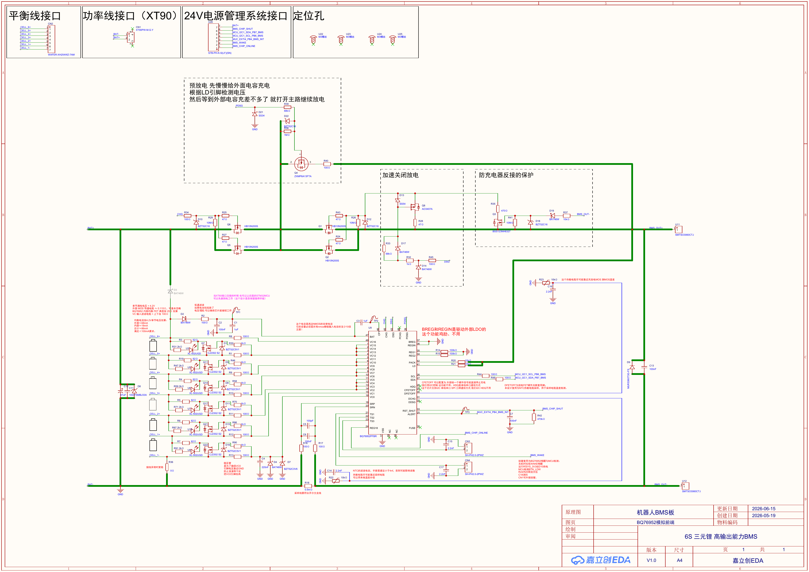
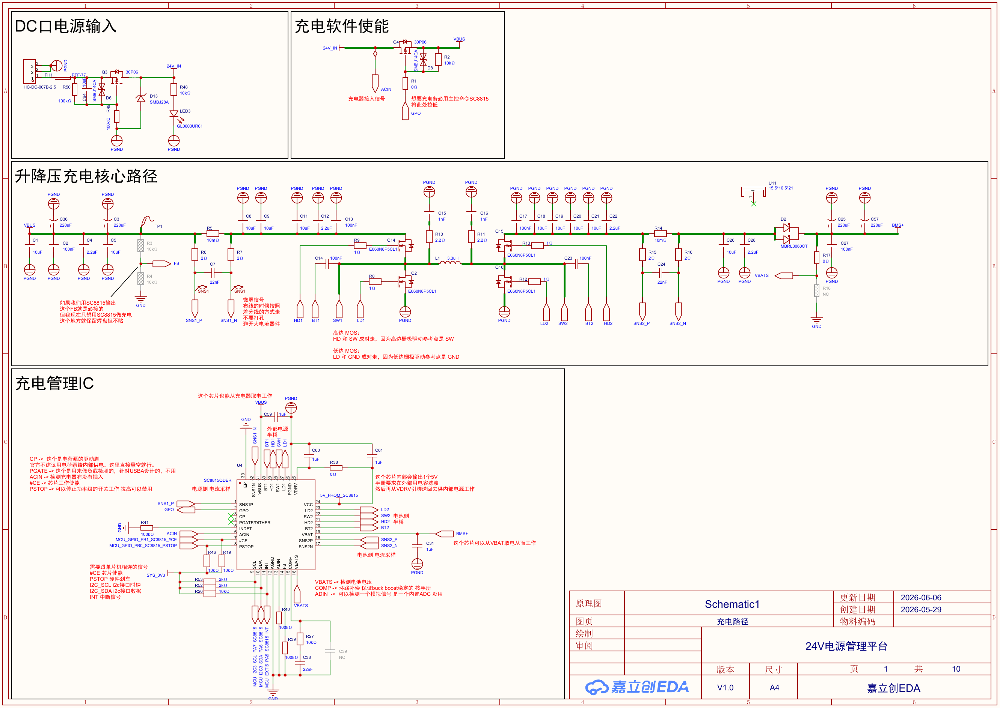
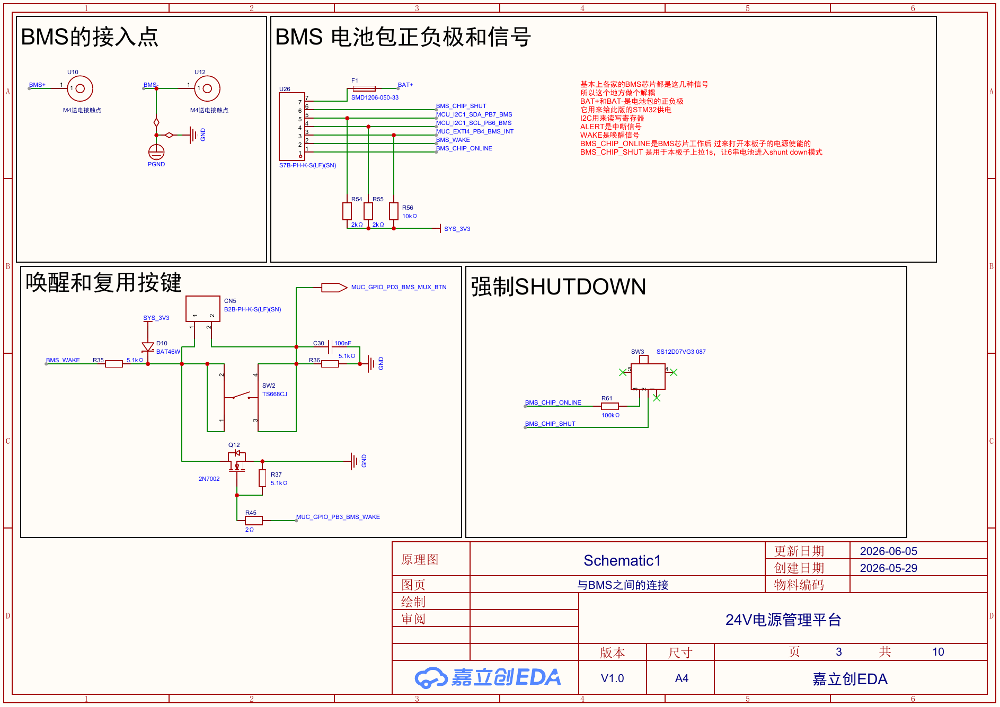
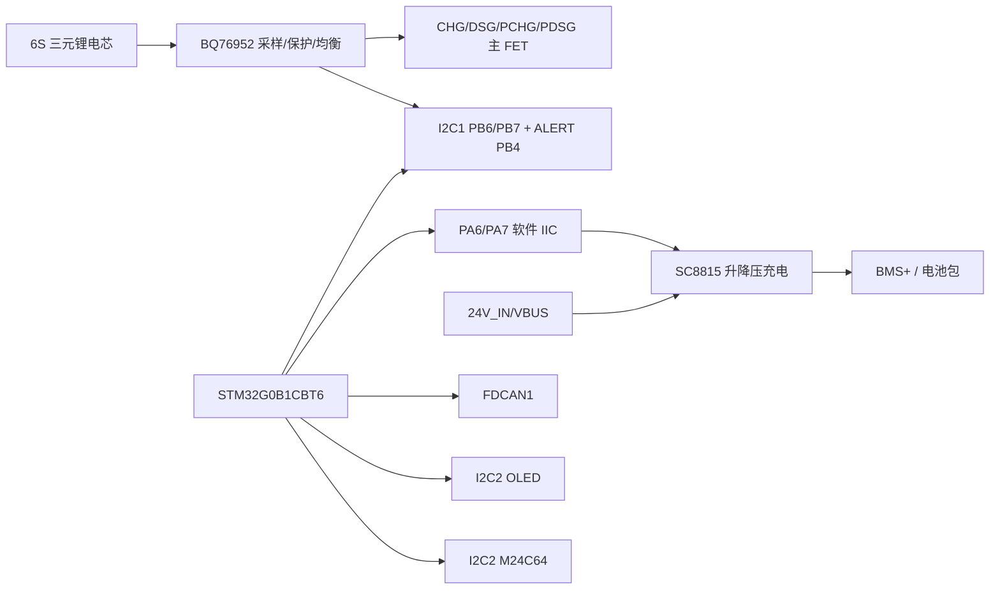
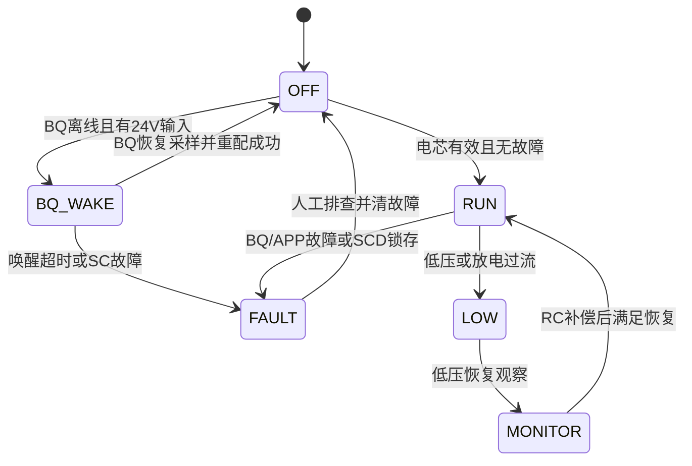

# 24V/6S BMS 项目初版文档

版本：v0.3  
分支：`wordflow`  
范围：当前 `new_bms` 仓库中的 24V/6S BMS 控制板固件、当前硬件网表/PDF、旧 UPS/BMS Word 文档写作标准。  
写作规则：正文按旧 Word 的项目讲义方式组织；事实按当前源码、`.ioc`、网表、PDF、规则文件取证；缺截图、缺实测、缺硬件确认时写 `Unknown` 或 `//TODO`，不补假图、不补假测试。

## 1. 项目概述

本项目要做的是一套 24V/6S 锂电池 BMS 与充电管理固件。它不是单独的电芯采样程序，也不是单独的充电芯片驱动，而是让主控 MCU 同时管理两条功率相关链路：

1. BQ76952 链路：负责 6 串电芯电压、电流、温度、保护、均衡和主 CHG/DSG FET。
2. SC8815 链路：负责从 24V 输入到 6S 电池包的升降压充电控制。
3. 外围链路：FDCAN 用于车身/上位通信，OLED 用于现场显示，EEPROM 用于参数存储，USART1 Debug CLI 用于 bring-up。

旧版 UPS 文档的价值是写作方式：先讲 UPS/BMS 背景，再讲芯片和硬件，再讲工程搭建、接口层代码和 APP 调用。本项目沿用这个读法，但不能沿用旧 BQ76930 的寄存器事实。BQ76952 使用 direct command、subcommand、Data Memory 和 transfer buffer checksum；SC8815 又是一条独立的充电芯片链路，所以本文按当前项目重新写。

本项目的主控是 STM32G0B1CBT6，CubeMX 工程启用了 FDCAN1、I2C1、I2C2、RTC、TIM3、USART1；当前固件已经进入 FreeRTOS 三任务模型。旧文档或早期蒸馏材料如果把当前工程理解成裸机主循环，应视为过期结论。

本节出处：`bms24v_platform/bms24v_platform.ioc:32-45`、`bms24v_platform/bms24v_platform.ioc:77`、`App/App_Main.c:18-20`、`App/App_Main.c:107-117`、`docs/rules/hardware_rules.md:23-124`、`docs/wordflow/bms_document_skill.md:8-23`。

## 2. BMS 与本项目需求

BMS 的核心工作不是“把电压读出来”这么简单。对一个 6S 电池包来说，它至少要回答四个问题：

1. 每一串电芯是否处在安全电压范围内。
2. 充电和放电电流是否超过当前硬件和电芯能力。
3. 电芯温度、采样电阻温度、FET 温度是否允许继续充放电。
4. 当某一串接近满电或压差过大时，是否需要停充或做均衡。

本项目使用 6 串三元锂 21700，最高满充电压按 25.2V 处理；用户确认目标运行电流为充电 5A、放电 10A。软件初期不会直接把所有能力打满，SC8815 bring-up 初期先保守限流，BQ 的电流方向、零点和增益也必须上板确认。用户已明确确认 BQ 低边采样电阻按 5mΩ 处理，所以文档、代码和保护阈值均以 5mΩ 为当前基线。

这也是为什么本文把“必须实测”的内容放在章节末尾：BMS 项目里，能从源码和网表确定的是连接关系、初始化顺序、配置值和软件策略；真正的电流方向、温升、FET 状态、均衡热路径，只能由实物测试确认。

本节出处：`docs/rules/hardware_rules.md:23-29`、`docs/rules/hardware_rules.md:48-57`、`docs/rules/hardware_rules.md:81-84`、`docs/wordflow/manual_confirmations.md:7`、`Int/Int_BQ76952_BSP.h:17`、`App/App_BatMan_Config.c:30-41`。

## 3. 本项目总体架构

当前硬件可以按“BMS 板”和“控制/充电板”理解。BMS 板上有 BQ76952、电芯采样、均衡、电流采样和主 FET；控制板上有 STM32G0B1CBT6、SC8815、OLED、EEPROM、FDCAN、USART1 和跨板接口。两块板之间通过 BMS 相关接口连接 I2C1、ALERT、WAKE/SHUT/ONLINE 等信号。



图 1：BMS 板原理图整页，用于定位 BQ76952、6S 电芯采样、均衡支路、低边电流采样和主 FET。  
出处：`docs/wordflow/assets/new_bms_board-1.png`；网表 `official_chip_docs_files/full_netlist (4).csv:23-34`、`official_chip_docs_files/full_netlist (4).csv:168-169`、`official_chip_docs_files/full_netlist (4).csv:285-291`。



图 2：控制板第 1 页，用于定位 24V 输入、SC8815、VBUS/BMS+ 和充电功率路径。  
出处：`docs/wordflow/assets/new_control_page1-01.png`；网表 `official_chip_docs_files/full_netlist (5).csv:2-34`、`official_chip_docs_files/full_netlist (5).csv:188-191`。



图 3：控制板第 3 页，用于定位 BMS 跨板接口、I2C1、ALERT、OLED/EEPROM、FDCAN 等控制侧连接。  
出处：`docs/wordflow/assets/new_control_page3-03.png`；网表 `official_chip_docs_files/full_netlist (5).csv:319-325`、`official_chip_docs_files/full_netlist (5).csv:477-484`、`official_chip_docs_files/full_netlist (5).csv:499-533`。

从软件看，当前工程保持了旧项目常见的 App / Com / Int 分层：

- `Int_*`：直接面对芯片、总线、寄存器和 GPIO，例如 `Int_BQ76952`、`Int_SC8815`、`Int_CanFd`、`Int_OLED`、`Int_EEPROM`。
- `Com_*`：放纯算法和参数，例如 SOC、SOH、电池参数、BQ 温度换算。
- `App_*`：放业务流程、状态机、任务、显示和调试命令，例如 `App_BatMan`、`App_SC8815`、`App_Power`、`App_DebugCli`。

下面这张图是为了帮助读代码，不替代原理图。



本节出处：`CMakeLists.txt:55-100`、`App/App_Main.c:8-15`、`Int/Int_BQ76952.h:63-121`、`Int/Int_SC8815_BSP.h:26-82`、`docs/rules/hardware_rules.md:31-124`。

## 4. 项目基础搭建：CubeMX、工程与 FreeRTOS

旧 UPS 文档会先让读者从 CubeMX 和 Keil 看到项目是如何搭起来的。本项目也应该这样读：先看 CubeMX 配了什么，再看 `main.c` 做了什么，最后看 APP 层创建了哪些任务。

### 4.1 CubeMX 芯片与外设

CubeMX 当前选择的芯片为 STM32G0B1CBT6，封装为 LQFP48。外设启用了 FDCAN1、I2C1、I2C2、RTC、TIM3、USART1。时钟使用 8MHz HSE 进入 PLL，系统频率 64MHz，RTC 使用 LSE。

关键引脚可以按功能记：

- BQ76952：PB6/PB7 为 I2C1，PB4 为 BQ_INT/ALERT falling EXTI。
- SC8815：PA6/PA7 为 GPIO 开漏上拉的软件 IIC，PB1 为 `SC8815_CE_N`，PB0 为 `SC8815_PSTOP`，PA5 为 INT。
- OLED/EEPROM：PA11/PA12 为 I2C2。
- FDCAN：PB8/PB9 为 RX/TX。
- Debug CLI：PA9/PA10 为 USART1 TX/RX。
- 蜂鸣器：PB5 为 TIM3_CH2 PWM。

//TODO 此处应该放 CubeMX Pinout 总览图，用于证明 MCU 引脚分配。当前可引用的文字证据是 `bms24v_platform/bms24v_platform.ioc:90-165`。

//TODO 此处应该放 CubeMX Clock Configuration 图，用于证明 HSE->PLL 64MHz 和 RTC LSE。当前可引用的文字证据是 `bms24v_platform/bms24v_platform.ioc:212-249`。

本节出处：`bms24v_platform/bms24v_platform.ioc:32-45`、`bms24v_platform/bms24v_platform.ioc:90-165`、`bms24v_platform/bms24v_platform.ioc:211-249`、`bms24v_platform/bms24v_platform.ioc:260-265`。

### 4.2 `main.c` 只做初始化和进入 APP

当前 `main.c` 的职责很干净：HAL 初始化、系统时钟、GPIO/RTC/FDCAN/I2C/UART/TIM 初始化，打印启动信息，然后进入 `App_Main()`。业务逻辑不放在 `main.c`，这和旧项目“主函数只搭框架”的教学习惯一致。

```c
HAL_Init();
SystemClock_Config();
MX_GPIO_Init();
MX_RTC_Init();
MX_FDCAN1_Init();
MX_I2C2_Init();
MX_USART1_UART_Init();
MX_I2C1_Init();
MX_TIM3_Init();
Bringup_UartPrint("BMS24V 平台安全启动\r\n");
App_Main();
```

代码出处：`bms24v_platform/Core/Src/main.c:95-121`。

### 4.3 APP 层初始化顺序

`App_Main_Init()` 先初始化 LED、CANFD、EEPROM、OLED，再初始化 SC8815、BQ76952、电源策略和 CLI。这个顺序有实际意义：SC8815 初始化后只进入“可通信但不充电”的 standby monitor；BQ 初始化后默认保持主 FET 关断；最后由 `App_Power` 统一决定什么时候允许充电、放电或唤醒。

```c
Int_Led_Init();
(void)Int_CanFd_Init();
(void)Int_EEPROM_Init();
App_OLED_Init();
App_SC8815_Init();
App_BatMan_Init();
App_Power_Init();
App_DebugCli_Init();
```

代码出处：`App/App_Main.c:79-98`。

### 4.4 FreeRTOS 三个任务

当前不是裸机 while 循环，而是三个 FreeRTOS 任务：

1. `batman_task`：1s 周期，先执行 `App_BatMan_Task()` 采样和估算，再执行 `App_Power_Task()` 推进功率策略。这样功率策略读到的是同一周期更新后的 BQ 快照。
2. `sc8815_task`：1s 周期，读取 SC8815 STATUS/ADC，并处理充电请求状态机。
3. `debug_cli_task`：20ms 周期，处理 USART1 调试命令和默认 CSV/BQ 监控输出。

```c
xTaskCreate(batman_task, "batman_task", 768, NULL, 3, NULL);
xTaskCreate(sc8815_task, "sc8815_task", 512, NULL, 2, NULL);
xTaskCreate(debug_cli_task, "debug_cli_task", 512, NULL, 1, NULL);
vTaskStartScheduler();
```

代码出处：`App/App_Main.c:18-20`、`App/App_Main.c:22-70`、`App/App_Main.c:101-117`。  
FreeRTOS 配置出处：`bms24v_platform/MDK-ARM/FreeRTOS/include/FreeRTOSConfig.h:19`、`bms24v_platform/MDK-ARM/FreeRTOS/include/FreeRTOSConfig.h:24`、`bms24v_platform/MDK-ARM/FreeRTOS/include/FreeRTOSConfig.h:27`。

//TODO 此处应该放 Keil 工程分组截图，用于证明 App/Com/Int/Core/FreeRTOS 的工程组织。当前可引用的文字证据是 `CMakeLists.txt:55-100` 和 `bms24v_platform/MDK-ARM/bms24v_platform.uvprojx` 文件存在。

## 5. BQ76952 电池监控芯片

旧文档讲 BQ76930 时，先讲芯片能力和关键引脚，再讲唤醒、CRC、I2C 读写、寄存器配置、采样、保护和均衡。本项目可以保留这个教学顺序，但必须换成 BQ76952 的协议模型。

BQ76952 在本项目中承担四个角色：

1. 采集 6S 单体电压、Stack/Pack 电压、CC2 电流、IC/TS 温度。
2. 按 Data Memory 配置硬件保护，例如 CUV/OCC/OCD/SCD/OTC/OTD。
3. 通过 FET control 参与主 CHG/DSG/PCHG/PDSG 功率路径管理。
4. 通过 host balance mask 执行 MCU 指定的单路均衡。

### 5.1 BQ 与当前硬件连接

当前 BQ76952 位于 BMS 板，控制板通过跨板接口连到 BQ 的 I2C、ALERT、WAKE/SHUT/ONLINE 等信号。电芯接口为 1x7P，连接 6S 电芯；电流采样为低边采样，R18 按用户确认值 5mΩ/6W 处理。

需要特别注意的是，当前 6S 并不是软件直觉里的 BQ Cell1 到 Cell6 连续映射。项目规则和代码均按物理 cell0..5 对应 BQ Cell1/2/6/9/12/16 处理。这个点后面采样代码会再次出现，不能凭连续串号改代码。

本节出处：`docs/rules/hardware_rules.md:69-84`、`official_chip_docs_files/full_netlist (4).csv:23-34`、`official_chip_docs_files/full_netlist (4).csv:168-169`、`docs/wordflow/manual_confirmations.md:7`。

### 5.2 BQ 初始化的第一目标：读到 Device Number

`App_BatMan_Init()` 是 BQ 业务入口。它的前半段不是为了马上开 MOS，而是为了确认通信链路真的成立：

1. 先复位 APP 状态和 OLED 状态。
2. 初始化 BQ 板级通信，并在第一条 BQ 命令前确定 CRC 模式。
3. 执行 BQ reset，等待芯片稳定。
4. 读取 Device Number，作为 I2C 地址、subcommand 帧和读回长度的第一道硬确认。

```c
App_BatMan_ResetState();
App_BatMan_InitAlgorithms();
Int_BQ76952_InitBoard();
Int_BQ76952_SetCrcEnabled(APP_BATMAN_CRC_BOOT_ENABLE != 0u);
ret = Int_BQ76952_Reset();
App_BatMan_BusyDelayMs(APP_BATMAN_BQ_RESET_SETTLE_MS);
ret = Int_BQ76952_ReadSubcommand(BQ76952_SUBCMD_DEVICE_NUMBER, data, 2u);
```

代码出处：`App/App_BatMan.c:216-270`。  
写作说明：旧项目会先讲“重置 BQ 再唤醒”，本项目的实际入口是 reset + Device Number 读回，后续如果加入 TS2 WAKE/RST_SHUT 的 GPIO 时序，应在 BSP 层补图和补代码。

### 5.3 BQ 初始化不会直接开主 FET

旧 BQ76930 文档里常见的写法是配置 `SYS_CTRL2.CHG_ON/DSG_ON`。本项目不能这样讲。当前 BQ76952 初始化进入 ConfigUpdate 写 Data Memory，退出后先禁用 Sleep、清启动告警，并明确保持 CHG/DSG/PCHG/PDSG 关断。主功率路径由 `App_Power` 根据采样、故障、充电器和温度条件统一释放。

```c
if (Int_BQ76952_EnterConfigUpdate() != INT_BQ76952_OK) { return; }
if (!App_BatMan_ConfigBq()) { (void)Int_BQ76952_ExitConfigUpdate(); return; }
if (Int_BQ76952_ExitConfigUpdate() != INT_BQ76952_OK) { return; }
ret = Int_BQ76952_SendSubcommand(BQ76952_SUBCMD_SLEEP_DISABLE);
App_BatMan_ClearStartupAlarms();
if (App_BatMan_KeepMainFetsOff() != INT_BQ76952_OK) { return; }
```

代码出处：`App/App_BatMan.c:273-344`。  
配置出处：`App/App_BatMan_Config.c:238-318`。

### 5.4 BQ 的周期任务读什么

初始化通过后，`App_BatMan_Task()` 每 1s 执行一次完整采样和估算。顺序固定为：单体电压、Stack/Pack、电流、温度、BQ 状态、软件故障摘要，然后更新 RC 模型、SOH、SOC、均衡、OLED 和调试输出。

```c
App_BatMan_Sample();
App_BatMan_UpdateRcModel(interval_ms);
App_BatMan_UpdateHealth(interval_ms);
App_BatMan_UpdateSoc(interval_ms);
App_BatMan_UpdateBalance(interval_ms);
App_BatMan_UpdateRuntimeOledStatus();
App_BatMan_UpdateDebugOutput(interval_ms);
```

代码出处：`App/App_BatMan.c:365-379`。

## 6. BQ76952 接口层：CRC、读写与 Data Memory

BQ76952 的接口层不能再按“单字节寄存器表”讲。当前 `Int_BQ76952` 对外提供几类接口：

1. direct command 读写。
2. command-only subcommand。
3. 读回型 subcommand。
4. 带数据 subcommand。
5. Data Memory 读写。
6. ConfigUpdate 进入/退出轮询。
7. host balance mask 写入。

本节出处：`Int/Int_BQ76952.h:63-121`、`Int/Int_BQ76952.c:329-625`。

### 6.1 CRC8 先保留开关

硬件规则要求 BQ 默认 I2C CRC 开启，INT 层必须保留 CRC 支持与开关。当前代码实现了 CRC8，并在 direct read/write 中根据 `s_bq76952_crc_enabled` 选择普通 I2C 帧或带 CRC 帧。这个设计适合 bring-up：如果实物 CRC 状态和默认值不一致，可以通过调试命令或启动配置切换，而不是重写驱动。

```c
static uint8_t Int_BQ76952_Crc8Update(uint8_t crc, uint8_t data)
{
    crc ^= data;
    for (uint8_t bit = 0u; bit < 8u; bit++)
    {
        crc = (crc & 0x80u) ? (uint8_t)((crc << 1u) ^ BQ76952_CRC8_POLY)
                            : (uint8_t)(crc << 1u);
    }
    return crc;
}
```

代码出处：`Int/Int_BQ76952.c:27-52`。  
direct read/write 出处：`Int/Int_BQ76952.c:329-483`。

### 6.2 Direct command 读写

direct command 用于读取 BQ 的普通命令值，例如单体电压、Stack 电压、CC2 电流、状态寄存器。当前代码会检查空指针、长度范围、HAL I2C 返回值；如果启用 CRC，还会逐字节校验 BQ 返回的 CRC。

```c
Int_BQ76952_StatusTypeDef Int_BQ76952_ReadDirect(uint8_t command,
                                                 uint8_t *data,
                                                 uint8_t len)
{
    if (data == NULL) { return INT_BQ76952_ERROR_PARAM; }
    if ((len == 0u) || (len > INT_BQ76952_DIRECT_MAX_LEN))
    {
        return INT_BQ76952_ERROR_LENGTH;
    }
    ...
}
```

代码出处：`Int/Int_BQ76952.c:329-418`。

### 6.3 Subcommand 与 transfer buffer

读 Device Number、Manufacturing Status 这类内容时，当前代码先把 subcommand 写到 `BQ76952_SUBCMD_ADDR_LSB`，等待 BQ 准备 transfer buffer，再读回数据。Data Memory 的读法也类似，只是写入的是 Data Memory 地址。

```c
ret = Int_BQ76952_WriteDirect(BQ76952_SUBCMD_ADDR_LSB, command, 2u);
if (ret != INT_BQ76952_OK) { return ret; }
HAL_Delay(INT_BQ76952_SUBCMD_RESPONSE_DELAY_MS);
return Int_BQ76952_ReadTransfer(subcommand, data, len);
```

代码出处：`Int/Int_BQ76952.c:496-517`、`Int/Int_BQ76952.c:526-551`。

### 6.4 Data Memory 必须在 ConfigUpdate 中写

BQ 的 Data Memory 配置不是随时乱写的。当前 APP 先进入 ConfigUpdate，写配置，再退出 ConfigUpdate；进入和退出都会轮询 CFGUPDATE 位，超时就失败。这个流程比“写寄存器然后继续跑”慢一些，但对 BMS 是必要的，因为半配置比配置失败更危险。

```c
ret = Int_BQ76952_SendSubcommand(BQ76952_SUBCMD_SET_CFGUPDATE);
...
ret = Int_BQ76952_ReadCfgUpdateBit(&is_cfg_update);
if (is_cfg_update) { return INT_BQ76952_OK; }
```

代码出处：`Int/Int_BQ76952.c:566-625`；APP 调用出处：`App/App_BatMan.c:273-313`。

## 7. BQ76952 APP 层：配置、采样、估算、均衡、FET

### 7.1 Data Memory 配置讲解

`App_BatMan_ConfigBq()` 只写当前项目已经有硬件依据和 bring-up 目标的最小集合：6S 映射、5mΩ CC Gain/Capacity Gain、保护阈值、FET 策略、均衡策略和 FET protection routing。这里不应该凭经验补齐所有 BQ 可配项。

重点配置可以按下面的顺序读：

1. `DA_CONFIGURATION` 和 `VCELL_MODE`：告诉 BQ 当前是 6S 稀疏采样映射。
2. `CC_GAIN` 和 `CAPACITY_GAIN`：按 5mΩ 采样电阻配置，让 APP 层电流读数保持 1:1。
3. CUV/OCC/OCD/SCD/OTC/OTD：给 BQ 自己的保护路径设置硬后备阈值。
4. `FET_OPTIONS` 和 `CHG_PUMP_CONTROL`：上电后主 FET 默认关断，等待 MCU host control。
5. `BALANCING_CONFIGURATION`：关闭 BQ 自主均衡，改由 MCU 写 `CB_ACTIVE_CELLS`。
6. FET protection routing：明确哪些保护会关 CHG/DSG。

```c
/* 实板低边采样电阻为 5mΩ。 */
App_BatMan_WriteConfigU32(BQ76952_DM_CC_GAIN,
                          APP_BATMAN_DM_CC_GAIN_5_MOHM_IEEE754);
App_BatMan_WriteConfigU32(BQ76952_DM_CAPACITY_GAIN,
                          APP_BATMAN_DM_CAPACITY_GAIN_5_MOHM_IEEE754);
```

代码出处：`App/App_BatMan_Config.c:6-45`、`App/App_BatMan_Config.c:162-286`。  
5mΩ 人工确认出处：`docs/wordflow/manual_confirmations.md:7`。

### 7.2 单体电压不是连续 Cell1..Cell6

采样代码里有一个非常重要的硬件约束：6S 物理电芯对应 BQ Cell1、Cell2、Cell6、Cell9、Cell12、Cell16。代码用数组固定这张映射，并计算 min/max/avg/delta。

```c
static const uint8_t commands[APP_BATMAN_CELL_COUNT] =
{
    BQ76952_CMD_CELL1_VOLTAGE,
    BQ76952_CMD_CELL2_VOLTAGE,
    BQ76952_CMD_CELL6_VOLTAGE,
    BQ76952_CMD_CELL9_VOLTAGE,
    BQ76952_CMD_CELL12_VOLTAGE,
    BQ76952_CMD_CELL16_VOLTAGE
};
```

代码出处：`App/App_BatMan_Sample.c:81-127`。  
硬件规则出处：`docs/rules/hardware_rules.md:76-80`。

### 7.3 电流方向必须实测

当前软件约定 `current_ma > 0` 表示充电，`current_ma < 0` 表示放电。代码已经把电流方向集中在 `APP_BATMAN_CC2_RAW_POLARITY`，如果实测方向相反，只改这个极性，不要到处改 SOC、功率状态机和日志。

```c
raw_current_ma = (int32_t)((int16_t)raw_u16) * APP_BATMAN_CC2_RAW_POLARITY;
current_ma = App_BatMan_ScaleCc2CurrentMa(raw_current_ma);
current_a = (float)current_ma / 1000.0f;
```

代码出处：`App/App_BatMan_Sample.c:156-174`。  
使用出处：`App/App_Power.c:383-388`。  
当前状态：阻值已按 5mΩ 处理，但电流零点、方向和实测增益仍是 Unknown，必须上板标定。

### 7.4 温度资源先能读，再谈保护

当前采样读取 IC、TS1、TS3 温度。TS1/TS3 有效时用于生成 cell temperature；如果 TS 无效，则降级为 IC 温度，避免日志、SOH 和显示全部变成不可读。这个降级是为了 bring-up 可观察，不代表温度保护已经完成标定。

代码出处：`App/App_BatMan_Sample.c:177-243`。  
硬件缺口出处：`docs/rules/hardware_rules.md:82`、`docs/rules/hardware_rules.md:124`。

### 7.5 SOC、SOH 与均衡

SOC 当前使用 CC2 电流做库仑积分，低电流时用 OCV 表轻微拉回，显示值再做滤波。SOH 当前记录吞吐量、等效循环、压差、最高温度和 safety fault 次数。均衡策略是 MCU host balance：故障、通信异常、温度越界、压差不足时关闭均衡，否则选择最高串做单路均衡。

这里需要特别注意：当前均衡是“策略已写入代码”，不是“已经热验证通过”。旧文档会配很多均衡截图和测试图，本项目初版只能放 TODO，不能画一张假热图。

代码出处：`App/App_BatMan_Estimator.c:138-330`、`Int/Int_BQ76952.c:554-563`。  

//TODO 此处应该放单路均衡热验证图，用于证明 `CB_ACTIVE_CELLS` mask 与物理发热支路一致。当前可引用的文字证据是 `App/App_BatMan_Estimator.c:221-305`。

### 7.6 FET 控制

初始化阶段，BQ 主 FET 明确保持关断；运行阶段由 `App_Power` 调用 `App_BatMan_SetMainFets()` 分别释放 CHG 和 DSG。BQ shutdown 是危险子命令，进入前先关主 FET，避免 BQ 掉电过程中 MOS 处在不明确状态。

```c
Int_BQ76952_StatusTypeDef App_BatMan_KeepMainFetsOff(void)
{
    return App_BatMan_WriteMainFetControl((uint8_t)APP_BATMAN_MAIN_FET_OFF_MASK);
}
```

代码出处：`App/App_BatMan_Config.c:289-318`、`App/App_BatMan_Config.c:399-417`。

## 8. SC8815 充电控制芯片

SC8815 是本项目和旧 UPS 文档差别很大的地方。旧文档核心是 UPS/BMS，当前新项目还多了一条 24V 输入到 6S 电池包的升降压充电链路。这个链路必须单独写清楚，否则容易把 BQ 主 FET 和 SC 充电功率级混在一起。

SC8815 在本项目中只允许做 6S 三元锂充电方向。禁止 OTG、反向输出、反向供电。`#CE` 低有效，高电平 disable；`PSTOP` 高电平 standby，低电平才允许功率级工作。软件初始化必须先建立安全态：`PSTOP=high`、`#CE=high`，不能在 Init 中启动充电。

用户已于 2026-07-10 确认 SC8815 控制板 VBATS 外部分压改为 R17=200kΩ、R18=10kΩ；按 `1.2V × (1 + 200k/10k)` 计算，名义目标为 25.2V。当前网表中的 R17/R18=0Ω 是改板前历史值，不再代表实物。

本节出处：`docs/rules/hardware_rules.md:31-57`、`official_chip_docs_files/full_netlist (5).csv:188-191`、`Int/Int_SC8815_BSP.h:130-140`。

//TODO 此处补充 SC8815 VBATS 分压实物照片，并记录 R17/R18 精度、满充附近 VBATS 电压和实际截止电压。当前文字证据见 `docs/wordflow/manual_confirmations.md` 和 `docs/rules/hardware_rules.md:48-49`。

## 9. SC8815 接口层与充电请求状态机

### 9.1 为什么用软件 IIC

控制板网表把 SC8815 相关网络命名为 I2C3，但项目规则和代码要求 PA6/PA7 用 GPIO 模拟 IIC，并保留线序接反处理。CubeMX 里 PA6/PA7 配置为开漏输出、上拉、默认高电平；这和软件 IIC 的空闲态一致。

本节出处：`bms24v_platform/bms24v_platform.ioc:107-122`、`docs/rules/hardware_rules.md:35-36`、`Int/Int_SC8815_BSP.h:31-41`、`Int/Int_SC8815.c:11-12`、`Int/Int_SC8815.c:562-595`。

### 9.2 初始化只进入 standby monitor

`App_SC8815_Init()` 先清本地快照，再调用 `Int_SC8815_InitSafe()`。`InitSafe` 的目标不是充电，而是先输出 `PSTOP=1`、`CE_N=1`，随后只进入“可通信但不充电”的 standby monitor。初始化末尾启用 ADC，是为了通过串口观察 VBUS/VBAT/IBUS/IBAT，不等价于启动充电。

```c
(void)Int_SC8815_InitSafe();
App_SC8815_SetStandbyMonitor();
(void)App_SC8815_Check(Int_SC8815_SetAdcEnabled(true));
App_SC8815_Sample();
```

代码出处：`App/App_SC8815.c:281-322`、`Int/Int_SC8815.c:562-595`。

### 9.3 充电不是直接拉 GPIO

`App_SC8815_RequestCharge()` 是唯一公开充电请求入口。其他模块不应直接写 `CE_N/PSTOP` 或 SC8815 寄存器来启动功率环路。请求通过队列进入 SC 任务，由 `App_SC8815_ApplyChargeRequest()` 判断是否满足条件。

进入充电前必须满足：

1. 最近一次 SC 通信正常。
2. 没有 VBUS short。
3. 没有 OTP。
4. PSTOP 高电平下关键寄存器写入成功。
5. 输入限流和电池侧充电限流设置成功。
6. ADC/CTRL/MASK 等安全默认配置写入成功。

最后一步才是释放 `PSTOP`，让 SC8815 离开 standby。

```c
if (!s_sc.comm_ok || s_sc.vbus_short || s_sc.otp)
{
    s_sc.charge_requested = false;
    App_SC8815_SetStandbyMonitor();
    return;
}
...
(void)Int_SC8815_SetChipEnabled(true);
(void)Int_SC8815_SetStandby(false);
```

代码出处：`App/App_SC8815.c:99-119`、`App/App_SC8815.c:122-204`、`App/App_SC8815.c:348-354`。

### 9.4 寄存器 guard

SC8815 INT 层带有项目 guard，会拒绝 OTG/反向输出、关闭关键保护、运行态修改关键配置等危险写法。这个 guard 的意义是：即使 APP 层以后加命令或调参，也不能绕过本项目硬件安全底线。

本节出处：`Int/Int_SC8815_BSP.h:551-572`、`Int/Int_SC8815.c:338-430`。

### 9.5 状态和 ADC 监控

SC 任务每周期先读 STATUS，再读 VBUS/VBAT/IBUS/IBAT 的换算值和 raw 值，然后才消费充电请求。这样最新的 short/OTP/通信失败可以阻止本周期的充电动作。

代码出处：`App/App_SC8815.c:215-248`、`App/App_SC8815.c:330-345`。  
CLI 出口出处：`App/App_DebugCli.c:157-170`、`App/App_DebugCli.c:111-114`。

//TODO 此处应该放 SC8815 `sc`/`scprobe` 串口日志截图，用于证明 STATUS/ADC 和线序状态。当前可引用的文字证据是 `App/App_DebugCli.c:157-170`。

## 10. 电源状态机：BQ 与 SC8815 如何协同

`App_Power` 是本项目最容易读混的一层。它不是 BQ 驱动，也不是 SC8815 驱动，而是把 BQ 主 FET 和 SC 充电请求协调起来。

核心原则只有一句：BQ CHG MOS 是电池包功率路径，SC 请求是充电功率级开关。无充电器或策略停充时，BQ CHG 可以保持打开，但 SC 不应误启动。

```c
if (!sc_charge_enable)
{
    App_SC8815_RequestCharge(false);
}
if (!App_BatMan_SetMainFets(charge_fet_enable, discharge_enable))
{
    App_SC8815_RequestCharge(false);
    s_power_state = APP_POWER_STATE_FAULT;
    return;
}
App_SC8815_RequestCharge(sc_charge_enable);
```

代码出处：`App/App_Power.c:54-89`。

下面这张状态图是代码阅读辅助，不代表已经完成实测。



### 10.1 正常运行

每 1s 的 BQ 任务更新完电芯、电流、温度和故障快照后，`App_Power_Task()` 判断：

- BQ 是否在线。
- 单体电压是否有效。
- SC 是否有有效输入。
- SC 是否有 short/OTP/通信故障。
- 充电温度和放电温度是否允许。
- 当前电流是否触发软件放电过流。
- 顶端均衡阶段是否需要先停充。

当一切正常时，状态进入 RUN，允许充电和放电；充电请求还要同时满足输入有效、SC 无故障、温度允许、未满停。

代码出处：`App/App_Power.c:321-388`、`App/App_Power.c:511-522`。

### 10.2 顶端均衡为什么会停充

如果最高串已经接近满电，而且电芯压差仍然比较大，继续充电可能把最高串硬顶到过压保护。当前策略是在顶端均衡阶段先停充，给 BQ host balance 留出把最高串拉低的时间。

代码出处：`App/App_Power.c:341-379`。

### 10.3 BQ shutdown 后为什么只让 SC 唤醒

BQ shutdown 后 REG18 可能掉电，BQ I2C 可能完全无响应。此时不能继续写 BQ FET；只允许 SC8815 在 24V 输入存在时建立 BMS+ 唤醒条件，等待 BQ 恢复采样后再回到正常闭环。

```c
/* BQ 已经不可采样时，不能再写 BQ FET；只允许 SC8815 给 BMS+ 建立唤醒条件。 */
if (input_ok)
{
    App_Power_UpdateWakeState(interval_ms, input_ok, sc_charge_ok);
}
```

代码出处：`App/App_Power.c:96-121`、`App/App_Power.c:399-468`。

### 10.4 故障策略

当前软件会锁存 BQ SCD，不自动重试；低压或放电过流进入 LOW，关闭放电；RC 补偿后仍低于恢复阈值时进入 MONITOR；通信失败、明显异常电芯电压或 safety status 非零会让 BQ APP 摘要 `fault_active` 置位。

代码出处：`App/App_Power.c:390-397`、`App/App_Power.c:470-510`、`App/App_BatMan_Sample.c:319-344`。

//TODO 此处应该放低限流充电波形或电源截图，用于证明 SC8815 从 standby 进入充电工作态。当前可引用的文字证据是 `App/App_SC8815.c:122-204`。

## 11. OLED、EEPROM、FDCAN 与串口诊断

### 11.1 OLED

OLED 与 EEPROM 共用 I2C2。当前 OLED 驱动按 SSD1315/SSD1306 类 128x64 I2C 屏实现，有 `OLED_GRAM` 缓冲、初始化命令和字符串/图形绘制 API。BQ 初始化阶段会先显示 I2C FAIL，Device Number 读成功后再显示 OK，这适合现场判断 BQ 链路是否活着。

出处：`docs/rules/hardware_rules.md:87-91`、`Int/Int_OLED.h:8-30`、`Int/Int_OLED.c:6-31`、`Int/Int_OLED.c:427-464`、`App/App_BatMan.c:224-227`、`App/App_BatMan.c:269-271`。

### 11.2 EEPROM

EEPROM 按 M24C64 8KB、32B/page、A0/A1/A2 接 GND、7-bit 地址 0x50 实现。驱动会做地址范围检查、跨页拆分写入，并提供 write-readback。当前还缺应用层参数 schema，不能假写“已经保存了哪些业务参数”。

出处：`Int/Int_EEPROM.h:7-29`、`Int/Int_EEPROM.c:9-22`、`Int/Int_EEPROM.c:101-135`。

### 11.3 FDCAN

`Int_CanFd` 当前是 transport bring-up 层：初始化接收所有标准帧，拒收扩展帧和远程帧；发送支持 classic CAN 和 CAN-FD DLC；接收会检查 DLC 和缓冲长度。应用协议 ID、缩放、字节序、控制命令还没有 ICD，不能写成已完成。

出处：`Int/Int_CanFd.c:68-115`、`Int/Int_CanFd.c:117-198`、`docs/rules/hardware_rules.md:94-100`。

### 11.4 USART1 Debug CLI

Debug CLI 是当前 bring-up 的主要人工验证入口。已有 help 文本和命令包括 `diag`、`bq`、`bqfast`、`sc`、`scprobe`、`charge on/off`、`csv on/off`、`pdsg probe` 等。初版上板时，不要先追求 CAN 协议闭环，先用 CLI 把 BQ Device Number、SC STATUS/ADC、电流方向和 FET 状态确认下来。

CSV 遥测默认开启：调度器启动后先输出表头，随后每 1s 输出 `current_a,pack_v,cell1_v...cell6_v,frame_time_s`，与 BQ 快照更新周期一致。单体电压按物理 Cell1～Cell6 输出；发送 `csv off` 可暂停并恢复普通诊断打印，发送 `csv on` 会重新输出表头并继续遥测。`bq on`/`bqfast on` 会自动暂停 CSV，避免两种连续输出交叉。

出处：`App/App_DebugCli.c:111-181`、`App/App_DebugCli.c:184-216`、`App/App_DebugCli.c:253-330`、`App/App_DebugCli.c:500-587`。

//TODO 此处应该放串口启动日志截图，用于证明 USART1 bring-up、BQ Device Number、SC STATUS/ADC 均有真实输出。当前可引用的文字证据是 `bms24v_platform/Core/Src/main.c:117-120`、`App/App_BatMan.c:257-270`、`App/App_DebugCli.c:157-170`。

## 12. 构建、内存与初版 bring-up 顺序

当前仓库保留 CMake/GCC 路径和 Keil/MDK 工程。GCC 链接脚本定义 FLASH 128KB、RAM 144KB；Keil scatter 文件也按 0x08000000/0x20000 FLASH 和 0x20000000/0x24000 RAM 布局。FreeRTOS heap 为 32KB，需要结合任务栈、HAL、OLED 缓冲、BQ/SC 临时缓冲继续看 map 文件。

出处：`CMakeLists.txt:1-14`、`CMakeLists.txt:55-106`、`bms24v_platform/gcc/STM32G0B1CBTx_FLASH.ld:1-12`、`bms24v_platform/gcc/STM32G0B1CBTx_FLASH.ld:108-113`、`bms24v_platform/MDK-ARM/bms24v_platform/bms24v_platform.sct:5-12`、`bms24v_platform/MDK-ARM/FreeRTOS/include/FreeRTOSConfig.h:27`。

//TODO 此处应该放一次 CMake 或 Keil 完整构建结果截图/日志，用于证明当前文档对应版本可编译。当前可引用的配置证据是 `CMakeLists.txt:1-14`、`CMakeLists.txt:55-100`。

//TODO 此处应该放 map 文件内存占用摘要，用于证明 FLASH/RAM/heap/stack 余量。当前可引用的布局证据是 `bms24v_platform/gcc/STM32G0B1CBTx_FLASH.ld:1-12` 和 `bms24v_platform/MDK-ARM/bms24v_platform/bms24v_platform.sct:5-12`。

初版 bring-up 建议按下面顺序做：

1. 上电前复核 SC8815 VBATS 分压为 R17=200kΩ、R18=10kΩ，并确认焊接无短路。
2. 使用限流电源给控制板 24V_IN 供电，先确认 5V、3V3 和 MCU 启动打印。
3. 打开串口，确认出现平台启动打印和 `App_Main` 初始化日志。
4. 用 `sc`/`scprobe` 看 SC8815 通信、AC、fault、VBUS/VBAT/IBUS/IBAT。
5. 读取 BQ Device Number，确认 I2C/subcommand/CRC 策略。
6. 逐串用万用表核对 BQ Cell1/2/6/9/12/16 与物理 6S 的映射。
7. 用小电流充/放电确认 CC2 电流方向、零点和增益；阻值按 5mΩ 处理。
8. 再做 BQ FET 状态读回、SC 低限流充电、均衡单路热验证。

## 13. Unknowns

| ID | Unknown | 当前证据缺口 | 为什么重要 | 下一步 |
| --- | --- | --- | --- | --- |
| U-001 | BQ CC2 电流符号、零点、实测增益 | 阻值已按用户确认的 5mΩ 处理，但没有小电流充/放电实测记录 | SOC、电源状态机和限流方向仍可能受极性/零点影响 | 限流电源 + 电子负载做小电流充/放电，记录 raw/current_ma |
| U-002 | SC8815 VBATS 实际截止电压 | 用户已确认 R17/R18=200kΩ/10kΩ，但电阻精度与截止实测未记录 | 名义 25.2V 可能受基准和分压误差影响 | 限流上电，测量 VBATS、PACK 总压及最高单体电压 |
| U-003 | BQ TS1/TS3 NTC 型号、阻值、B 值、分压参数 | 硬件规则只说明 TS1/TS3 靠近低边采样电阻，参数未闭环 | 温度阈值、SOH、热保护和日志可信度依赖它 | 查 BOM/实物/模块资料并更新规则 |
| U-004 | OLED I2C 地址 | 代码有地址实现，但网表不能证明模块实际地址 | OLED 可能不显示或与 EEPROM 地址/总线冲突 | 上板 I2C 扫描 |
| U-005 | CAN 应用协议 | 只有 FDCAN transport，缺 ID、字节序、缩放和控制命令 ICD | 无法写上位机/整车通信文档 | 在 `docs/logic` 建 CAN ICD |
| U-006 | 构建与 map 占用 | 文档未捕获最新 Keil/CMake 构建截图和 map 摘要 | Word 初版无法证明对应版本可编译和内存余量 | 跑构建，补日志截图和 map 摘要 |

## 14. Conflicts

| ID | Conflict | Source A | Source B | 处理 |
| --- | --- | --- | --- | --- |
| C-001 | 早期蒸馏文档把当前固件描述为 bare-metal，但当前源码已创建 FreeRTOS 任务 | `docs/ai_distilled/00_project_overview.md:22` | `App/App_Main.c:112-117`、`bms24v_platform/MDK-ARM/FreeRTOS/include/FreeRTOSConfig.h:19` | 本文以当前源码为准 |
| C-002 | SC8815 网络名像 I2C3，但项目规则和代码要求 PA6/PA7 软件 IIC并处理线序问题 | `official_chip_docs_files/full_netlist (5).csv:10-11` | `docs/rules/hardware_rules.md:35-36`、`Int/Int_SC8815_BSP.h:31-41`、`Int/Int_SC8815.c:11-12` | 本文按软件 IIC 写 |
| C-003 | SC8815 VBATS 分压实物与历史网表冲突 | 当前确认：`docs/wordflow/manual_confirmations.md`、`docs/rules/hardware_rules.md:48` | 改板前网表：`official_chip_docs_files/full_netlist (5).csv:188-191` | 按 200kΩ/10kΩ 执行，网表仅保留为历史证据；上板测量实际截止电压 |
| C-004 | BQ CRC 默认状态需要与实物确认 | 规则：`docs/rules/hardware_rules.md:72` | 代码保留可切换策略：`App/App_BatMan.c:230-236`、`Int/Int_BQ76952.c:267-292` | bring-up 时用 Device Number/CRC 错误日志确认 |
| C-005 | 旧 BQ76930 寄存器讲法不能迁移到 BQ76952 | 旧 Word 段落 454-918 讲 BQ76930 单字节寄存器 | 当前接口：`Int/Int_BQ76952.h:63-121`、迁移说明 `official_chip_docs_files/BQ76930_to_BQ76952_逻辑替换设计说明.md:58-77` | 本文按 BQ76952 direct/subcommand/Data Memory 写 |
| C-006 | 旧网表/迁移说明写 R18=0.5mΩ，但用户已确认按 5mΩ，且当前代码也按 5mΩ 配置 | 旧资料：`official_chip_docs_files/full_netlist (4).csv:168-169`、`official_chip_docs_files/BQ76930_to_BQ76952_逻辑替换设计说明.md:48` | 当前确认/代码：`docs/wordflow/manual_confirmations.md:7`、`docs/rules/hardware_rules.md:81`、`Int/Int_BQ76952_BSP.h:17`、`App/App_BatMan_Config.c:30-41` | 阻值按 5mΩ 执行；旧资料后续同步 |

## 15. Evidence Index

| 主题 | 主要证据 |
| --- | --- |
| 旧文档风格 | `尚硅谷嵌入式项目之UPS.docx` 段落 5-60、101-207、454-918、919-1648、1931-2791；`docs/wordflow/bms_document_skill.md:8-23` |
| MCU/CubeMX | `bms24v_platform/bms24v_platform.ioc:32-45`、`bms24v_platform/bms24v_platform.ioc:90-165`、`bms24v_platform/bms24v_platform.ioc:211-249` |
| `main.c` 启动 | `bms24v_platform/Core/Src/main.c:95-121` |
| FreeRTOS 任务 | `App/App_Main.c:18-20`、`App/App_Main.c:22-70`、`App/App_Main.c:107-117` |
| BQ 硬件规则 | `docs/rules/hardware_rules.md:69-84`、`official_chip_docs_files/full_netlist (4).csv:23-34`、`official_chip_docs_files/full_netlist (4).csv:168-169` |
| BQ INT 层 | `Int/Int_BQ76952.h:63-121`、`Int/Int_BQ76952.c:27-52`、`Int/Int_BQ76952.c:329-625` |
| BQ APP 初始化 | `App/App_BatMan.c:216-356` |
| BQ 配置 | `App/App_BatMan_Config.c:6-45`、`App/App_BatMan_Config.c:162-318`、`App/App_BatMan_Config.c:399-417` |
| BQ 采样 | `App/App_BatMan_Sample.c:81-127`、`App/App_BatMan_Sample.c:145-174`、`App/App_BatMan_Sample.c:177-358` |
| BQ 算法/均衡 | `App/App_BatMan_Estimator.c:138-330`、`Int/Int_BQ76952.c:554-563` |
| SC 硬件规则 | `docs/rules/hardware_rules.md:31-57`、`official_chip_docs_files/full_netlist (5).csv:2-34`、`official_chip_docs_files/full_netlist (5).csv:188-191` |
| SC INT 层 | `Int/Int_SC8815_BSP.h:26-82`、`Int/Int_SC8815_BSP.h:551-572`、`Int/Int_SC8815.c:338-430`、`Int/Int_SC8815.c:562-595` |
| SC APP 层 | `App/App_SC8815.c:99-119`、`App/App_SC8815.c:122-248`、`App/App_SC8815.c:281-354` |
| 电源状态机 | `App/App_Power.c:54-121`、`App/App_Power.c:321-522` |
| OLED/EEPROM/FDCAN/CLI | `Int/Int_OLED.h:8-30`、`Int/Int_OLED.c:6-31`、`Int/Int_OLED.c:427-464`、`Int/Int_EEPROM.h:7-29`、`Int/Int_EEPROM.c:9-135`、`Int/Int_CanFd.c:68-198`、`App/App_DebugCli.c:111-587` |
| 构建/内存 | `CMakeLists.txt:1-14`、`CMakeLists.txt:55-106`、`bms24v_platform/gcc/STM32G0B1CBTx_FLASH.ld:1-12`、`bms24v_platform/MDK-ARM/bms24v_platform/bms24v_platform.sct:5-12` |
