# 24V/6S BMS 全电路逻辑与设计详解

版本：v1.0 / 证据审计版  
日期：2026-07-14  
对象：机器人 6S BMS 板 + 24V 电源管理控制板  
范围：原理图、网表、关键器件资料、当前固件映射与可验证设计计算  

## 1. 阅读声明、准确性边界与证据优先级

这份文档的目标不是把原理图元件重新念一遍，而是回答五类工程问题：电从哪里来、经过哪些功率器件、什么条件下导通或关断、MCU 如何观察和控制这些状态、哪些安全结论仍然需要实物或 PCB 版图才能成立。

用户要求“不允许有错误”。在没有 PCB Gerber、完整 BOM 版本、器件实物丝印、示波器波形、热像和充放电实测的情况下，任何人都不能诚实地承诺绝对零错误。因此本文采用更严格且可复核的办法：只把连接关系和数据手册直接支持的内容写成 **Fact**；由连接关系推导但尚未实测的行为写成 **Inference**；证据缺失写成 **Unknown**；不同来源不一致写成 **Conflict**。这样可以避免把看似完整、实际未经证实的推断混入硬件事实。

证据按以下顺序使用：当前原理图与逐引脚网表；当前源码、`.ioc`、构建文件和人工确认记录；芯片/电芯官方资料；项目规则文档；旧项目只用于写作风格，不作为新硬件事实。原理图红色注释属于设计者意图，只有在网表和数据手册也支持时才升级为电路结论。

本文中的页码均指 PDF 的物理页或印刷页；CSV 行号包含表头。计算值采用标称参数，除非明确写出最差情况。`Human confirmation: Needed` 表示必须由原理图/BOM修订、实物测量或设计者确认后才能用于量产安全决策。

为保持正文的教学可读性，同时满足逐结论审计，本文采用“就近证据 + 审计字段继承”规则：每个非平凡正文结论仍须在本段或紧邻表格给出 Evidence；若未单独写 Confidence，则原理图/网表直接连接与源码静态行为默认为 High，标称算术默认为 High，依赖器件未给参数、寄生、动态或实装状态的推断不得高于 Medium；若未单独写 Human confirmation，则仅描述当前受控文件内容时为 Not needed，涉及 BOM/贴装、PCB、线束、阈值实值、波形、热、时序或量产安全时一律为 Needed。表格、Unknown、Conflict 或反向索引中的显式字段优先于本规则。

| 结论 | Evidence | Confidence | Human confirmation |
| --- | --- | --- | --- |
| 两块目标电路分别为 10 页的 24V 电源管理控制板和 1 页的机器人 BMS 板。 | `official_chip_docs_files/SCH_Schematic1_2026-06-17.pdf` pp.1-10；`official_chip_docs_files/SCH_机器人BMS板_2026-06-17.pdf` p.1 | High | Not needed |
| 当前网表可用于逐引脚交叉检查，但不能证明 PCB 走线、器件装配值和焊接返修状态。 | `official_chip_docs_files/full_netlist (4).csv:1-313`；`official_chip_docs_files/full_netlist (5).csv:1-535`；缺 PCB/Gerber/装配检查记录 | High | Needed |
| BQ 分流电阻和 SC8815 VBATS 分压在当前PDF/网表、固件/README与人工确认之间不一致，必须作为 Conflict 分源保留。 | `official_chip_docs_files/full_netlist (4).csv:168-169`；`official_chip_docs_files/full_netlist (5).csv:188-191`；`App/App_BatMan_Config.c:35-37,193-203`；`Int/Int_SC8815_BSP.h:129-139`；`official_chip_docs_files/README.md:1`；`docs/wordflow/manual_confirmations.md:7-8` | High | Needed |

## 2. Architecture Summary：整机由哪几条电气链路组成

整机不是“一个 BMS 芯片加一个 MCU”，而是两块板、四条彼此耦合但职责不同的链路。

第一条是 **电池采样与保护链**。6 串电芯通过 7 芯平衡线进入 BMS 板，BQ76952 读取稀疏映射的 VC 输入、低边分流器两端电压和温度通道；它还驱动正极侧的充电、放电和预放电 MOS 网络。这个链路决定电池包何时允许对外供电或接受充电。

第二条是 **适配器升降压充电链**。DC 口经输入保护和软使能形成 `24V_IN/VBUS`，SC8815 驱动四管同步升降压功率级，把适配器侧能量送到 `BMS+`。该控制器负责充电电压、电流和功率级状态，但它不能代替 BQ76952 的单体过压、温度和主 FET 保护。

第三条是 **双源输出与模拟优先级链**。两个 LM74800-Q1 分别管理 `24V_IN` 和 `BMS+`，再通过各自背靠背 N-MOS 汇合到 `VOUT`。它的工程目的包括低压降 OR-ing、反向电流阻断以及输入欠压/过压门限。数据手册引脚定义与网表交叉后可确认：电池侧 U3 的 VSNS 经 R21 10kΩ取自 `24V_IN`，再通过内部 VSNS-SW 开关和 U6/R23 分压送 OV；因此适配器电压达到约22.4V时会关闭电池侧 HGATE，形成**模拟适配器优先级**。这不是两个EN端的数字互锁，精确切换区间仍由门限公差、两路理想二极管和动态响应共同决定。

第四条是 **低压控制与通信链**。`VBUS` 和 `BAT+` 通过二极管 OR 形成 `SYS_VIN`，同步降压得到 `SYS_5V`，再由 LDO 得到 `SYS_3V3`。STM32G0B1 在 3.3V 域工作，通过 I2C1 管 BQ、GPIO 模拟 IIC 管 SC8815、I2C2 管 OLED/EEPROM、FDCAN 管外部总线，另外控制蜂鸣器、LED、按键、唤醒和关断信号。

以下只画**能量流**，箭头表示该工况下的主功率方向；通信和控制信号另列，避免把 FDCAN、OLED 等误读成主 FET 后级负载：

```text
适配器供负载：DC口 → FH1/Q3 → 24V_IN → U2 LM74800 + Q6/Q7 → VOUT → 负载
适配器给电池充电：24V_IN → Q4 → VBUS → SC8815四开关功率级 → BMS+
                                                     → BMS主CHG/DSG MOS → BAT+
电池供负载：BAT+ → BMS主CHG/DSG MOS → BMS_OUT+(=BMS+) → U3 LM74800 + Q8/Q9
                                                                   → VOUT → 负载
共同负极回路：负载PGND/GND → BMS_OUT- → R18分流器 → BAT-

控制/采样（不是功率流）：
STM32 ─I2C1→ BQ76952；STM32 ─GPIO-I2C→ SC8815；STM32 ─I2C2→ OLED/EEPROM；
STM32 ─FDCAN→ TJA1051T/3 → CANH/CANL。
```

该图只表达系统级方向。主 MOS 的体二极管方向、双源动态换流、SC8815 开关节点瞬时电流以及故障反灌均以下文网表、数据手册和实测要求为准。

### 2.1 三类地与负极命名

原理图同时出现 `GND`、`PGND`、`BAT-` 和 `BMS_OUT-`。控制板第 5 页明确画出 `GND` 与 `PGND` 的网络连接；SC8815 功率级主要使用 `PGND`，MCU 和小信号主要使用 `GND`。BMS 板中 `BAT-`/`GND` 位于分流电阻电池侧，`BMS_OUT-` 位于分流电阻系统侧。由此可知：电流测量的本质是观察 `GND` 与 `BMS_OUT-` 之间的微小压差，而不是把两个名字当作永远等电位的逻辑地。

在10A下，人工确认/固件采用的5mΩ基线会产生50mV，而当前BMS PDF和网表标注的0.5mΩ只产生5mV。两者相差10倍；当前硬件设计证据是0.5mΩ，5mΩ来自人工确认和固件配置，最终仍须以实物四线测阻为准。任何电流增益、保护阈值和库仑积分均不能在阻值未闭环时混用。

### 2.2 额定电池包边界

电芯资料给出 INR21700-50E 单体典型/最小容量 5000/4900mAh，标称电压 3.65V。若且仅若本机是 6S1P，则标称包电压为 21.9V、典型能量为 109.5Wh；原理图只能证明 6 个串联采样节点，不能证明并联数，因此整包容量、能量和允许电流的最终值仍是 Unknown。

EVE 规格书把 1A 充到 4.20V定义为标准充电，把 2.5A 充到 4.15V定义为倍率充电，把 5A 充到 4.10V定义为最大持续充电；同页还给出15A最大持续放电和2.50V放电截止。由此可直接判定：规格书**没有给出“5A + 25.2V”这一组合，不能据此宣称合规**。5A列示条件对应4.10V/节、6S为24.6V；25.2V对应4.20V/节，而规格书明确列出的标准充电电流是1A。若采用其他电流/电压组合，必须取得电芯厂商书面授权。BQ 单体过压和 SC8815 总压截止必须各自独立设置，不能用总压控制掩盖某一串先到顶。

同一规格页还按温度限制单体充电电流：0-15°C不超过1A、15-45°C不超过5A；下一物理页给出45-55°C不超过1A。当前固件把充电温区设为0-45°C，且在0-15°C不降低3A包电流请求，这是代码 **Fact**。但现有原理图只确认6S、不确认并联数n；若理想均流，单体约承受 `3A/n`。因此6S1P或2P时理论单体分别约3A/1.5A，超过低温1A；n≥3时平均值可能不超1A，但并联均流、单体温差和SC限流误差仍未验证。准确判定是 **Conditional non-compliance risk/Critical Unknown**，而不是无条件宣称每节都承受3A。证据：`official_chip_docs_files/《EVE INR21700 50E 规格书》RD-EVE INR21700-50E-S76-LF A版(1)(1)(1).pdf` 物理PDF pp.3-4（印刷页2-3/15）；`Int/Int_SC8815_BSP.h:24-28`；`App/App_SC8815.c:168-171`；`App/App_Power.c:22-23,316-317,474,483,495`；并联数缺失见`official_chip_docs_files/SCH_机器人BMS板_2026-06-17.pdf` p.1。

| 结论 | Evidence | Confidence | Human confirmation |
| --- | --- | --- | --- |
| BMS 板负责单体采样、低边电流采样、温度、均衡与正极侧主 FET。 | `official_chip_docs_files/SCH_机器人BMS板_2026-06-17.pdf` p.1；`official_chip_docs_files/full_netlist (4).csv:2-49,129-171,285-313` | High | Not needed |
| 控制板包含 SC8815 充电功率级、双 LM74800 电源 OR、5V/3.3V 电源和 MCU 外围。 | `official_chip_docs_files/SCH_Schematic1_2026-06-17.pdf` pp.1-10；`official_chip_docs_files/full_netlist (5).csv:2-535` | High | Not needed |
| 原理图只证明 6S，不证明 1P 或整包容量。 | `official_chip_docs_files/SCH_机器人BMS板_2026-06-17.pdf` p.1 的 CN2 与 VC 映射；缺并联连接/BOM/电芯装配图 | High | Needed |
| 规格书未给出“5A+25.2V”组合；5A列示条件是4.10V/节，不能把两列参数拼接后宣称合规。 | `official_chip_docs_files/《EVE INR21700 50E 规格书》RD-EVE INR21700-50E-S76-LF A版(1)(1)(1).pdf` 物理PDF p.3（印刷页2/15）；`docs/wordflow/manual_confirmations.md:8` | High | Needed，若偏离规格需厂商授权 |
| 固件在0-15°C仍可请求3A包电流；若为6S1P/2P，理论单体电流超过EVE低温≤1A限制，n≥3仍需均流/温差验证。 | `official_chip_docs_files/《EVE INR21700 50E 规格书》RD-EVE INR21700-50E-S76-LF A版(1)(1)(1).pdf` 物理PDF pp.3-4；`Int/Int_SC8815_BSP.h:24-28`；`App/App_SC8815.c:168-171`；`App/App_Power.c:22-23,316-317,474,483,495`；并联数Unknown | High（软件/规格）；Low（实装并联数） | Needed，闭环n与降流前禁止低温实芯充电 |

## 3. Module Inventory：功能块与器件职责

### 3.1 BMS 板模块

| 功能块 | 关键器件/接口 | 主要网络 | 设计职责 |
| --- | --- | --- | --- |
| 6S 接入 | CN2 1×7 | `CELL_6+`…`CELL_1+`,`CELL_1-` | 将 6 个串联电芯边界引到采样与均衡网络 |
| AFE/保护 | U9 BQ76952PFBR | VC0…VC16、SRP/SRN、TS1/2/3、CHG/DSG/PDSG | 采样、保护判断、FET 驱动、主机通信 |
| 单体滤波/均衡 | 100Ω VC 电阻、62Ω/1W 泄放电阻、CJ2302 S2、LED、5.1V 稳压管 | 六个物理单体与稀疏 VC 节点 | 滤波并形成六路外部旁路均衡支路 |
| 电流采样 | R18、R16/R17、C5/C6 | `GND`↔`BMS_OUT-`、SRP/SRN | 低边 Kelvin 差分采样和高频/低频滤波 |
| 主功率开关 | Q5/Q6、Q1/Q2、Q4、Q8、Q3 | `BAT+`↔`BMS_OUT+` | 充电、放电、预放电、快速关断和反接相关辅助保护 |
| 跨板控制 | U26 7P | BAT+、SHUT、I2C1、ALERT、WAKE、ONLINE | 与控制板 MCU/电源域交换供电和控制信号 |

本表每一行的 Evidence：`official_chip_docs_files/SCH_机器人BMS板_2026-06-17.pdf` p.1；`official_chip_docs_files/full_netlist (4).csv:1-313`，各功能块的逐引脚证据在第5章展开。Confidence：High（当前PDF/CSV拓扑）。Human confirmation：Needed（受控BOM、PCB与实装一致性）。

### 3.2 控制/电源板模块

| 原理图页 | 功能块 | 关键器件 | 主要网络 |
| --- | --- | --- | --- |
| p.1 | DC 输入、充电软使能、同步升降压 | Q3/Q4、TVS D13、U4 SC8815、四管桥、L1、R5/R14 | `24V_IN`,`VBUS`,`BMS+` |
| p.2 | 双路理想二极管/反向阻断 | U2/U3 LM74800-Q1、Q6-Q9、TVS、输出电容 | `24V_IN`,`BMS+`,`VOUT` |
| p.3 | BMS 跨板、唤醒/复用键、强制关断 | U26、SW2/SW3、Q12、D10 | I2C1、ALERT、WAKE、SHUT、ONLINE |
| p.4 | 系统 5V 与 3.3V | U16 LGS54360、L2、LDO1 ME6211 | `SYS_VIN`,`SYS_5V`,`SYS_3V3` |
| p.5 | MCU 最小系统 | U14 STM32G0B1CBT6、8MHz/32.768kHz 晶体、SWD | 各 GPIO/总线时钟与复位 |
| p.6 | CAN FD 物理层 | U15 TJA1051T/3、R30、D7 | CANH/CANL、PB8/PB9 |
| p.7 | 人机接口 | OLED U18、蜂鸣器、Q10 | I2C2、PB5 PWM |
| p.8 | 机械定位 | M3 螺丝孔 | 无电气功能 |
| p.9 | 双路 VOUT 接口 | CN3/CN7 | `VOUT`,`PGND` |
| p.10 | 非易失存储 | U17 M24C64 | I2C2、3.3V |

本表每一行的 Evidence：`official_chip_docs_files/SCH_Schematic1_2026-06-17.pdf` pp.1-10；`official_chip_docs_files/full_netlist (5).csv:1-535`，各页电路的逐引脚证据在第6-13章展开。Confidence：High（当前PDF/CSV拓扑）。Human confirmation：Needed（受控BOM、PCB与实装一致性）。

### 3.3 主要器件选型边界

BQ76952 的正常 BAT 工作范围是 4.7-80V，支持 3-16 串；6S 最大工作电压远低于其 80V 正常上限。SC8815 的 VBUS/VBAT 推荐范围是 2.7-36V、绝对最大 40V，适合 24V 输入和 6S 电池，但瞬态必须由 TVS、输入回路电感和布局共同控制。LM74800-Q1 的 A/VS 推荐上限是 65V，适合 24V 母线，但外部 MOS 的 VGS 额定值必须至少 15V；当前资料只给出这些 MOS 的 100V VDS 与 14mΩ RDS(on)，没有给出 VGS(max) 和 SOA，因此这两项仍是 Unknown。

| 结论 | Evidence | Confidence | Human confirmation |
| --- | --- | --- | --- |
| BQ76952、SC8815 和 LM74800-Q1 的额定母线范围覆盖 6S/24V 标称工作点。 | `official_chip_docs_files/TI_BQ76952_Datasheet.pdf` pp.1,7-10；`official_chip_docs_files/Southchip_SC8815_Datasheet_User_Provided.pdf` pp.6-7；`official_chip_docs_files/TI_LM7480_Q1_Datasheet.pdf` pp.3-6 | High | Not needed |
| 额定覆盖不等同于瞬态和热设计通过；PCB 环路、TVS 动态钳位、MOS SOA 均未提供。 | 缺 PCB/Gerber、瞬态波形、MOS 完整数据手册和热测试 | High | Needed |
| 控制板 p.8 只有定位孔，p.9 只有两组并联 VOUT 接口，不应虚构额外功能。 | `official_chip_docs_files/SCH_Schematic1_2026-06-17.pdf` pp.8-9 | High | Not needed |

## 4. 全局电流路径与工作状态

### 4.1 适配器给负载供电

适配器从 DC 口进入后，经输入极性/浪涌辅助网络形成 `24V_IN`。U2 LM74800-Q1 检查自身 EN/UVLO 和 OV 条件，驱动 Q6/Q7 组成的背靠背 N-MOS；通过后，能量进入 `VOUT`，再从 CN3/CN7 提供给负载。背靠背结构的意义是：关断时不让单个 MOS 体二极管形成无法切断的反向通路；导通时则用毫欧级 MOS 替代串联二极管压降。

### 4.2 电池给负载供电

电池正极 `BAT+` 先经过 BMS 板的 CHG/DSG 主 MOS 网络成为 `BMS_OUT+`，控制板把该点命名为 `BMS+`。随后 U3 LM74800-Q1 驱动 Q8/Q9，将电池源接到同一个 `VOUT`。负极侧从负载 `PGND/GND` 返回 BMS 板 `BMS_OUT-`，再经分流器 R18 回到 `BAT-`。因此放电电流既经过正极主 FET，也经过低边分流器；任何只观察正极路径的分析都是不完整的。

### 4.3 适配器给电池充电

`24V_IN` 通过“充电软件使能”高边开关 Q4 形成 `VBUS`，SC8815 在 CE/PSTOP 和寄存器配置允许后，驱动四个外部 MOS 与 3.3µH 电感进行同步升降压。电池侧经 R14 采样后到达 `BMS+`，再通过 BMS 板允许充电方向的主 MOS 进入 `BAT+`。充电必须同时满足 SC8815 功率级允许、BQ CHG 路径允许、单体/温度/电流保护未动作；其中任何一层关断都应停止能量进入电芯。

### 4.4 无适配器时控制系统为何仍可能运行

控制板 p.4 将 `VBUS` 与 `BAT+` 分别通过肖特基二极管并到 `SYS_VIN`，所以适配器或电池任一侧存在都能给 5V buck 供电。`SYS_5V_EN` 又由 `VBUS` 与 `BMS_CHIP_ONLINE` 通过二极管 OR 产生：外部电源存在时可以启动系统；电池侧则依赖 BQ 的 REG18/ONLINE 状态维持。该结构解释了为什么 BQ shutdown 后 MCU 可能失电，也解释了为什么需要按键/SC8815 建立唤醒条件。

### 4.5 状态矩阵

| 场景 | U2 适配器路 | U3 电池路 | SC8815 | BQ 主 FET | 预期系统结果 |
| --- | --- | --- | --- | --- | --- |
| 仅适配器、无电池 | 取决于 U2 阈值，正常应可导通 | 无有效 BMS+ | 当前代码在 `!cell_ok && input_ok` 时可经 BQ 唤醒路径临时请求启动 | BQ 不在线 | VOUT 可由适配器供电；物理“无电池”和“BQ离线/关机”未独立表示，不能据此认定可安全充电 |
| 仅电池、BQ 正常 | 无输入 | 取决于 U3 EN/OV 条件 | standby/disabled | DSG 允许后导通 | VOUT 由电池供电 |
| 适配器与电池同时存在 | U2典型在约20.9-29.8V窗口使能 | U3由24V_IN交叉OV；典型约22.4V上升门限关闭电池HGATE | 允许时向电池充电 | CHG/DSG 由 BQ/MCU策略控制 | 典型门限呈适配器优先；最坏公差可出现约0.6V供电缺口，毛刺/反灌仍需实测 |
| BQ shutdown | 可能由适配器供 VOUT | BMS+ 路可能失去正常驱动 | 可在严格策略下建立唤醒条件 | 关闭或不可控前必须先进入安全态 | MCU 是否仍供电取决于适配器和 ONLINE/5V_EN 路径 |
| 短路/过流/过温 | 可能仍有适配器源 | U3/BQ 路应被关断 | 应进入 standby 或禁止充电 | BQ 硬件保护优先切断对应 FET | 最终行为需要故障注入实测验证 |

| 结论 | Evidence | Confidence | Human confirmation |
| --- | --- | --- | --- |
| 适配器和电池通过两个 LM74800-Q1 路径汇合到同一个 VOUT。 | `official_chip_docs_files/SCH_Schematic1_2026-06-17.pdf` p.2；`official_chip_docs_files/full_netlist (5).csv:201-283` | High | Not needed |
| 电池放电回路经过 BMS 正极主 MOS 和低边 R18 分流器。 | `official_chip_docs_files/SCH_机器人BMS板_2026-06-17.pdf` p.1；`official_chip_docs_files/full_netlist (4).csv:168-169,285-313` | High | Not needed |
| U3通过24V_IN交叉检测形成适配器优先，但精确动态切换行为仍不能只凭静态门限确认。 | `official_chip_docs_files/SCH_Schematic1_2026-06-17.pdf` p.2；`official_chip_docs_files/full_netlist (5).csv:201-250`；`official_chip_docs_files/TI_LM7480_Q1_Datasheet.pdf` pp.3,5-6,16 | High（静态逻辑）/ Medium（动态） | Needed |
| BQ shutdown 后的供电与唤醒是多器件协同行为，必须通过受限电源实测。 | `official_chip_docs_files/SCH_Schematic1_2026-06-17.pdf` pp.3-4；`official_chip_docs_files/SCH_机器人BMS板_2026-06-17.pdf` p.1；`App/App_Power.c:399-468` | Medium | Needed |
| Power 当前会在 `!cell_ok && input_ok` 时走 BQ 唤醒分支并临时请求 SC；这是代码 Fact。由于物理“无电池”和“BQ离线/关机”共用该状态，由此产生的上电/充电后果是 Inference。 | `App/App_Power.c:146-169,439-445` | High | Needed，必须用断开电池、BQ关机和通信故障三种独立工况验证 |

## 5. BQ76952 BMS 板：从电芯端到受保护输出端

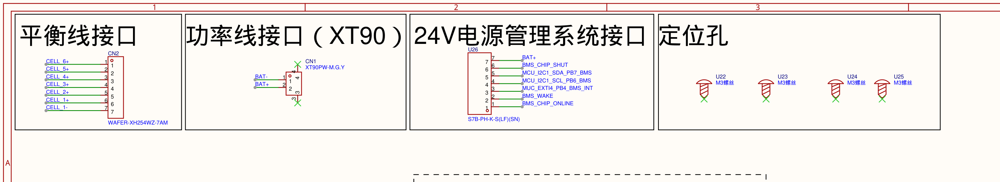{width=6.2}

### 5.1 外部连接器与端子定义

BMS 板同时存在三类连接：大电流端子、单体采样线和小信号系统线。三者不能互相替代。CN1/U11/U12 承担主功率；CN2 只承担单体抽头采样及均衡支路电流；U26 承担辅助 BAT+、I2C、告警、唤醒和关断。特别需要注意，U26 **没有 GND 引脚**，两板的小信号参考电位要通过主负极端子和分流电阻建立。

| 接口 | 引脚 | 网络 | 可验证作用 | Evidence | Confidence | Human confirmation |
| --- | ---: | --- | --- | --- | --- | --- |
| CN1 XT90 | 1 | `GND/BAT-` | 原始电池负极 | `official_chip_docs_files/SCH_机器人BMS板_2026-06-17.pdf` p.1；`official_chip_docs_files/full_netlist (4).csv:210-213` | High | Needed，核对实物丝印 |
| CN1 XT90 | 2 | `BAT+` | 原始电池正极，不经过主 MOS | 同上 | High | Needed |
| U11 | 1 | `BMS_OUT+` | 受 CHG/DSG 网络控制的正输出 | `official_chip_docs_files/full_netlist (4).csv:251-252` | High | Needed |
| U12 | 1 | `BMS_OUT-` | 经 R18 分流器后的系统负端 | `official_chip_docs_files/full_netlist (4).csv:251-252` | High | Needed |
| CN2 | 1…7 | `CELL_6+`…`CELL_1+`,`CELL_1-` | 六串七线采样接口 | `official_chip_docs_files/full_netlist (4).csv:104-110` | High | Needed，必须做线序和错插验证 |
| U26 | 1…7 | ONLINE、WAKE、ALERT、SCL、SDA、SHUT、BAT+ | 小信号和辅助供电跨板接口 | `official_chip_docs_files/full_netlist (4).csv:285-291` | High | Needed，核对线束 |

`BAT+` 与 `CELL_6+` 在板内不是同一个网络，它们只通过 D3 BAT46W 相连；在完整电池包上，两者又应在电芯端外部落到同一最高电位。由连接关系推断，D3 允许只插平衡线顶端时给 BAT+ 辅助域提供一条弱供电路径。BMS 原理图把 D3 灰显并写有“是否保留值得怀疑”的设计注释，而网表仍包含 D3，因此其量产贴装状态为 **Unknown**。证据：`official_chip_docs_files/SCH_机器人BMS板_2026-06-17.pdf` p.1；`official_chip_docs_files/full_netlist (4).csv:119-120`。

最低电芯负端 `CELL_1-` 由 R36 0Ω接到 BMS 本地 `GND/BAT-`。这使 VC0 的参考与原始电池负极一致，但不意味着 `BMS_OUT-` 在大电流下与之严格等电位；两者之间还有 R18。证据：`official_chip_docs_files/full_netlist (4).csv:283-284`。

> [RISK] CN2 一旦倒序、错位一针或在主功率线未建立时带电插拔，会让 VC 引脚承受非预期差分/共模顺序。原理图不能证明连接器具备机械防反、预充针或热插拔顺序，必须做专用线束防错和受限电源验证。

### 5.2 BQ76952 供电、BAT 输入与电荷泵

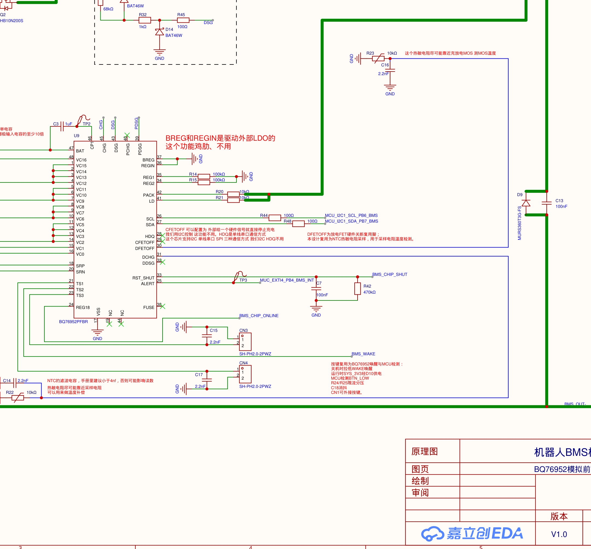{width=6.2}

BQ 的供电路径为 `CELL_6+ → D2 BAT46W → R2 100Ω → BAT(pin47)`；C1 1µF 与 C2 100nF 对 GND 去耦。CP1(pin46) 通过 C3 1µF 接到 BAT 节点，作为高边 FET 驱动电荷泵储能电容。BAT+ 节点另有 C12 47µF、C11 100nF 与 SMBJ33A D6 对 GND。证据：`official_chip_docs_files/SCH_机器人BMS板_2026-06-17.pdf` p.1；`official_chip_docs_files/full_netlist (4).csv:47-48,111-118,172-177`。BQ正常BAT推荐工作范围4.7-80V；本6S标称21.9V、最高25.2V在该范围内。数据手册证据：`official_chip_docs_files/TI_BQ76952_Datasheet.pdf` pp.9-10。

R2 与 C1 的一阶名义时间常数为 `100Ω × 1µF = 100µs`，但实际启动还受芯片 BAT 输入电流、D2 压降和 C2/C3 动态充电影响。C3 是否足以支持四只并联主 MOS 的总门电荷，不能仅由电容量判断：还需要主 MOS 的 Qg 曲线、BQ 电荷泵能力、目标开通时间和实际门极波形。结论为 **Unknown**，Human confirmation: Needed。

D6 的 33V 标称不能直接等价为“BAT 节点永远低于 33V”。TVS 的击穿电压、规定电流下钳位电压、动态电阻及 PCB 回路电感都参与瞬态峰值；在缺少浪涌等级、TVS 数据页和布局的情况下，钳位裕量为 **Unknown**。

### 5.3 六串稀疏 VC 映射

BQ76952 支持更多串数，本板只使用 Cell1、Cell2、Cell6、Cell9、Cell12、Cell16 六个逻辑通道。中间未使用的 VC 引脚不是全部悬空，而是成组绑定到相邻的物理电芯节点。这一连接与固件写入的 `VCELL_MODE=0x8923` 及软件数组 Cell1/2/6/9/12/16 一致。数据手册允许稀疏串数配置，但明确要求 Cell1、Cell2 和 Cell16 必须对应真实连接的电芯；本板三者均有真实抽头，因此“稀疏6S拓扑可用”是 **Fact**，但热插拔瞬态仍是 **Unknown**。证据：`official_chip_docs_files/TI_BQ76952_Datasheet.pdf` pp.69,75-76；`official_chip_docs_files/full_netlist (4).csv:2-49,140-153`。

| 物理节点 | BQ 引脚组 | 串联电阻 | 固件逻辑通道 | Evidence | 结论 |
| --- | --- | --- | --- | --- | --- |
| `CELL_6+` | VC16/pin48 | R8 100Ω | Cell16 | `official_chip_docs_files/full_netlist (4).csv:49,140-141`；`Int/Int_BQ76952_BSP.h:208-231` | Fact |
| `CELL_5+` | VC15/14/13/12, pins1-4 | R1 100Ω | Cell12 | `official_chip_docs_files/full_netlist (4).csv:2-5,142-143` | Fact |
| `CELL_4+` | VC11/10/9, pins5-7 | R9 100Ω | Cell9 | `official_chip_docs_files/full_netlist (4).csv:6-8,144-145` | Fact |
| `CELL_3+` | VC8/7/6, pins8-10 | R10 100Ω | Cell6 | `official_chip_docs_files/full_netlist (4).csv:9-11,146-147` | Fact |
| `CELL_2+` | VC5/4/3/2, pins11-14 | R11 100Ω | Cell2 | `official_chip_docs_files/full_netlist (4).csv:12-15,148-149` | Fact |
| `CELL_1+` | VC1/pin15 | R12 100Ω | Cell1 | `official_chip_docs_files/full_netlist (4).csv:16,150-151` | Fact |
| `CELL_1-` | VC0/pin16 | R13 100Ω | 参考端 | `official_chip_docs_files/full_netlist (4).csv:17,152-153` | Fact |

VC0 还由 C4 220nF、D4 BAT46W、D7 3.6V 稳压管对 GND 形成滤波和钳位网络。该连接能证明存在保护元件，不能在没有器件方向、动态参数和布局的情况下证明所有负向或插拔瞬态都被限制在 BQ 绝对最大值以内。证据：`official_chip_docs_files/full_netlist (4).csv:123-128`。

> [FACT] 硬件稀疏映射和当前固件映射一致；这消除了“软件把第 3 个物理电芯误读为 BQ Cell3”的常见错误。仍需在首板上从 CN2 逐针施加受限电压，验证每个软件数组元素对应正确抽头。

### 5.4 六路外部被动均衡

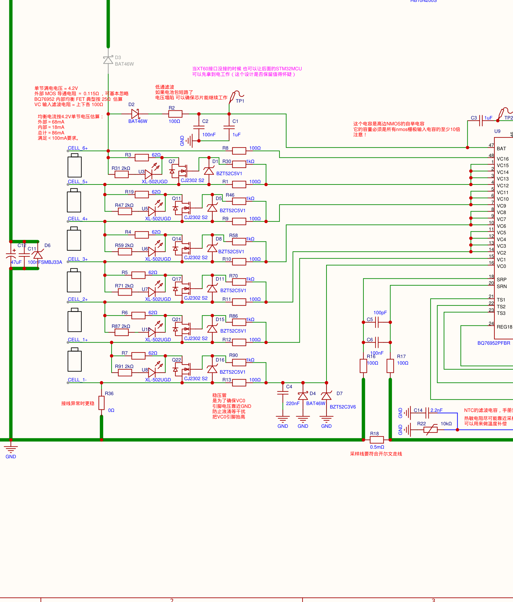{width=6.2}

六路均衡采用重复单元：物理电芯上端经过 62Ω/1W 主泄放电阻与 CJ2302 NMOS 回到该电芯下端；一条 2kΩ+绿色 LED 支路用于指示；MOS 栅极由相应 BQ VC 节点经 1kΩ驱动，并用 5.1V 稳压管限制 VGS。该网络利用 BQ 内部均衡开关产生控制压差，再由外部 NMOS 提高泄放电流。

| Cell | 主泄放支路 | 指示支路 | Gate/钳位 | 网表证据 |
| ---: | --- | --- | --- | --- |
| 6 | R3 62Ω/1W + Q7 | R31 2kΩ + U3 | R30 1kΩ + D1 5.1V | `official_chip_docs_files/full_netlist (4).csv:50-60,129-130,198-199` |
| 5 | R19 + Q11 | R47 + U5 | R46 + D5 | `official_chip_docs_files/full_netlist (4).csv:59-67,131-132,170-171,200-201` |
| 4 | R4 + Q14 | R59 + U6 | R58 + D8 | `official_chip_docs_files/full_netlist (4).csv:68-76,131-132,202-203` |
| 3 | R5 + Q17 | R71 + U7 | R70 + D11 | `official_chip_docs_files/full_netlist (4).csv:77-85,133-134,204-205` |
| 2 | R6 + Q21 | R87 + U10 | R86 + D15 | `official_chip_docs_files/full_netlist (4).csv:86-94,135-136,206-207` |
| 1 | R7 + Q22 | R91 + U8 | R90 + D16 | `official_chip_docs_files/full_netlist (4).csv:95-103,137-138,208-209` |

按 4.20V 标称端电压计算，忽略 MOS 与走线压降时：

1. 主支路电流 `I = 4.20V / 62Ω = 67.7mA`。
2. 62Ω 电阻功耗 `P = 4.20² / 62 = 0.284W`，约为 1W 标称的 28.4%。
3. 若绿色 LED 正向压降按 3.0V 估算，指示支路约 `(4.20-3.0)/2kΩ = 0.6mA`。
4. 结合 BQ 内部均衡开关电阻范围、上下各100Ω VC串阻和4.20V电压，内部支路估算约17.1-19.5mA；内部路径与62Ω外部主支路合计约84.8-87.2mA，若再计约0.6mA LED支路，则“总电芯泄放”约85.4-87.8mA，可按 **约85-88mA** 做首轮热设计。

其中连接和器件额定值是 **Fact**；67.7mA、约0.6mA、17.1-19.5mA及总计约85-88mA均是基于标称/规格边界的 **Inference**，不是实测值。相邻通道约束、器差、温度、VC输入电流分配和MOS压降会改变结果，所以最终电流与总热量仍是 **Unknown**，必须逐通道串表测流并用热像验证。证据：`official_chip_docs_files/TI_BQ76952_Datasheet.pdf` pp.18,63-65；`official_chip_docs_files/full_netlist (4).csv:50-103,129-138,170-171,198-209`。

单节 5Ah 电芯若以 67.7mA 连续泄放，理想状态每小时仅减少约 1.35% 容量；消除 100mAh 失衡约需 1.48h。真实时间还受均衡占空比、温升、单节电压、软件轮询和相邻通道限制影响。当前固件每 10s 评估一次，只选最高一节；启动条件为最低单体≥3.9V、压差≥40mV、温度合格，停止条件为最低单体<3.85V或压差≤20mV。证据：`App/App_BatMan_Internal.h:10-17`；`App/App_BatMan_Estimator.c:29-35,48-60,222-305`。

> [RISK] 电阻额定功率有静态余量不等于 PCB 热设计通过。六路同时贴近布置、封装焊盘温升、MOS 热阻、外壳无风环境以及 BQ 对相邻均衡通道的约束均需热像与长时间均衡试验确认。

### 5.5 低边分流、电流方向与地参考

R18 连接 `GND/BAT-` 和 `BMS_OUT-`，网表与 BMS 图均给出 `0.5mΩ、±1%、6W`。SRP 经 R16 100Ω接电池侧，SRN 经 R17 100Ω接输出侧；C5 100pF 和 C6 100nF 均跨 SRP/SRN，构成差模高频/低频滤波。两侧各100Ω且主差分电容100nF与TI推荐应用网络匹配，这是 **Fact**；PCB是否真正Kelvin取样仍是 **Unknown**。证据：`official_chip_docs_files/TI_BQ76952_Datasheet.pdf` p.65；`official_chip_docs_files/SCH_机器人BMS板_2026-06-17.pdf` p.1；`official_chip_docs_files/full_netlist (4).csv:158-169`。

由该引脚连接可确定分流电压符号：充电时常规电流从 `BAT-/GND` 经 R18 流向 `BMS_OUT-`，故 `SRP-SRN>0`；放电回流从 `BMS_OUT-` 经 R18 流向 `BAT-/GND`，故 `SRP-SRN<0`。这与固件“正充、负放”的换算约定一致；若实测符号相反，应先排查端子/采样线序，不能只在软件中取反掩盖硬件错误。证据：`official_chip_docs_files/full_netlist (4).csv:158-169,251-252`；`App/App_BatMan_Sample.c:156-175`。连接和符号结论：**Fact/High**；实板极性：Human confirmation Needed。

| 电流 | `Vshunt = I×0.5mΩ` | `P = I²×0.5mΩ` | 工程解释 |
| ---: | ---: | ---: | --- |
| 10A | 5mV | 0.05W | 若实物0.5mΩ而仍按5mΩ标定，测量电流/库仑量约低报10倍 |
| 50A | 25mV | 1.25W | 两板数字地静态偏移可达 25mV |
| 100A | 50mV | 5.0W | 接近分流器 6W 标称且未计环境降额 |
| 109.5A | 54.8mV | 6.0W | 仅为理想电阻功率等式，不是允许连续电流结论 |

U26 没有 GND，主板小信号地来自 BMS_OUT-，BQ 数字 I/O 则参考分流器另一侧的 BAT-/GND。因此大电流时 SDA/SCL/ALERT/WAKE/SHUT 的逻辑低电平裕量包含分流压降和动态地弹噪声。50A/100A 的静态参考差分别约 25mV/50mV，电机浪涌下还会叠加铜箔和连接器寄生。证据：`official_chip_docs_files/full_netlist (4).csv:168-169,251-252,285-291`；`official_chip_docs_files/full_netlist (5).csv:290-291,319-325`。

> [CONFLICT] 当前BMS PDF/网表标0.5mΩ，固件却按5mΩ写入CC Gain/Capacity Gain并解释CC2。若实物确为0.5mΩ，同一实际电流只产生5mΩ方案的1/10压降，测量电流和库仑量会约低报10倍；以固定分流压降为本质的OCC/OCD/SCD对应实际安培阈值则约放大10倍。硬件证据：`official_chip_docs_files/SCH_机器人BMS板_2026-06-17.pdf` p.1、`official_chip_docs_files/full_netlist (4).csv:168-169`；固件证据：`App/App_BatMan_Config.c:35-37,193-203`、`App/App_BatMan_Sample.c:156-175`。量产前必须四线测实物阻值、重生成增益/阈值并做双向电流注入。

### 5.6 充电/放电主 MOS、门极驱动与导通损耗

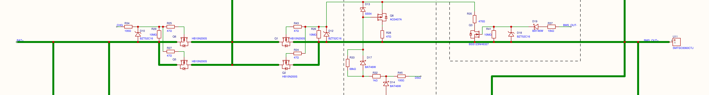{width=6.2}

正极主路径是 `BAT+ → Q5||Q6 充电组 → 共漏中点/公共漏极节点 $3N239 → Q1||Q2 放电组 → BMS_OUT+`。当前原理图符号定义pin1=G、pin2=D、pin3=S；网表中Q5/Q6与Q1/Q2的pin2全部接 `$3N239`，Q5/Q6 pin3接BAT+，Q1/Q2 pin3接BMS_OUT+，因此这是两组反向串联的**共漏**结构，不是共源。四只器件的网表描述均为 HB10N200S、100V、45A、`RDS(on)=14mΩ@10V`。背靠背的充电/放电分组允许 BQ 针对电流方向分别关断，同时在完全关断时阻断体二极管形成的单向持续通路。连接结论Confidence: High；封装pinout仍须以受控BOM/官方MOS手册确认。证据：`official_chip_docs_files/SCH_机器人BMS板_2026-06-17.pdf` p.1；`official_chip_docs_files/full_netlist (4).csv:302-313`。

CHG(pin45) 经 R34 100Ω进入公共驱动节点，再由 R25/R27 各 47Ω到 Q6/Q5 gate；D10 16V限制门源电压，R29 10MΩ回到 BAT+。DSG(pin43) 经 R45 100Ω、R32 1kΩ、D14、D17/R33 68kΩ及 Q8 AO3407A 快速关断网络，再由 R43/R24 各 47Ω到 Q1/Q2 gate；D12 16V钳位，R26 10MΩ回源。证据：`official_chip_docs_files/full_netlist (4).csv:214-245,248-250,253-254,259-260,269-280,302-313`。

若四只 MOS 完全同温、同参数且并联均流理想，每个并联组为 7mΩ，两组串联约 14mΩ：

| 主路电流 | 总压降 | 总 MOS 导通损耗 | 每只 MOS 理想损耗 |
| ---: | ---: | ---: | ---: |
| 10A | 0.14V | 1.4W | 0.35W |
| 50A | 0.70V | 35W | 8.75W |
| 100A | 1.40V | 140W | 35W |

这些是 25°C、10V 栅压附近的理想标称计算；真实损耗随结温使 RDS(on) 增大，且并联器件会因栅回路、源极铜阻、热耦合和阈值差异偏流。缺 MOS 完整数据手册、铜厚、铺铜面积、散热器和热测试，因此连续电流能力为 **Unknown**，不能从“45A×4”相加得到。

图纸将 Q8 区域标注为“加速关闭放电”。从连线可推断 Q8 用于比 10MΩ被动回落更快地抽走 DSG gate 电荷；精确关断时间、VGS 过冲和 Q1/Q2 同步性必须用差分探头测量。结论：连接为 Fact；瞬态效果为 Inference；Human confirmation: Needed。

### 5.7 预放电、反向充电器检测与输出瞬态

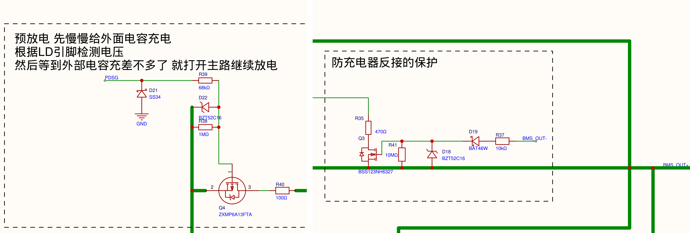{width=6.2}

PDSG(pin39) 经 R39 68kΩ驱动 Q4 ZXMP6A13FTA，R38 1MΩ提供偏置、D22 16V钳位；Q4 再控制 R40 100Ω/2W 从主 MOS 共漏中点 `$3N239` 向 BMS_OUT+ 预充。其目的不是长期供电，而是在主 DSG 接通前给外部母线电容限流充电。证据：`official_chip_docs_files/full_netlist (4).csv:234-241,264-268,302-313`。

按 25.2V 电池和输出电容初始为 0V 计算，R40 初始电流约 `252mA`、瞬时功耗约 `6.35W`，高于 2W 连续额定。因此必须依赖短脉冲和 BQ PDSG timeout；若输出持续短路、MOS未转入主通道或状态机重复触发，R40可能过热。外部总电容、PDSG超时、停止电压差和失败锁定策略均需实测。当前固件写 PDSG timeout 250、stop delta 0，并注释为约 2.5s、关闭 delta 停止；证据：`Int/Int_BQ76952_BSP.h:185-186`；`App/App_BatMan_Config.c:264-267`。

Q3 BSS123、R35 470Ω、R41 10MΩ、D18 16V、D19 BAT46W、R37 10kΩ组成图纸标注的“防充电器反接保护”辅助网络。网表可证明连接，不能证明所有反接电压下的 MOS VGS、BQ pin 电流和响应时序均安全。证据：`official_chip_docs_files/full_netlist (4).csv:226-233,261-263,279-282`。

D9 MURS360 与 C13 100nF 跨 BMS_OUT+/BMS_OUT-。MURS360 是单向快恢复二极管，不是双向 TVS；它可为特定极性的感性瞬态提供回路，但不应被描述为可吸收任意方向或任意能量的浪涌。证据：`official_chip_docs_files/full_netlist (4).csv:178-181`。

### 5.8 温度通道、复用引脚与传感器归属

| BQ pin | 硬件连接 | 设计含义 | 固件使用情况 | Evidence |
| --- | --- | --- | --- | --- |
| TS1/pin21 | CN4 外接接口，C17 2.2nF | 外接热敏通道 | 采样有效时参与 `temp_cell_c` 平均 | `official_chip_docs_files/full_netlist (4).csv:22,196-197,257-258`；`App/App_BatMan_Sample.c:177-243` |
| TS2/pin22 | `BMS_WAKE` | 唤醒复用，不作温度 | 由跨板按键/MCU使用 | `official_chip_docs_files/full_netlist (4).csv:23,285-291` |
| TS3/pin23 | CN3 外接接口，C15 2.2nF | 外接热敏通道 | 与 TS1 同上 | `official_chip_docs_files/full_netlist (4).csv:24,194-195,255-256` |
| DFETOFF/pin30 | R23 10k NTC，C16 2.2nF | 板载温度/复用输入 | 是否配置为温度输入未由现行配置证明 | `official_chip_docs_files/full_netlist (4).csv:31,188-191` |
| DCHG/pin31 | R22 10k NTC，C14 2.2nF | 板载温度/复用输入 | 同上 | `official_chip_docs_files/full_netlist (4).csv:32,186-193` |

当前软件把 TS1/TS3 两个有效值取平均作为 `temp_cell_c`；两者均无效时退回 BQ 内部温度。`temp_fet_c` 当前直接等于内部温度，并非独立 FET 热敏结果。证据：`App/App_BatMan_Sample.c:177-243`。因此文档不能把 R22/R23 宣称为已闭环的“充电 MOS/放电 MOS 温度保护”；其安装位置、Beta 值、Data Memory pin 配置和软件采样均需确认。

EVE温度分段限流使用的是 **Cell Surface Temperature**，而不是BQ芯片内部温度。当前资料没有证明TS1/TS3探头贴在电芯表面，也没有探头误差、热耦合延迟或两探头平均是否覆盖最热点的预算；失效回退到BQ内部温度更不能证明电芯表面温度。因此即使软件补上0-15°C降流，也只有在探头物理位置、误差和温箱动态验证闭环后才能宣称符合电芯温度条件。证据：`official_chip_docs_files/《EVE INR21700 50E 规格书》RD-EVE INR21700-50E-S76-LF A版(1)(1)(1).pdf` 物理PDF pp.3-4；`App/App_BatMan_Sample.c:177-243`。当前结论：**Unknown/High，Human confirmation: Needed**。

### 5.9 通信、告警、在线、唤醒与关断

| 信号 | BQ 引脚 | 板内网络与元件 | 跨板去向 | Evidence |
| --- | --- | --- | --- | --- |
| ALERT | pin25 | `MUC_EXTI4_PB4_BMS_INT`、TP3 | U26 pin3→MCU PB4 | `official_chip_docs_files/full_netlist (4).csv:26,139,285-291` |
| SCL/SDA | pins26/27 | 各串 R44/R48 100Ω | U26 pins4/5→PB6/PB7 | `official_chip_docs_files/full_netlist (4).csv:27-28,298-301` |
| REG18/ONLINE | pin24 | `BMS_CHIP_ONLINE` | U26 pin1→主板电源使能 | `official_chip_docs_files/full_netlist (4).csv:25,285-291` |
| TS2/WAKE | pin22 | `BMS_WAKE` | U26 pin2→按键/PB3电路 | `official_chip_docs_files/full_netlist (4).csv:23,285-291` |
| RST_SHUT | pin33 | C7 100nF、R42 470kΩ下拉 | U26 pin6→SW3 | `official_chip_docs_files/full_netlist (4).csv:34,246-247,296-297` |

BREG、REGIN 接 GND，REG1/REG2 各以 100kΩ到 GND；HDQ、CFETOFF、DDSG、FUSE、PCHG 未连接。PACK pin42和LD pin41分别经R20/R21 10kΩ检测BMS_OUT+，为负载检测、充电器检测和PDSG状态转换提供硬件输入。证据：`official_chip_docs_files/SCH_机器人BMS板_2026-06-17.pdf` p.1；`official_chip_docs_files/full_netlist (4).csv:29-45,154-157,182-185`。FUSE pin38 悬空，主功率路径也未见独立熔断器；主板 F1/F2 仅是 500mA 辅助 PPTC，FH1只在 DC 输入侧，证据：`official_chip_docs_files/full_netlist (5).csv:136,143-144,333-334,385-386`。电池主放电短路若伴随主 MOS 击穿，最终隔离措施为 **Unknown/Critical**。

REG18的官方规格是1.6-2.0V、典型1.8V，外接电容要求1.8-22µF；pin说明写“only for internal use”，短路限流3-14mA。当前BMS网表中`BMS_CHIP_ONLINE`只有U9 pin24和U26 pin1两个端点，没有任何REG18去耦电容；控制板又把该网络接到R61 100kΩ关断支路和U8二极管，再由二极管OR节点驱动1MΩ下拉的`SYS_5V_EN`。连接与缺电容是 **Fact**；把“only for internal use”的REG18跨板外引与官方用途说明相对照是 **Conflict**；缺电容后的稳定性、启动波形、二极管后EN裕量和温度角落行为均为 **Unknown/Critical**。证据：`official_chip_docs_files/TI_BQ76952_Datasheet.pdf` pp.5,12-13；`official_chip_docs_files/full_netlist (4).csv:25,285`；`official_chip_docs_files/full_netlist (5).csv:319,331-332,379-384`。必须补齐规定电容，并由TI确认外引ONLINE用法后测启动、负载和全温角落。

固件把 PB4 配为下降沿 EXTI，但仓库未发现 `HAL_GPIO_EXTI_Callback` 实现；所以当前 ALERT 只进入 HAL IRQ 分发，没有应用层消费闭环。证据：`bms24v_platform/Core/Src/gpio.c:103-111`、`bms24v_platform/Core/Src/stm32g0xx_it.c:105-117`，App/Int/Com 全局检索无回调。现行保护主要依赖 BQ 硬件自主 FET 反应和BatMan任务轮询，而不是 ALERT 立即唤醒任务；该任务每轮末尾 `vTaskDelay(1000)`，实际轮询周期为本轮执行时间再加1000 tick，严格大于1s且未实测。

## 6. SC8815 充电板 Page 1：24V 输入与四开关同步升降压

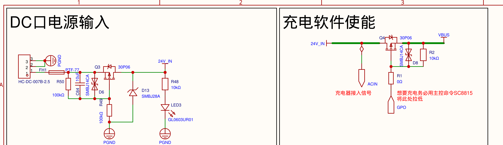{width=6.2}

### 6.1 DC 入口、保险丝座与高边防反/软启动

DC 入口为 `U21 → FH1 → Q3 30P06 → 24V_IN`。U21 pin1 为正，pins2/3 为 GND；FH1 是保险丝座，当前网表没有实际保险丝型号、额定电流、分断能力或 I²t，因此只能确认预留，不能确认保护能力。证据：控制板原理图 p.1；`official_chip_docs_files/full_netlist (5).csv:136-144`。

Q3 gate 由 R49/R50 各100kΩ偏置，C64 10µF与 D6 SMBJ14CA跨 gate/source；24V_IN 对地有 D13 SMBJ28A，LED3+R48 10kΩ用于输入存在指示。连接证据：`official_chip_docs_files/full_netlist (5).csv:139-152,183-184,195-197`。

若忽略二极管钳位和 MOS 漏电，R49/R50 对 C64 的 Thévenin 电阻为 50kΩ，名义时间常数约 `0.5s`；稳态分压使 gate 约为输入的一半，在24V输入时 |VGS| 约12V。该推导依赖 Q3 的源/漏/栅实际封装定义和 D6 方向。C64 只标“10µF”，耐压、介质、容差和 DC bias 后有效容量均为 **Unknown**。

`24V_IN → Q4 30P06 → VBUS` 构成“充电软件使能”高边开关。Q4 gate 由 SC8815 GPO 经 R1 0Ω控制，R2 10kΩ把 gate 偏置回 VBUS，D8 SMBJ14CA钳制 gate/source。证据：`official_chip_docs_files/full_netlist (5).csv:35-38,163-164,198-200`。MCU并不直接驱动 Q4；它要先通过 SC8815 I2C 写 GPO。Q4 body diode 是否承担首次启动供电、其方向和启动冲击必须由实物波形确认。

### 6.2 SC8815 控制器引脚与缺省停机条件

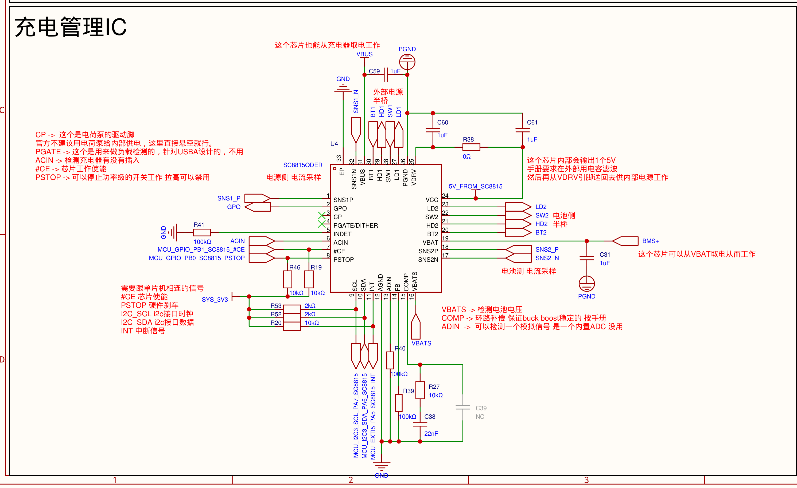{width=6.2}

| SC8815 引脚/功能 | 当前网络 | 外围与默认条件 | Evidence |
| --- | --- | --- | --- |
| ACIN pin6 | `24V_IN` | 直接检测输入 | `official_chip_docs_files/full_netlist (5).csv:7` |
| #CE pin7 | PB1 | 10kΩ上拉到3.3V，低有效 | `official_chip_docs_files/full_netlist (5).csv:8,161-162` |
| PSTOP pin8 | PB0 | 10kΩ上拉到3.3V，高时停功率级 | `official_chip_docs_files/full_netlist (5).csv:9,159-160` |
| SCL/SDA pins9/10 | PA7/PA6 | 各2kΩ上拉到3.3V | `official_chip_docs_files/full_netlist (5).csv:10-11,153-156` |
| INT pin11 | PA5 | 10kΩ上拉；主控当前仅普通输入 | `official_chip_docs_files/full_netlist (5).csv:12,157-158` |
| GPO pin2 | Q4 gate | R1 0Ω，控制 VBUS 高边 PMOS | `official_chip_docs_files/full_netlist (5).csv:3,35-38` |
| VCC/VDRV | 内部驱动供电 | R38 0Ω相连，C60/C61各1µF | `official_chip_docs_files/full_netlist (5).csv:122-127` |
| COMP | 环路补偿 | R27/C38/C39 网络 | `official_chip_docs_files/full_netlist (5).csv:114-121` |
| VBATS | 电池电压检测 | R17/R18/C31，存在装配冲突 | `official_chip_docs_files/full_netlist (5).csv:188-194` |
| CP、PGATE/DITHER | NC | 未使用 | `official_chip_docs_files/full_netlist (5).csv:2-34` |

#CE 与 PSTOP 均有硬件上拉，MCU未配置前的静态意图是 #CE 高禁用、PSTOP 高停机。Cube GPIO 初始化又先写 #CE=高、PSTOP=高；`App_SC8815_Init` 后把 #CE 拉低但保持 PSTOP 高，形成“芯片在线、功率环路停止”的 standby monitor。硬件证据见上表；软件证据：`bms24v_platform/Core/Src/gpio.c:57-88`、`App/App_SC8815.c:69-82,289-302`。

### 6.3 四开关升降压主功率级

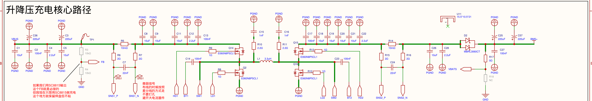{width=6.2}

主路径为：

`VBUS → R5 10mΩ/3W → Q14高边/Q2低边（SW1） → L1 3.3µH → Q15高边/Q16低边（SW2） → R14 10mΩ/3W → D2 MBRL3060CT → BMS+`。

连接证据：控制板原理图 p.1；`official_chip_docs_files/full_netlist (5).csv:39-113,165-187`。四开关拓扑可在输入高于或低于电池电压时分别工作于 buck、buck-boost 或 boost 区域；实际模式由 SC8815 环路和寄存器决定，不能把 L1 两侧的开关节点当作固定方向 PWM。

| 器件组 | 标称值/型号 | 设计作用 | Evidence |
| --- | --- | --- | --- |
| Q14/Q2/Q15/Q16 | 60V、64A、8.5mΩ@10V | 两个同步半桥 | `official_chip_docs_files/full_netlist (5).csv:39-50` |
| L1 | 3.3µH，额定14A，饱和22A | 储能与电流连续化 | `official_chip_docs_files/full_netlist (5).csv:165-166` |
| R5/R14 | 10mΩ、3W | 输入/电池侧电流采样 | `official_chip_docs_files/full_netlist (5).csv:167-170` |
| R8/R9/R12/R13 | 1Ω | 四管 gate 阻尼/速度控制 | `official_chip_docs_files/full_netlist (5).csv:69-76` |
| C14/C23 | 100nF | 高边 bootstrap | `official_chip_docs_files/full_netlist (5).csv:77-80` |
| R10+C15、R11+C16 | 2.2Ω+1nF | SW1/SW2 RC snubber | `official_chip_docs_files/full_netlist (5).csv:81-88` |
| 输入电容 | 多颗10µF/2.2µF/100nF及220µF | 限制 VBUS 纹波和开关环路面积 | `official_chip_docs_files/full_netlist (5).csv:89-102` |
| 电池侧电容 | 100nF、10µF、2.2µF及220µF | 限制输出纹波和瞬态 | `official_chip_docs_files/full_netlist (5).csv:103-113` |

10mΩ/3W 分流器仅按 `sqrt(P/R)` 得到的理想功率极限约 `sqrt(3/0.01)=17.3A`；14A时每只压降140mV、功耗1.96W。它不等于允许连续17.3A，因为额定功率依赖焊盘、铜面积和环境温度。L1 的14A额定和22A饱和也不能直接转换为输出14A；buck/boost模式下输入、输出和电感平均电流不同，且需要叠加纹波峰值。

若以 24V 输入、25.2V 电池、忽略损耗的 126W/5A 输出估算，输入平均约5.25A；但实际效率、充电器电压下陷和电感纹波都会提高峰值。若按固件请求 IBAT=3A，则理想输出约75.6W，24V侧约3.15A/100%效率。固件证据：`App/App_SC8815.c:168-171`；`Int/Int_SC8815_BSP.h:19-28`。

### 6.4 电流采样、滤波与电流方向

R5 和 R14 两端分别进入 SC8815 的 SNS1P/N 与 SNS2P/N，每路用 2Ω串联电阻和 22nF 差分电容滤波。对称电阻有助于限制引脚尖峰并保持共模误差对称；PCB 必须从分流器焊盘做 Kelvin 引出，不能在大电流铜排任意位置取样。证据：`official_chip_docs_files/full_netlist (5).csv:51-68,167-170`。

当前固件假设 IBUS、IBAT 分流均10mΩ且增益均为6×，请求 IBUS=5A、IBAT=3A，并设置允许上限6A/5A。证据：`Int/Int_SC8815_BSP.h:19-28`；`App/App_SC8815.c:168-171`；`Int/Int_SC8815.c:795-830`。网表与阻值假设一致，但实际偏差、温漂和零点必须校准。

### 6.5 VBATS 与充电总压设定的 Critical Conflict

`official_chip_docs_files/SCH_Schematic1_2026-06-17.pdf` p.1 将 R17 标为0Ω并把 `BMS+` 直接送到 VBATS，R18标为 `NC`；网表 `official_chip_docs_files/full_netlist (5).csv:188-191` 却把 R17、R18 都列为0Ω。如果两只同时贴装，会形成 `BMS+ → R17 0Ω → VBATS → R18 0Ω → GND` 的直接短路。

与此同时，`Int/Int_SC8815_BSP.h:129-139` 的注释和 `VBAT_SET=0x20` 按外部分压 R17=200kΩ、R18=10kΩ、名义 25.2V 目标解释；`docs/wordflow/manual_confirmations.md:7-8` 记录人工确认也为200kΩ/10kΩ；`official_chip_docs_files/README.md:1` 又写过100kΩ/5.1kΩ计划值。四类来源互相冲突：

| 来源 | R17上臂 | R18下臂 | 含义 | 判定 |
| --- | ---: | ---: | --- | --- |
| 当前控制板 H03 p.1 | 0Ω | NC | VBATS直连BMS+ | Conflict |
| 当前网表 lines188-191 | 0Ω | 0Ω | 若实装会硬短路 | Critical Conflict |
| 当前固件注释/人工确认 | 200kΩ | 10kΩ | 21:1外部分压 | Conflict |
| 资料 README | 100kΩ | 5.1kΩ | 约20.61:1外部分压 | Conflict |

> [RISK] 在生产 BOM、贴片坐标、实物阻值和 SC8815 VBATS 模式未统一前，禁止上电验证充电闭环。应先断电测量 BMS+ 到 GND 的阻值、VBATS 到两端的阻值，再用限流电源单独验证 ADC 读数和目标电压。

### 6.6 环路补偿、FB 保留与单向充电意图

COMP 使用 R27/C38/C39。PDF把 C39标 `NC`，网表 `official_chip_docs_files/full_netlist (5).csv:120-121` 列220pF；这会改变高频极点/零点，属于 **Conflict**，不能当作无影响的 BOM 差异。环路稳定性还依赖 L1、输入/输出电容有效值、ESR、工作模式和充电电流，必须按最终 BOM 做 Bode 或负载阶跃验证。

反向输出 FB 的 R3/R4 在 PDF 中灰显并注明保留焊盘不贴，且完全不出现在网表；充电输出又串联 D2 MBRL3060CT 到 BMS+。两项共同支持“本项目只用 SC8815 给电池充电，不用其反向 OTG 给 VBUS供电”的设计意图。证据：控制板原理图 p.1；`official_chip_docs_files/full_netlist (5).csv:185-187`。但 D2 的具体管脚并联方式、压降和热耗仍需实物确认。

### 6.7 充电启动/停止的硬件与软件组合时序

固件在 PSTOP 保持高时依次写 VBAT_SET、RATIO、CTRL0/1/2/3、MASK、IBUS/IBAT 限流和 ADC 配置；所有写入成功后才把 PSTOP 拉低。发生通信、短路或过温故障时，软件回到 `CE_N=0、PSTOP=1` 的 standby monitor，并尝试清 GPO。证据：`App/App_SC8815.c:63-82,102-187,255-303`。

停止请求通过长度1的 overwrite 队列从 `batman_task/App_Power` 传给 `sc8815_task`；请求函数只覆盖队列，PSTOP/GPO要等下一次 `App_SC8815_Task` 才更新。SC任务每轮末尾使用 `vTaskDelay(1000)`，不是 `vTaskDelayUntil`；所以1000 tick只是循环延时，实际周期还包含本轮执行时间并会相位漂移。在**正常调度**下，请求到软件动作约为0到一次SC循环重访时间，另叠加高优先级阻塞、I2C和调度抖动，当前没有实测硬上界。Power排队停止后会在同一高优先级上下文同步写BQ FET，并不等待“SC能量级已停”握手，因此BQ gate可能先变化，能量后果为 **Inference**。SC自身short/OTP硬件保护可能更早动作，不能与该软件队列延迟混为一谈。证据：`App/App_Main.c:43-57`；`App/App_Power.c:55-93`；`App/App_SC8815.c:310-325,344-357`。

回 standby 时清 GPO 的返回值被丢弃；若 I2C 已故障，PSTOP仍可由 GPIO拉高，但 Q4 gate是否确实释放不能由软件确认。证据：`App/App_SC8815.c:69-81`。必须在故障注入中同时测 PSTOP、GPO、Q4 gate、SW1/SW2 和电感电流。

## 7. 双 LM74800-Q1 理想二极管 OR 与 VOUT

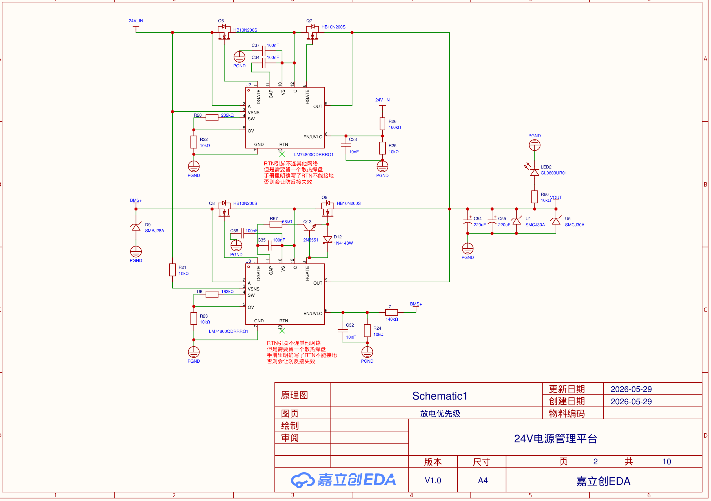{width=6.2}

### 7.1 两条输入支路

| 支路 | 路径 | 控制器/MOS | UV/OV/定时外围 | Evidence |
| --- | --- | --- | --- | --- |
| 适配器支路 | `24V_IN → Q6/Q7 → VOUT` | U2 LM74800-Q1；两只 HB10N200S | R28 232k/R22 10k；R26 160k/R25 10k；C33 10nF | `official_chip_docs_files/full_netlist (5).csv:214-232,243-266` |
| 电池支路 | `BMS+ → Q8/Q9 → VOUT` | U3 LM74800-Q1；两只 HB10N200S | U6 162k/R23 10k；U7 140k/R24 10k；C32 10nF | `official_chip_docs_files/full_netlist (5).csv:201-213,233-252` |

每路两个100V N-MOS背靠背串联，标称总 RDS(on) 约28mΩ。背靠背结构使关闭时能够阻断双向电流，LM74800 控制其中的理想二极管/断路功能；实际体二极管方向、启动先后和 reverse-current response 仍以数据手册及波形为准。

两个控制器的 RTN pin13 都悬空。图纸明确写明只保留散热焊盘且不能接 GND，否则反接保护失效；网表与此一致。该焊盘是器件特殊连接要求，不应被 PCB 自动铺地规则误连。证据：控制板原理图 p.2；`official_chip_docs_files/full_netlist (5).csv:201-232`。

电池支路另有 Q13 2N5551、D12 和 R57 68kΩ组成的门极辅助网络，端点位于 U3 相关 gate/charge-pump 节点与 Q9 gate 之间；网表只能证明这一局部连接。`24V_IN` 对电池支路的交叉控制来自 `R21 → U3 VSNS → SW → U6/R23 → OV` 链，而不是 Q13 的直接输入。Q13网络的精确钳位/加速作用仍为 **Unknown**，需核对芯片与晶体管 pinout 并测量波形。连接 Fact 的证据：`official_chip_docs_files/full_netlist (5).csv:208,211,236,262,267-273`；功能解释 Confidence: Low，Human confirmation: Needed。

### 7.2 输出钳位与电容

VOUT 对 GND 有 C54/C55各220µF、U1/U5两只 SMCJ30A以及 LED2+R60 10kΩ。两只同型号 TVS 直接并联并不能由静态网表证明浪涌均流；动态电阻和温升差会导致一只先进入雪崩。应以单只额定核算或通过标准浪涌测试确认并联方案。证据：`official_chip_docs_files/full_netlist (5).csv:267-289`。

VOUT 直接送到 Page9 的 CN3/CN7 两个 XT60；两口并联，没有独立电子保险、分流或单口开关。任一接口反灌、线缆短路或插拔电弧都会作用于同一母线。证据：控制板原理图 pp.2,9；`official_chip_docs_files/full_netlist (5).csv:522-525`。

### 7.3 EN/UVLO、OV 门限与模拟适配器优先级

LM74800-Q1 的 EN/UVLO 上升/下降典型阈值为1.231/1.132V，OV上升/下降典型阈值为1.231/1.130V。U2 pin3 VSNS直接接24V_IN，内部开关送R28/R22的OV分压；U2 EN由R26/R25分压。U3 EN由BMS+经U7/R24分压；关键的交叉路径是 `24V_IN → R21 10kΩ → U3 VSNS → 内部SW → U6 162kΩ → U3 OV → R23 10kΩ → GND`。阈值是数据手册 **Fact**，连接是网表 **Fact**。引脚证据：`official_chip_docs_files/TI_LM7480_Q1_Datasheet.pdf` pp.5,16；网络证据：`official_chip_docs_files/full_netlist (5).csv:239-266`。

按标称阻值、不计内部SW 10-46Ω计算：

| 功能 | 分压 | 典型上升门限 | 典型下降门限 | 含义 |
| --- | --- | ---: | ---: | --- |
| U2适配器UVLO | 160k/10k | `1.231×17=20.927V` | `1.132×17=19.244V` | 适配器支路进入/退出工作窗口 |
| U2适配器OV | 232k/10k | `1.231×24.2=29.790V` | `1.130×24.2=27.346V` | 过压关闭适配器HGATE |
| U3电池UVLO | 140k/10k | `1.231×15=18.465V` | `1.132×15=16.980V` | BMS+足够高时允许电池支路 |
| U3对24V_IN交叉OV | (10k+162k)/10k | `1.231×18.2=22.404V` | `1.130×18.2=20.566V` | 适配器升高时关闭电池HGATE；下降时提前恢复 |

把芯片门限范围与1%电阻最坏方向组合，U2 UVLO上升约19.94-21.95V、下降约18.20-20.08V；U2 OV上升约28.37-31.25V；U3电池UVLO上升约17.59-19.37V；U3交叉OV上升约21.34-23.50V、下降约19.49-21.50V。该公差分析未包含OV/EN输入漏电、R21后的内部开关电阻、温漂和PCB漏电。证据：`official_chip_docs_files/TI_LM7480_Q1_Datasheet.pdf` p.5给出上升1.195-1.267V、下降1.091-1.159V；分压证据：`official_chip_docs_files/full_netlist (5).csv:201-250,239-266`。

由此可得稳态 **Inference**：典型角下，正常24V输入升高时U2先在约20.927V允许适配器路，随后U3在约22.404V关闭电池HGATE；输入下降时U3约20.566V恢复，而U2约19.244V才退出，呈现名义重叠和模拟式“适配器优先”倾向。但独立最坏角可相反：上升时U3最低约21.34V已关而U2最高约21.95V尚未开，存在约0.61V静态缺口；下降时U2最高约20.08V已退而U3最低约19.49V才恢复，存在约0.59V缺口。典型重叠与最坏角缺口来自同一数据手册公差，并非来源冲突；它表明典型值不能证明全公差连续供电，属于 **Risk/High**，最终VOUT连续性为 **Unknown/High**，不能宣称无缝数字互锁。

另一个静态后果是：当24V_IN高到触发U2 OV时，同一输入仍通过U3交叉OV压住电池支路，因而不能假定“适配器过压后自动无缝回退电池”。低于22.4V附近时谁供电仍由两源端电压和理想二极管环路决定，不是固定数字优先。必须对门限全公差扫压并在四种上电/掉电顺序、近等压和U2过压条件下同步记录VOUT、两路输入电流、HGATE/DGATE和反灌峰值。

Q13/D12/R57位于U3 HGATE和Q9 gate/charge-pump节点之间，是gate辅助网络；精确作用需结合晶体管pinout和波形确认。必须覆盖四种实测：24V先上/电池后上、电池先上/24V后上、两源近等压、满载下任一源瞬断。每种场景记录两路输入电流、VOUT跌落/过冲、HGATE/DGATE、反向电流和TVS电流。

## 8. BMS 跨板接口、唤醒复用键与强制关断

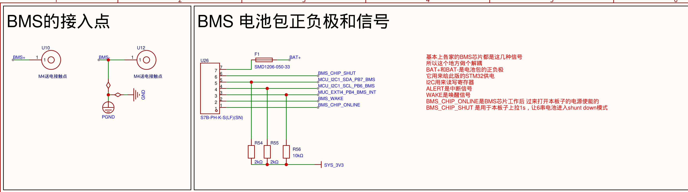{width=6.2}

### 8.1 U26 一一映射与电气条件

| U26 pin | 信号 | BMS端来源 | 主板端负载/去向 | Evidence |
| ---: | --- | --- | --- | --- |
| 1 | `BMS_CHIP_ONLINE` | BQ REG18 | 5V EN OR、SW3关断源 | `official_chip_docs_files/full_netlist (4).csv:25,285-291`；`official_chip_docs_files/full_netlist (5).csv:319,331-332,381-382` |
| 2 | `BMS_WAKE` | BQ TS2 | R35/按键/PB3 Q12 网络 | `official_chip_docs_files/full_netlist (4).csv:23,285-291`；`official_chip_docs_files/full_netlist (5).csv:294-310,320` |
| 3 | `MUC_EXTI4_PB4_BMS_INT` | BQ ALERT | PB4，10kΩ上拉 | `official_chip_docs_files/full_netlist (4).csv:26,139,287`；`official_chip_docs_files/full_netlist (5).csv:315-316,321` |
| 4 | I2C1 SCL | BQ SCL + 100Ω | PB6，2kΩ上拉 | `official_chip_docs_files/full_netlist (4).csv:27,298-301`；`official_chip_docs_files/full_netlist (5).csv:311-314,322` |
| 5 | I2C1 SDA | BQ SDA + 100Ω | PB7，2kΩ上拉 | 同上 |
| 6 | `BMS_CHIP_SHUT` | BQ RST_SHUT | SW3，BMS端470kΩ/100nF | `official_chip_docs_files/full_netlist (4).csv:34,246-247,296-297`；`official_chip_docs_files/full_netlist (5).csv:324,326-332` |
| 7 | 原始 `BAT+` | 未经主MOS的包正极 | F1 500mA PPTC→主板BAT+ | `official_chip_docs_files/full_netlist (4).csv:291`；`official_chip_docs_files/full_netlist (5).csv:325,333-334` |

I2C 的2kΩ上拉在3.3V、逻辑低接近0V时产生约1.65mA灌电流；ALERT 的10kΩ上拉约0.33mA。BMS端每根I2C再串100Ω，主要作用是限制边沿/尖峰而不是建立电平。总线电容、连接线长度和地偏移未给出，100kHz可用性仍需测量。

### 8.2 唤醒/按键复用网络

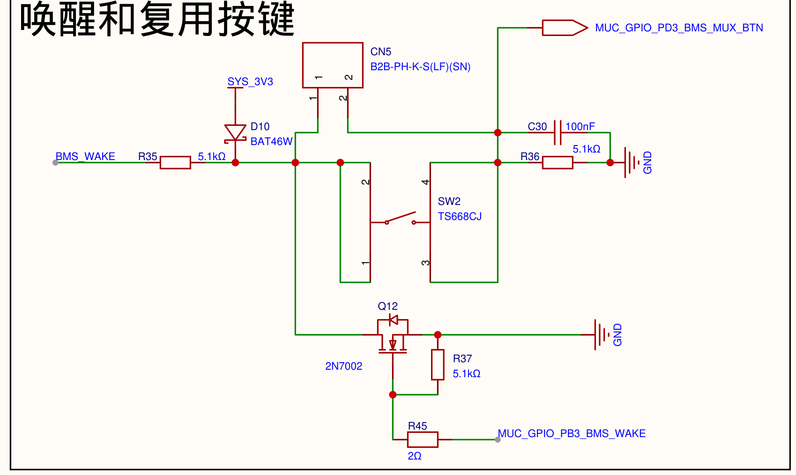{width=5.6}

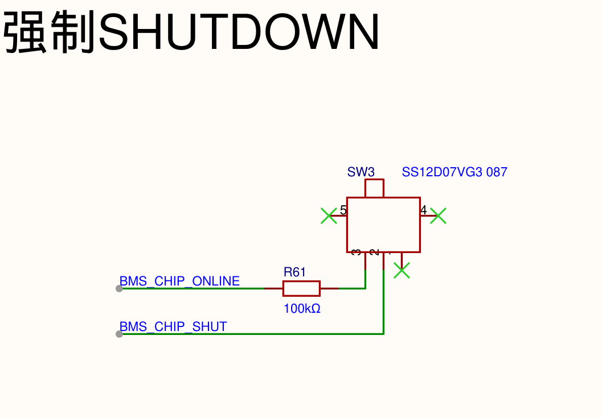{width=5.6}

网络可化简为：`BMS_WAKE --R35 5.1k-- Node A`；`SYS_3V3 --D10-- Node A`；Node A 经 SW2/CN5到 Node B(PD3)，Node B 由 R36 5.1kΩ和 C30 100nF下拉/滤波。PB3经 R45 2Ω驱动 Q12 gate，Q12 source接GND、drain接 Node A，gate另有 R37 5.1k下拉。证据：`official_chip_docs_files/full_netlist (5).csv:292-310,317-318`。

当 SYS_3V3 消失时，按键可把 BMS_WAKE 经 R35/R36拉低，形成 BQ 唤醒动作；若D10方向/封装与图面意图一致，主板运行后，D10向 Node A提供高电平，按键把该状态送到PD3。R36×C30只有约0.51ms，不能代替完整按键去抖。H01 p.1残留注释称“MCU检测BTN_LOW”，但当前主板PD3有下拉且运行时按下更像高电平，构成 **Conflict**；必须用万用表/示波器确认D10方向和按键极性。

Q12 是更高风险项：若D10方向如连接推断，SYS_3V3存在时让Q12导通可能形成 `SYS_3V3 → D10 → Q12 → GND`，路径中没有R35限流。固件当前未发现PB3专门安全时序说明。必须核对Q12实际pinout、D10方向、PB3复用和导通电流后才能使用主动唤醒。

### 8.3 强制 shutdown 的 RC 与阈值不确定性

SW3 经 R61 100kΩ把 `BMS_CHIP_ONLINE` 送到 `BMS_CHIP_SHUT`；BMS端 RST_SHUT 有 R42 470kΩ下拉和 C7 100nF。释放时名义时间常数约47ms；开关闭合时等效电阻 `100k||470k≈82.5kΩ`，上升时间常数约8.25ms，稳态电压约为 ONLINE 的 `470/(100+470)=82.5%`。证据：`official_chip_docs_files/full_netlist (5).csv:326-332`；`official_chip_docs_files/full_netlist (4).csv:246-247,296-297`。

ONLINE 实际来自 REG18，规格1.6-2.0V。RST_SHUT高门限为0.66×VREG18，低门限为0.33×VREG18；SW3闭合时82.5%分压在静态标称上高于高门限。RST_SHUT拉高会立即复位大部分数字逻辑，但不会立即改变保护FET/FUSE保持状态；持续高约1s后才进入SHUTDOWN并关闭外部保护FET。证据：`official_chip_docs_files/TI_BQ76952_Datasheet.pdf` pp.11,48。关机后仅电池供电时，ONLINE下降还会释放5V EN；若VBUS仍存在，另一条使能二极管可能继续维持MCU供电。由于当前REG18规定电容缺失，实际边沿和1s保持仍必须实测。

## 9. 辅助电源树：SYS_VIN、5V Buck 与 3.3V LDO

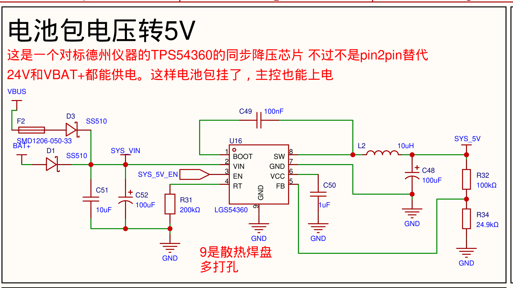{width=6.2}

### 9.1 两路辅助输入 OR

辅助电源路径为：

`VBUS → F2 500mA PPTC → D3 SS510 ─┐`

`原始 BAT+ → D1 SS510 ────────────┴→ SYS_VIN → U16 Buck`。

证据：控制板原理图 p.4；`official_chip_docs_files/full_netlist (5).csv:358-365,385-386`。这里的 `BAT+` 来自 BMS U26 pin7，是未经 BMS 主 MOS 保护的原始包正极辅助电源；它不是 Page1/Page2 的 `BMS+` 保护后充电/输出节点。若文档或线束把二者混用，BQ关断主MOS后主板仍可能通过原始BAT+获得辅助功率，且故障边界会被误判。

F2 与 F1 同为保持500mA、动作1A的PPTC。F2只限制VBUS到辅助电源树的电流；BAT+支路没有在Page4串同类PPTC，而是在Page3进入时经过F1。因此F1/F2均不能保护电池主输出。SS510 的正向压降、反向漏电和热耗依工作电流而变，当前缺器件温升和最差输入电压验证。

### 9.2 5V Buck 功率级与反馈

U16 LGS54360 的外围为：输入 C51 10µF+C52 100µF；BOOT C49 100nF；VCC C50 1µF；L2 10µH、额定1.6A、饱和2A；输出 C48 100µF；反馈 R32=100kΩ、R34=24.9kΩ。证据：`official_chip_docs_files/full_netlist (5).csv:335-357`。

反馈比例为 `1 + 100/24.9 = 5.016`。若输出实测目标为5.00V，则隐含基准约 `5/5.016 = 0.997V`。这只是由外围反推的 Inference；仓库未提供 LGS54360 官方数据手册，开关频率、反馈基准容差、补偿方式、UVLO、限流和热关断均为 **Unknown**。

如果3.3V域及5V外设合计消耗250mA，理想输出功率约1.25W；从21.9V电池在85%效率假设下输入约67mA。该估算不能代替效率曲线。L2的1.6A额定和2A饱和只说明磁件标称边界，不证明U16、二极管/同步管、PCB和电容纹波能力满足同样电流。

### 9.3 SYS_5V_EN 的二极管 OR 与保持逻辑

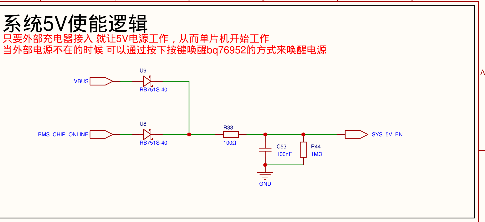{width=4.8}

VBUS 经 U9 RB751S-40、BMS_CHIP_ONLINE 经 U8 RB751S-40 做二极管 OR，再通过 R33 100Ω到 U16 EN；C53 100nF和 R44 1MΩ下拉。名义释放时间常数约 `1MΩ×100nF=0.1s`。证据：`official_chip_docs_files/full_netlist (5).csv:366-369,379-384`。

这使系统存在两种自举来源：适配器存在时由VBUS开启；仅电池时依赖BQ REG18/ONLINE开启。BQ shutdown 后仅电池供电会失去ONLINE并最终关闭MCU，而适配器仍在时VBUS可继续维持MCU。该结构支持“关BMS但保留适配器侧诊断”的可能性，也意味着“按下shutdown后MCU必定掉电”不是普遍事实。

ONLINE为1.6-2.0V且REG18负载能力有限。经RB751后送U16 EN的电压大致低于该值一个肖特基压降；U16 EN门限又因缺LGS54360数据手册而未知，因此电压裕量仍是 **Unknown**。应先补齐REG18规定的1.8-22µF电容，再在电池最低电压、高低温和最大5V负载下测REG18、二极管后节点与EN电平。BQ证据：`official_chip_docs_files/TI_BQ76952_Datasheet.pdf` pp.12-13；硬件缺失证据：`official_chip_docs_files/full_netlist (4).csv:25,285`。

### 9.4 3.3V LDO 与功耗

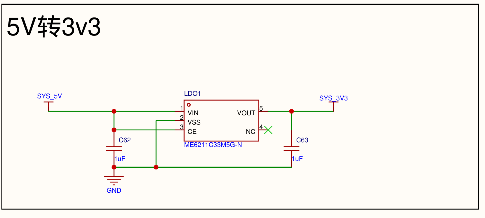{width=4.8}

LDO1 ME6211C33 由SYS_5V供电，CE直接接SYS_5V，输入和输出各1µF。证据：`official_chip_docs_files/full_netlist (5).csv:370-378`。线性压降功耗为 `(5.0-3.3)×I3V3`：50mA时约85mW，100mA时约170mW，200mA时约340mW。是否安全取决于封装热阻、铜面积、环境温度和OLED/MCU/CAN VIO等总电流。

当前网表无法证明1µF的介质、ESR及DC bias有效值满足ME6211稳定性要求；也没有电源良好信号、3.3V独立电压监控或复位监督器。MCU内部BOR/option bytes状态未提供，属于 **Unknown**。

## 10. STM32G0B1 最小系统、时钟、复位和调试

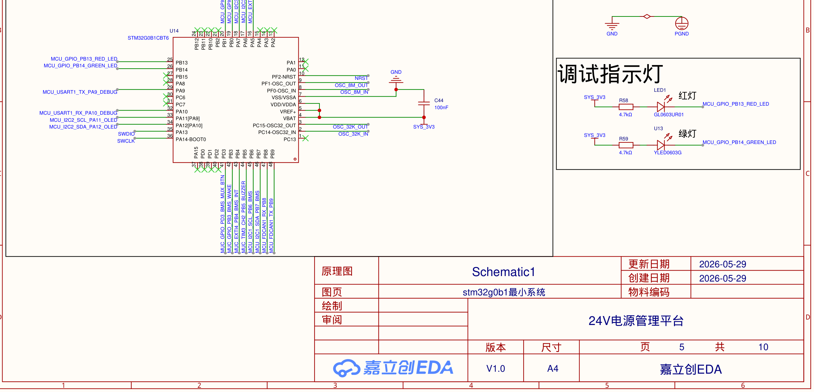{width=6.2}

### 10.1 MCU 电源与最小系统边界

U14 为 STM32G0B1CBT6、Cortex-M0+、LQFP48。当前网表只明确显示一只 C44 100nF 作为3.3V去耦；是否在PCB/BOM还有未导出的近端电容为 **Unknown**。证据：`official_chip_docs_files/full_netlist (5).csv:401-450`。对带FDCAN、两路硬件I2C、UART和多GPIO切换的MCU，仅凭一只100nF不能证明电源完整性通过，必须检查每个VDD/VSS焊盘、VDDA/VREF连接、去耦距离和地回路。

固件时钟由外部8MHz HSE经PLL `PLLN=16、PLLR=/2`得到64MHz SYSCLK；RTC使用32.768kHz LSE。证据：`bms24v_platform/bms24v_platform.ioc:223-249`；`bms24v_platform/Core/Src/main.c:140-183`。

### 10.2 引脚矩阵与当前软件所有权

| MCU引脚 | 原理图网络/硬件 | 固件配置 | 当前所有者/状态 | Evidence |
| --- | --- | --- | --- | --- |
| PF0/PF1 | X1 8MHz | HSE→PLL→64MHz | 系统时钟 | `official_chip_docs_files/full_netlist (5).csv:387-392`；`bms24v_platform/bms24v_platform.ioc:174-177,223-249` |
| PC14/PC15 | X2 32.768kHz | LSE→RTC | RTC仅初始化 | `official_chip_docs_files/full_netlist (5).csv:393-400`；`bms24v_platform/bms24v_platform.ioc:166-169,245-247` |
| PA5 | SC8815_INT | 普通输入，无上下拉 | 当前未读取/无EXTI | `official_chip_docs_files/full_netlist (5).csv:401-448`；`bms24v_platform/Core/Src/gpio.c:63-67` |
| PA6/PA7 | SC I2C3 SDA/SCL | 开漏上拉，GPIO bit-bang | `sc8815_task`；驱动默认交换线序 | `bms24v_platform/bms24v_platform.ioc:103-122`；`Int/Int_SC8815.c:37-70` |
| PB0/PB1 | PSTOP/#CE | 推挽上拉，初始高 | SC功率级停机/芯片使能 | `bms24v_platform/Core/Src/gpio.c:57-88` |
| PA9/PA10 | DEBUG TX/RX | USART1 115200 8N1 | CLI/printf | `bms24v_platform/bms24v_platform.ioc:90-92,123-125`；`bms24v_platform/Core/Src/usart.c:41-67` |
| PA11/PA12 | I2C2 SCL/SDA | AF6开漏，无内部上拉 | OLED+EEPROM | `bms24v_platform/bms24v_platform.ioc:93-98`；`bms24v_platform/Core/Src/i2c.c:155-183` |
| PB3 | BMS_WAKE/Q12 | GPIO输出用途未形成完整业务 | 高风险主动唤醒节点 | `official_chip_docs_files/full_netlist (5).csv:298-310` |
| PB4 | BQ ALERT | 上拉、下降沿EXTI | 有ISR分发，无应用回调 | `bms24v_platform/Core/Src/gpio.c:103-111`；`bms24v_platform/Core/Src/stm32g0xx_it.c:105-117` |
| PB5 | 蜂鸣器Q10 | TIM3_CH2，1kHz配置 | 未启动PWM | `bms24v_platform/bms24v_platform.ioc:154-155,260-265`；`bms24v_platform/Core/Src/tim.c:44-80` |
| PB6/PB7 | BQ I2C1 | AF6开漏，无内部上拉 | BQ76952 | `bms24v_platform/Core/Src/i2c.c:122-150` |
| PB8/PB9 | FDCAN RX/TX | AF3 | 仅启动/过滤，无业务收发 | `bms24v_platform/Core/Src/fdcan.c:89-102`；`Int/Int_CanFd.c:24-46` |
| PB13/PB14 | 红/绿LED | 推挽 | 低电平点亮 | `bms24v_platform/Core/Src/gpio.c:60-61,90-95`；`Int/Int_Led.c:5-18` |
| PA13/PA14 | SWDIO/SWCLK | 调试复用 | SWD；PA14也为BOOT0复用脚 | `bms24v_platform/bms24v_platform.ioc:99-102` |
| PD3 | 复用按键 | 普通输入，无上下拉 | 当前未读取/无去抖 | `bms24v_platform/bms24v_platform.ioc:170-173`；`bms24v_platform/Core/Src/gpio.c:97-101` |

PA6/PA7 的 `.ioc` 网络标签与 SC 驱动默认交换线序存在 **Conflict**；驱动会在ACK失败时自动切换。证据：`Int/Int_SC8815_BSP.h:13-18`；`Int/Int_SC8815.c:37-70,444-477`。自动切换能提高bring-up容错，但也会掩盖原理图/代码命名错误，量产应固定真实线序并在逻辑分析仪上确认。

### 10.3 晶体、负载电容与时钟风险

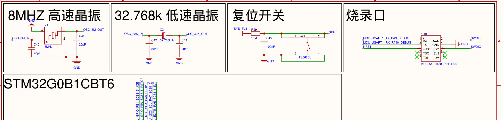{width=6.2}

X1 8MHz 两侧 C40/C41各20pF；X2 32.768kHz 两侧 C42/C43各20pF。证据：`official_chip_docs_files/full_netlist (5).csv:387-400`。晶体实际负载约由两电容串联等效再加寄生，即理想约10pF+寄生；是否匹配晶体CL需晶体料号和PCB寄生。LSE通常对负载和布局更敏感，当前没有起振时间、温漂和低温启动记录。

时钟初始化在GPIO之前执行，HSE或LSE失败会进入 `Error_Handler`；该处理只关全局中断并死循环，尚未设置SC/BQ/FET安全态。证据：`bms24v_platform/Core/Src/main.c:101-115,157-183,212-225`。如果时钟故障发生在 `MX_GPIO_Init` 前，SC的硬件上拉必须独立保证停机。

### 10.4 NRST、SWD/UART 调试与启动模式

NRST由R29 10kΩ上拉、C45 100nF到地、SW1按键下拉，名义RC约1ms。U19 2×5调试口引出SWD、NRST、UART和GND。证据：`official_chip_docs_files/full_netlist (5).csv:451-468`。PA14兼BOOT0复用，最终启动模式还受option bytes影响；仓库没有option-byte导出，BOR、BOOT锁定和读保护策略均为 **Unknown**。

### 10.5 LED 默认态与短暂闪亮

红/绿LED均为 `3.3V → 4.7kΩ → LED → MCU`，因此低电平点亮。Cube GPIO初始化先把PB13/PB14写低，随后 `Int_Led_Init` 写高关闭，启动阶段可能短暂双灯亮。证据：`official_chip_docs_files/full_netlist (5).csv:469-476`；`bms24v_platform/Core/Src/gpio.c:60-61,90-95`；`Int/Int_Led.c:5-18`。以红LED Vf≈2.4V估算电流约0.19mA；绿LED电流因Vf接近3.3V可能更低，亮度需实测。

## 11. CAN FD 物理层与终端

{width=5.8}

U15 TJA1051T/3 的VCC接5V、VIO接3.3V，S脚接GND，TXD/RXD接MCU PB9/PB8；VCC/VIO各有100nF去耦。CN2 pin1为GND、pin2 CANL、pin3 CANH；D7 PESD1CAN跨双线做ESD保护；R30 120Ω只有H1跳帽闭合时才跨CANH/CANL。证据：控制板原理图 p.6；`official_chip_docs_files/full_netlist (5).csv:477-498`。

硬件层支持高速CAN/CAN FD物理接口，但总线只有两个物理端点时才应在两端各启用一个120Ω；中间节点必须断开H1。线束阻抗、支线长度、共模接地、屏蔽和浪涌等级未提供。

固件把FDCAN1配置为Normal、FD无BRS、仲裁和数据段均约500kbit/s：`64MHz/8/(1+13+2)=500kbit/s`，采样点87.5%，SJW=2TQ。当前硬件过滤器只接收上位机查询ID `0x600`，并严格拒绝扩展帧、远程帧、经典CAN和BRS帧；`Int_CanFd` 提供轮询收发及控制器重启，`App_CanBms` 实现查询应答、每秒状态和低电/故障事件。证据：`bms24v_platform/Core/Src/fdcan.c:40-58`；`Int/Int_CanFd.c:83-227`；`App/App_CanBms.c:546-799`；`docs/protocol/bms_canfd_protocol.md`。

> [UNKNOWN] 软件协议和恢复策略已经定义，但 CAN FD 分析仪互通、无ACK、bus-off、掉线恢复、总线负载及故障注入仍未完成实板验证。

## 12. OLED、蜂鸣器与人机接口

### 12.1 OLED 与 I2C2 总线负载

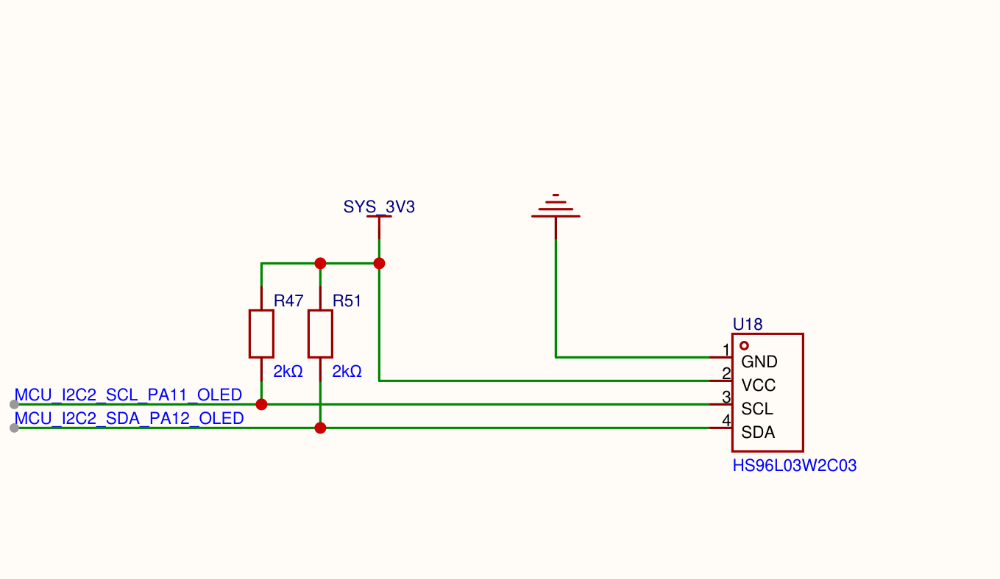{width=4.8}

U18 标注SSD1315、0.96英寸、128×64、I2C；R47/R51各2kΩ上拉到3.3V。与Page10 EEPROM共用I2C2。证据：`official_chip_docs_files/full_netlist (5).csv:499-502,514-517,526-535`。固件使用HAL地址0x78，即7-bit 0x3C；驱动注释兼容SSD1315/SSD1306，实际控制器丝印需确认。证据：`Int/Int_OLED.c:9-35`。

`Int_OLED_Refresh` 按8页执行，每页发送3个地址命令后再逐字节发送128个数据，共 `8×(3+128)=1048` 次独立HAL I2C发送。`App_OLED_Render` 状态变化时先Clear，而Clear内部已Refresh，随后再Refresh一次，所以一次重绘约2096笔事务。证据：`Int/Int_OLED.c:98-117`；`App/App_OLED.c:61-86`。在约100kHz总线上可能耗时数百毫秒，并位于同一 `batman_task` 周期的功率判断之前，需实测调度延迟。

### 12.2 无源蜂鸣器低侧驱动

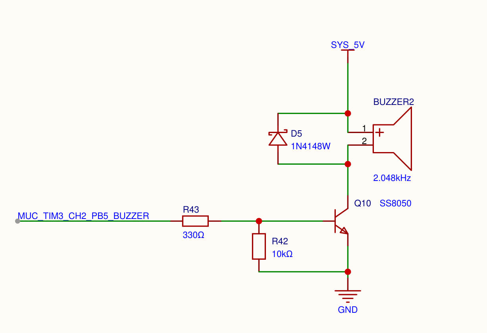{width=4.8}

BUZZER2 为5V无源电磁蜂鸣器，标称2.048kHz；Q10 SS8050低侧驱动，R43 330Ω限基极电流、R42 10kΩ下拉、D5 1N4148W提供感性续流。证据：`official_chip_docs_files/full_netlist (5).csv:503-513`。3.3V GPIO高、VBE按0.7V估算，基极电流约 `(3.3-0.7)/330=7.9mA`。

TIM3_CH2由64MHz定时器时钟、PSC=63、ARR=999配置为1kHz，初始CCR=0；仓库未发现 `HAL_TIM_PWM_Start` 或比较值更新，所以当前蜂鸣器未启动。证据：`bms24v_platform/Core/Src/tim.c:44-80,109-118`。1kHz配置与器件2.048kHz标称存在 **Conflict**；标称谐振点通常影响音量和效率，应改配置或用扫频实测确定。

## 13. EEPROM、双路输出与机械页

### 13.1 M24C64 EEPROM

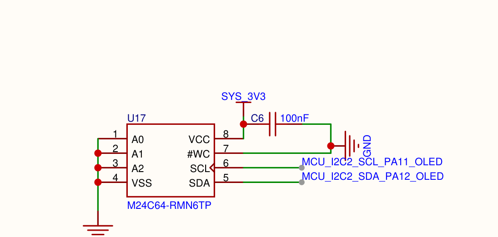{width=5.2}

U17 为 M24C64-RMN6TP，64Kbit即8KiB；A0/A1/A2接GND，#WC接GND，SDA/SCL接I2C2，C6 100nF去耦。标准地址推断为7-bit 0x50。证据：控制板原理图 p.10；`official_chip_docs_files/full_netlist (5).csv:526-535`。

固件目前只在启动时对HAL地址0xA0做最长约10ms ACK探测；没有读写、页大小、写周期等待、数据结构、磨损策略或CRC，且 `App_Main` 忽略探测返回值。证据：`Int/Int_EEPROM.c:5-24`；`Int/Int_EEPROM.h:10-11`；`App/App_Main.c:86-90`。#WC接地意味着硬件允许写入，不提供只读保护。

### 13.2 两个并联 VOUT 端口

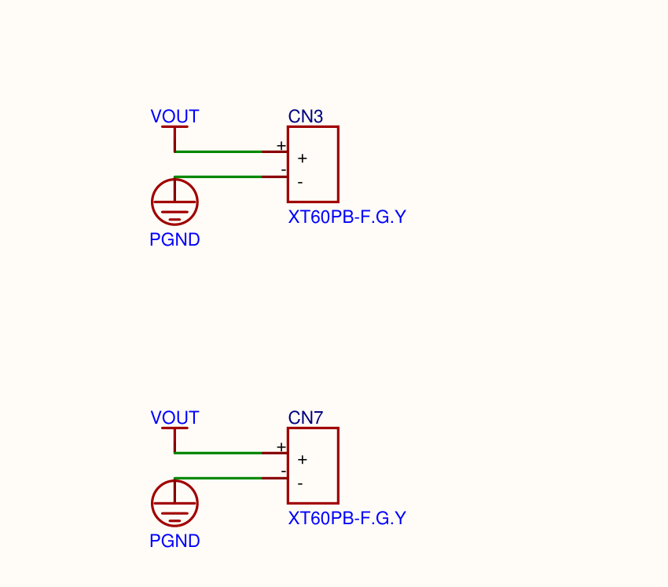{width=4.8}

Page9 的CN3/CN7均直接连接VOUT与GND，无独立保险、开关、分流或反灌隔离。证据：`official_chip_docs_files/full_netlist (5).csv:522-525`。两个端口可以并联分配负载，但也共享短路、插拔电弧和反向电源风险；禁止把其中一个口默认当“输入口”而不评估VOUT回灌路径。

### 13.3 Page8 机械定位

Page8只有U22-U25四个M3定位件，不承载电气网络。证据：控制板原理图 p.8；`official_chip_docs_files/full_netlist (5).csv:518-521`。螺丝孔是否接机壳地、保护地或铜皮，不能从网表证明；若使用金属支柱，必须检查与高压铜皮、功率地和外壳的爬电/短接关系。

## 14. Hardware-Software Interface Matrix

### 14.1 总线、地址、电气上拉与软件所有权

| 接口 | 物理引脚/外设 | 7-bit地址或速率 | 电气条件 | 软件所有权 | Evidence | Confidence | Human confirmation |
| --- | --- | --- | --- | --- | --- | --- | --- |
| BQ76952 I2C | PB6/PB7, I2C1 | 0x08；HAL地址0x10/0x11 | 2kΩ上拉、BMS端100Ω串联 | `batman_task`；CLI也可直调 | `Int/Int_BQ76952_BSP.h:10-23`；`Int/Int_BQ76952.c:268-452` | High | Needed，确认BQ Comm Type |
| SC8815 I2C | PA6/PA7 GPIO | 0x74；8-bit E8/E9 | 2kΩ上拉；逐事务全局关中断 | `sc8815_task`；CLI probe可直调 | `Int/Int_SC8815_BSP.h:10-18`；`Int/Int_SC8815.c:17-143,380-477` | High | Needed，确认线序/SCL |
| OLED I2C | PA11/PA12, I2C2 | 0x3C；HAL 0x78 | 2kΩ上拉 | `batman_task` | `Int/Int_OLED.c:9-35` | High | Needed，确认控制器 |
| EEPROM I2C | PA11/PA12, I2C2 | 0x50；HAL 0xA0 | 与OLED共总线 | 启动探测 | `Int/Int_EEPROM.c:5-24` | High | Needed，确认型号 |
| FDCAN | PB8/PB9 | 500kbit/s，FD无BRS | TJA1051T/3，可选120Ω | 只初始化过滤 | `bms24v_platform/bms24v_platform.ioc:5-23`；`Int/Int_CanFd.c:24-46` | High | Needed，协议Unknown |
| Debug UART | PA9/PA10 | 115200 8N1 | 无流控 | CLI/printf，RX单字节IRQ | `bms24v_platform/Core/Src/usart.c:41-67,97-112`；`App/App_DebugCli.c:52-55,599-624` | High | Not needed |

I2C1和I2C2均为硬件I2C、Timing=`0x10B17DB5`、analog filter开启、digital filter=0、无DMA/无I2C中断，使用阻塞轮询。证据：`bms24v_platform/Core/Src/i2c.c:30-115,117-187`。约100kHz为由时钟/Timing推断；必须用逻辑分析仪确认实际频率、上升时间、clock stretching和最坏线缆条件。

BQ当前默认non-CRC。驱动可以切换CRC帧格式，但该开关不会自动写BQ Comm Type；若单方面启用将导致通信失配。证据：`Int/Int_BQ76952.h:43-52`；`Int/Int_BQ76952.c:283-290`。

### 14.2 功率与告警 GPIO

| 信号 | MCU引脚 | 有效极性/默认态 | 硬件作用 | 当前软件行为 | Evidence | Confidence | Human confirmation |
| --- | --- | --- | --- | --- | --- | --- | --- |
| SC_PSTOP | PB0 | 高=停止；上电高 | 直接停SC功率环路 | standby保持高，充电最后拉低 | `bms24v_platform/Core/Src/gpio.c:57-81`；`Int/Int_SC8815.c:568-574` | High | Needed，示波确认上电/切换时序 |
| SC_CE_N | PB1 | 低有效；GPIO初始高 | SC芯片使能 | App初始化后低，PSTOP仍高 | `bms24v_platform/Core/Src/gpio.c:57-88`；`App/App_SC8815.c:69-82` | High | Needed，示波确认时序 |
| SC_INT | PA5 | 硬件10k上拉 | SC状态/中断 | 普通输入，未读取、无EXTI | `bms24v_platform/bms24v_platform.ioc:103-106`；`bms24v_platform/Core/Src/gpio.c:63-67` | High | Not needed（当前软件快照） |
| BQ_ALERT | PB4 | 下降沿EXTI，MCU内部上拉 | BQ告警 | 只有HAL分发，无应用回调 | `bms24v_platform/Core/Src/gpio.c:103-111`；`bms24v_platform/Core/Src/stm32g0xx_it.c:105-117` | High | Needed，运行时注入告警 |
| BMS_WAKE驱动 | PB3 | 取决于Q12/D10 | 主动下拉WAKE节点 | 完整业务路径Unknown | 控制板p.3；`official_chip_docs_files/full_netlist (5).csv:298-310` | Medium | Needed，核对D10方向与波形 |
| 复用按键 | PD3 | 外部5.1k下拉 | 运行时用户输入/掉电唤醒 | 普通输入但未读取 | `bms24v_platform/bms24v_platform.ioc:170-173`；`bms24v_platform/Core/Src/gpio.c:97-101` | High | Needed，确认有效电平 |
| 蜂鸣器 | PB5/TIM3_CH2 | PWM高驱动Q10 | 声音提示 | 1kHz配置但未启动 | `bms24v_platform/Core/Src/tim.c:44-80` | High | Needed，扫频并实听 |
| 红/绿LED | PB13/PB14 | 低点亮 | 状态指示 | GPIO阶段先低，App后拉高 | `bms24v_platform/Core/Src/gpio.c:60-61,90-95`；`Int/Int_Led.c:5-18` | High | Needed，观察启动瞬态 |

### 14.3 测量量的真实来源与软件命名

| 软件字段/物理量 | 真正硬件来源 | 换算/解释 | 不能声称的内容 | Evidence | Confidence | Human confirmation |
| --- | --- | --- | --- | --- | --- | --- |
| 6个单体电压 | BQ Cell1/2/6/9/12/16 | 稀疏映射到数组0…5 | 不是连续VC1…VC6 | `App/App_BatMan_Sample.c:81-137` | High | Needed，逐通道加压核对 |
| `stack_mv` | BQ STACK direct command | raw×10mV | — | `App/App_BatMan_Sample.c:139-154` | High | Needed，与DMM对比 |
| `pack_mv` | 当前直接复制`stack_mv` | 无独立采样 | 不是PACK pin实测 | 同上 | High | Not needed（当前软件快照） |
| `current_a` | BQ CC2+软件增益 | 当前按5mΩ、正充负放 | 未校准前不能代表0.5mΩ实物 | `App/App_BatMan_Sample.c:156-175` | High（代码）/ Low（实值） | Needed，四线测阻与双向标定 |
| `temp_cell_c` | TS1/TS3有效值平均 | 无效时回退内部温度 | 不能确定探头物理位置 | `App/App_BatMan_Sample.c:177-243` | High（代码）/ Low（物理位置） | Needed，核对探头位置并温箱标定 |
| `temp_fet_c` | 当前等于BQ内部温度 | 软件占位 | 不是R22/R23独立FET NTC | 同上 | High | Needed，闭环独立FET温度通道 |
| SC VBUS/VBAT | SC内部ADC | 12.5×比例 | VBATS硬件冲突未解时不可校准 | `Int/Int_SC8815_BSP.h:112-126`；`Int/Int_SC8815.c:652-792` | High（代码）/ Low（实值） | Needed，冻结分压并标定 |
| SC IBUS/IBAT | R5/R14 10mΩ | 6×比例 | 开尔文/零点未验证 | `Int/Int_SC8815.c:795-830` | High（代码）/ Medium（硬件） | Needed，零点与双向标定 |

## 15. 启动、RTOS/Concurrency Model 与故障时序

### 15.1 从复位向量到调度器

1. Startup装载SP、初始化`.data/.bss`并进入`SystemInit/main`。GCC证据：`bms24v_platform/gcc/startup_stm32g0b1xx_gcc.s:14-56,105-156`；Keil证据：`bms24v_platform/MDK-ARM/startup_stm32g0b1xx.s:53-123`。
2. `HAL_Init()`建立TIM14 HAL tick。
3. HSE与LSE启动，PLL将8MHz提升到64MHz；任一失败进入`Error_Handler`。
4. `MX_GPIO_Init`首先把SC SDA/SCL写高、PSTOP写高、CE_N写高；LED先写低。
5. RTC、FDCAN、I2C2、USART1、I2C1、TIM3依次初始化。
6. App层关闭LED、启动CAN、探测EEPROM、初始化OLED、将SC置于standby monitor、复位/配置BQ并最终关主FET、初始化Power和CLI。
7. 创建三个任务并启动FreeRTOS。

证据：`bms24v_platform/Core/Src/main.c:85-134`；`App/App_Main.c:76-124`。启动次序是安全分析的一部分：BQ主FET“全关”直到App层较晚才下发，时钟错误又发生在GPIO安全态之前。

### 15.2 任务、优先级、循环延时与外设所有权

| 任务/上下文 | 优先级 | 循环延时/触发 | 栈 | 主要职责/外设 | Evidence |
| --- | ---: | ---: | ---: | --- | --- |
| `batman_task` | 3 | 每轮末尾 `vTaskDelay(1000)`；实际周期>1000 tick | 768 words≈3072B | BQ I2C1、采样、估算、OLED、App_Power | `App/App_Main.c:18-40,115` |
| `sc8815_task` | 2 | 每轮末尾 `vTaskDelay(1000)`；实际周期>1000 tick | 512 words≈2048B | SC软件I2C、状态机、请求队列 | `App/App_Main.c:43-57,116` |
| `debug_cli_task` | 1 | 每轮末尾 `vTaskDelay(20)`；实际周期>20 tick | 512 words≈2048B | UART命令分发、危险bring-up命令 | `App/App_Main.c:60-73,117` |
| USART1 IRQ | NVIC 3 | 字节到达 | ISR | 单字节接收重装 | `bms24v_platform/Core/Src/usart.c:97-112`；`App/App_DebugCli.c:599-624` |
| EXTI4 | NVIC 3 | BQ ALERT下降沿 | ISR | 当前只HAL分发 | `bms24v_platform/Core/Src/stm32g0xx_it.c:105-117` |
| SysTick | kernel priority3 | 1kHz | ISR | FreeRTOS tick | `bms24v_platform/MDK-ARM/FreeRTOS/include/FreeRTOSConfig.h:19-30,55-59` |
| TIM14 | NVIC 3 | 1ms | ISR | HAL tick | `bms24v_platform/Core/Src/stm32g0xx_hal_timebase_tim.c:32-111` |

FreeRTOS为抢占式、1kHz tick、5个优先级、heap_4 32KiB、timer task关闭。三个任务都使用相对延时 `vTaskDelay` 而非绝对节拍 `vTaskDelayUntil`，所以实际循环周期=执行时间+延时并会相位漂移；“1000 tick”不能写成严格1s周期。三次`xTaskCreate`返回值均未检查，也没有stack overflow/malloc failed hook。证据：`bms24v_platform/MDK-ARM/FreeRTOS/include/FreeRTOSConfig.h:19-44`；`App/App_Main.c:31-73,110-124`。

### 15.3 数据新鲜度和跨任务关断延迟

`batman_task`在同一高优先级上下文内先采BQ，再刷新OLED，再执行`App_Power_Task`。低优先级任务不能在BQ快照到功率决策间抢占，但OLED重绘本身可能先阻塞数百毫秒。BatMan与SC任务均在每轮末尾相对延时1000 tick，实际周期各自等于执行时间+延时且会漂移；SC优先级更低，因此Power通常使用上一帧SC状态，而BQ数据是本轮新采样。精确相位和最大数据年龄需运行轨迹确认。证据：`App/App_Main.c:18-57,115-117`。

SC请求队列长度1、首次在SC任务中懒创建、使用overwrite。若Power或CLI请求停止/充电，实际PSTOP/GPO动作要等下一次SC任务；正常调度下是0到一次SC循环重访时间，而该循环为执行时间+1000 tick相对延时，再加高优先级阻塞、I2C和调度抖动，当前无实测硬上界。BQ FET命令则在BatMan任务内同步I2C发送且不等待SC停机确认。证据：`App/App_Main.c:43-57`；`App/App_SC8815.c:26-30,310-325,344-357`；`App/App_Power.c:55-93`。

> [RISK] 软件层没有把“SC能量级已停止”作为硬件握手再关闭BQ CHG/DSG。故障关断时序必须用电流探头同时观察SC电感电流、PSTOP、Q4 gate、BQ CHG/DSG gate和包电流。

### 15.4 共享总线、临界区与日志并发

项目开启FreeRTOS mutex能力，但未发现I2C/UART互斥。CLI可以直接操作BQ PDSG或SC probe；高优先级任务可能在低优先级HAL I2C调用期间抢占，HAL锁可能返回BUSY并触发瞬时通信故障。证据：`bms24v_platform/MDK-ARM/FreeRTOS/include/FreeRTOSConfig.h:31-33`；`App/App_DebugCli.c:236-324,424-452`；`Int/Int_BQ76952.c:312-445`。

> [RISK] HAL `USE_RTOS=0U` 与应用运行 FreeRTOS 可以同时成立，不构成来源 Conflict。该配置不会为共享 HAL 外设自动建立 RTOS 互斥；结合 CLI 可直接调用 BQ/SC 接口的代码，当前审计结论是“跨任务外设所有权与互斥尚未闭环”。证据：`bms24v_platform/Core/Inc/stm32g0xx_hal_conf.h:180`；`App/App_Main.c:110-124`；`App/App_DebugCli.c:236-324,424-452`；`Int/Int_BQ76952.c:312-445`。Confidence：High。Human confirmation：Needed，需用运行时调用轨迹复核所有权与锁覆盖。

SC GPIO-I2C每笔事务保存PRIMASK并全局关中断，会推迟SysTick、TIM14和UART RX；最长关中断时间未标定。证据：`Int/Int_SC8815.c:17-28,380-441`。多个任务使用blocking `printf`，UART TX返回值被忽略且没有日志mutex，输出可能交错或在HAL_BUSY时丢失。证据：`bms24v_platform/Core/Src/retarget.c:33-53`；`App/App_Main.c:84-120`；`App/App_SC8815.c:236-252`；`App/App_Power.c:184-215`。

### 15.5 Error_Handler、HardFault 与看门狗缺口

`Error_Handler`只关全局中断并死循环；NMI/HardFault同样死循环，没有主动把PSTOP/CE_N/Q12等GPIO置安全态。若HSE/LSE失败，甚至发生在GPIO初始化之前。证据：`bms24v_platform/Core/Src/main.c:101-115,157-183,212-225`；`bms24v_platform/Core/Src/stm32g0xx_it.c:68-96`。

工程未启用IWDG/WWDG，没有复位原因记录、任务看门狗或brownout业务处理。证据：`bms24v_platform/bms24v_platform.ioc:34-43`；`bms24v_platform/Core/Inc/stm32g0xx_hal_conf.h:48,60`；App/Int/Core无相关调用。Option Bytes/BOR设置为 **Unknown**。

## 16. BQ76952/SC8815 软件配置基线与安全语义

### 16.1 BQ通信事务与初始化序列

BQ direct command单笔超时100ms、direct最大34字节；subcommand/Data Memory transfer最大32字节，检查echo、长度、反码和；ConfigUpdate最多轮询100×1ms。证据：`Int/Int_BQ76952.c:9-18,59-201,227-265,551-611`。

初始化顺序为：

1. 复位App状态并选择non-CRC。
2. 发送BQ RESET，忙等约200ms。
3. 读取Device Number；当前只检查通信成功，没有比对预期器件号。
4. 进入ConfigUpdate，逐项写Data Memory。
5. 读取Power Config只用于打印，不做全量配置回读。
6. 退出ConfigUpdate、禁用Sleep、清启动类Alarm。
7. 发送CHG/DSG/PCHG/PDSG全关，再做首帧采样。

证据：`App/App_BatMan.c:209-366`。

> [UNKNOWN] 从BQ复位到`App_BatMan_KeepMainFetsOff()`之间，主FET状态取决于BQ ROM/OTP/已有Data Memory；MCU没有更早的直接gate安全GPIO。必须在冷启动、棕断、看门狗复位和I2C失败条件下测四个FET gate。

### 16.2 BQ Data Memory 写入表

| 地址/组 | 写值 | 当前设计意图 | 审计结论 | Evidence |
| --- | ---: | --- | --- | --- |
| DA Configuration `0x9303` | `0x05` | ADC/温度基线 | 原始值Fact；各bit需TRM复核 | `Int/Int_BQ76952_BSP.h:181`；`App/App_BatMan_Config.c:185-190` |
| VCELL_MODE `0x9304` | `0x8923` | Cell1/2/6/9/12/16 | 与硬件一致 | 同上；硬件`official_chip_docs_files/full_netlist (4).csv:2-17` |
| CC/Capacity Gain `0x91A8/0x91AC` | `0x3FBF67F5/0x48D9C710` | 按5mΩ标定 | 与0.5mΩ硬件Critical Conflict | `App/App_BatMan_Config.c:35-37,193-203` |
| Protection Configuration `0x925F` | `0x0002` | 保护框架 | 需TRM确认bit语义 | `Int/Int_BQ76952_BSP.h:151`；`App/App_BatMan_Config.c:209-210` |
| Enabled Protections A/B/C | `0xFC/0x30/0x00` | SCD/OCD2/OCD1/OCC/COV/CUV、OTD/OTC | COV启用但阈值未写 | `Int/Int_BQ76952_BSP.h:152-154,190-200`；`App/App_BatMan_Config.c:285-290` |
| CHG route A/B/C | `0x98/0xD5/0x56` | CHG保护路由 | 原始值Fact，逐bit需TRM | `Int/Int_BQ76952_BSP.h:155-157`；`App/App_BatMan_Config.c:291-296` |
| DSG route A/B/C | `0xE4/0xE6/0xE2` | DSG保护路由 | 同上 | `Int/Int_BQ76952_BSP.h:158-160`；`App/App_BatMan_Config.c:297-302` |
| Alarm mask | `0xF800` | 告警掩码 | ALERT无应用回调 | `Int/Int_BQ76952_BSP.h:161`；`App/App_BatMan_Config.c:211-212` |
| CUV threshold/delay/hys | 56/300/4 | 注释约2.83V/996.6ms/202mV | 需校准 | `Int/Int_BQ76952_BSP.h:162-164`；`App/App_BatMan_Config.c:213-218` |
| OCC threshold/delay/recovery | 15/127/`0xFF38` | 注释6A/426ms/-200mA | 依赖分流器，当前比例冲突 | `Int/Int_BQ76952_BSP.h:165-166,173`；`App/App_BatMan_Config.c:219-222,235-236` |
| OCD1 | 35/38 | 注释14A/300ms | 同上 | `Int/Int_BQ76952_BSP.h:167-168`；`App/App_BatMan_Config.c:223-226` |
| OCD2 | 89/22 | 注释15.2A/80ms | 同上 | `Int/Int_BQ76952_BSP.h:169-170`；`App/App_BatMan_Config.c:227-230` |
| SCD | `0x04/0x1C` | 注释80mV/400µs，5mΩ时约16A | 0.5mΩ下物理电流完全不同 | `Int/Int_BQ76952_BSP.h:171-172`；`App/App_BatMan_Config.c:231-234` |
| OTC | 50/3/45 | 50°C/3s/45°C恢复 | 需确认传感器映射 | `Int/Int_BQ76952_BSP.h:175-177`；`App/App_BatMan_Config.c:239-244` |
| OTD | 60/3/55 | 60°C/3s/55°C恢复 | 同上 | `Int/Int_BQ76952_BSP.h:178-180`；`App/App_BatMan_Config.c:245-250` |
| FET_OPTIONS | `0x3D` | FET_INIT_OFF、PDSG、host FET等 | 需TRM与波形 | `Int/Int_BQ76952_BSP.h:183,201-205`；`App/App_BatMan_Config.c:260-267` |
| Charge Pump | `0x01` | gate驱动基线 | 需Qg/波形验证 | `Int/Int_BQ76952_BSP.h:184`；`App/App_BatMan_Config.c:262-263` |
| PDSG | timeout250/stop delta0 | 注释约2.5s/禁delta停止 | R40脉冲热需验证 | `Int/Int_BQ76952_BSP.h:185-186`；`App/App_BatMan_Config.c:264-267` |
| Balancing config | `0x00` | 禁自主均衡、主机写mask | 与10s host策略一致 | `Int/Int_BQ76952_BSP.h:187`；`App/App_BatMan_Config.c:272-279` |

Data Memory是逐项写入，没有事务回滚和逐项读回校验；中途失败会留下部分新值。证据：`App/App_BatMan_Config.c:124-170,179-307`；`Int/Int_BQ76952.c:227-265,534-537`。固件在Enabled Protections A中启用COV，却没有写 `Protections:COV:Threshold`；因此实机COV阈值只能来自器件默认值、OTP或历史Data Memory，属于 **Unknown/Critical**，不能把软件4.20V门控当成BQ硬件COV阈值。证据：`App/App_BatMan_Config.c:18-23,285-290`；`official_chip_docs_files/TI_BQ76952_Technical_Reference_Manual_sluuby2b.pdf` pp.35,179。

### 16.3 BQ应用层阈值、FET与均衡策略

| 规则 | 当前值 | 软件动作 | Evidence |
| --- | --- | --- | --- |
| 电芯读数有效范围 | 2.5-4.3V | 超出使`cell_ok=false` | `App/App_BatMan.h:11-22` |
| 低压关放电/恢复 | 3.0V / 3.2V | 关闭/恢复DSG策略 | `App/App_Power.c:308-358,466-523` |
| 满充停止/恢复 | 4.20V / 4.18V | 停/重启SC充电 | 同上 |
| 充电温区 | 0-45°C | 区外禁止充电 | `App/App_Power.c:12-25,357-365` |
| SC充电包电流 | 固定请求3A | 0-15°C不降流；单体电流取决于并联数和均流 | `Int/Int_SC8815_BSP.h:24-28`；`App/App_SC8815.c:168-171`；`App/App_Power.c:22-23,316-317,474,483,495` |
| 放电温区 | -20-60°C | 区外禁止放电 | 同上 |
| 软件放电限流 | 12A | Power层门控 | 同上 |
| host均衡 | 10s；只选最高一串 | ≥3.9V、差≥40mV、0-45°C、IC<70°C启动；<3.85V或差≤20mV停止 | `App/App_BatMan_Estimator.c:222-305` |

软件`fault_active`包含通信故障、电芯范围异常和Safety Status A/B/C；PF Status和Alarm虽读取但未纳入总故障表达式。证据：`App/App_BatMan_Sample.c:251-344`。如果PF要求立即锁断，当前应用逻辑不完整。

`App_BatMan_SetMainFets()`对任一非“全关”目标先发送 `ALL_FETS_ON`，随后才以另一笔I2C事务写目标 `FET_CONTROL off_mask`。BQ TRM明确：`ALL_FETS_ON (0x0096)`会移除主机FET关断控制，并在没有其他阻断条件时重新允许FET；`FET_CONTROL (0x0097)`才逐只使能/禁用。底层每次成功发送subcommand后显式 `HAL_Delay(2ms)`，所以两命令之间至少存在约2ms等待，再叠加第二笔I2C事务。这些是 **Fact**。因此在后者生效前，所有未被保护、CFETOFF/DFETOFF或其他条件阻断的FET均可能导通，是有数据手册依据的 **Inference/Critical**；未知的只是各gate是否实际越过VGS阈值、窗口精确时长和包电流波形。证据：`App/App_BatMan_Config.c:74-117`；`Int/Int_BQ76952.c:15,455-470`；`official_chip_docs_files/TI_BQ76952_Technical_Reference_Manual_sluuby2b.pdf` p.32 §5.2.2、p.168 §13.3.6.1。

### 16.4 Power状态机的关键分支和旁路

`App_Power_Task`先处理`!cell_ok`，后处理`fault_active`。但`cell_ok=false`既可能是BQ离线，也可能是已经读到某节<2.5V或>4.3V；该分支在SC输入有效时会进入BQ_WAKE并请求SC功率级，而不是先进入FAULT。证据：`App/App_Power.c:308-315,439-456`；`App/App_BatMan_Sample.c:325-344`。这是“离线唤醒”和“电芯异常”语义混用的 **Critical Conflict**。

CLI `charge on` 可直接请求SC充电，不经过App_Power的BQ在线、电芯、电压和温度门控；CLI也可直接操作PDSG。这是bring-up入口，不是生产安全路径。更隐蔽的是，`App_Power_SetOutput()` 在目标三元组与缓存相同时会直接返回，而CLI绕过该缓存直接overwrite SC队列；所以下一轮Power即使仍判断“应停止充电”，也不保证重新发送stop，旁路可能持续到Power目标状态变化或缓存失效。代码路径是 **Fact**，持续带电后果为 **Inference/Critical**。证据：`App/App_DebugCli.c:10-15,236-324,474-482`；`App/App_Power.c:55-93,296-524`。

SCD由BQ硬件检测后，App在BatMan任务轮询中锁存；该轮询每轮执行后再延时1000 tick，实际周期>1s且未测。必须等BQ SCD位清除并执行CLI `fault clear` 才解除软件锁。证据：`App/App_Main.c:31-40`；`App/App_Power.c:262-272,367-374,457-465`；`App/App_DebugCli.c:411-423`。

### 16.5 SC8815寄存器守卫与状态机

SC软件I2C地址为0x74；当前驱动保存PRIMASK并全局关中断完成事务。固件假设IBUS/IBAT分流10mΩ、比例6×；`VBAT_SET=0x20`选择外部分压，`RATIO=0x24`选择6×电流和12.5×电压采样。证据：`Int/Int_SC8815_BSP.h:10-28,129-139`。

驱动禁止写VBUSREF 0x01-0x04，也禁止OTG/反向FB、关闭关键保护、短路折返、PFM等危险位；读回区和保留寄存器不可写。证据：`Int/Int_SC8815_BSP.h:31-54,151-158`；`Int/Int_SC8815.c:194-377`。这减少CLI误写风险，但也意味着VBUS参考行为依赖硬件/芯片默认，实际值为 **Unknown**。

状态解析包含AC_OK、INDET、VBUS_SHORT、OTP、EOC；App故障只包含通信失败、VBUS_SHORT、OTP，INDET/EOC不算故障，AC_OK单独作为充电器存在条件。证据：`Int/Int_SC8815.c:619-643`；`App/App_SC8815.c:195-228,360-377`；`App/App_Power.c:308-317`。

## 17. 设计计算与器件规格交叉校核

### 17.1 关键器件工作范围

| 器件 | 官方推荐/关键规格 | 本设计标称工作点 | 判定 | Evidence |
| --- | --- | --- | --- | --- |
| BQ76952 | BAT正常4.7-80V；3-16S；单节2-5V时25°C精度±5mV | 6S，标称21.9V、最高25.2V | 电压范围覆盖；精度仍需系统校准 | `official_chip_docs_files/TI_BQ76952_Datasheet.pdf` pp.1,9-10,64 |
| BQ SRP/SRN | 测量时差分/引脚推荐范围-0.2至0.2V | 0.5mΩ在100A时50mV | 输入范围覆盖；增益配置错误 | 同资料 pp.7,9；`official_chip_docs_files/full_netlist (4).csv:168-169` |
| BQ VC RC | 外部串阻20-100Ω，电容0.1-1µF | 串阻100Ω | 阻值在上限；完整电容拓扑/热插拔需核查 | `official_chip_docs_files/TI_BQ76952_Datasheet.pdf` p.9；`official_chip_docs_files/full_netlist (4).csv:2-49,140-153` |
| SC8815 | VBUS/VBAT推荐2.7-36V，绝对最大40V；L=2.2-10µH，应用建议2.2-4.7µH | 24V输入、最高25.2V电池、L=3.3µH | 标称覆盖；瞬态必须<40V | `official_chip_docs_files/Southchip_SC8815_Datasheet_User_Provided.pdf` pp.6-7,18 |
| SC分流 | RSNS1 10mΩ；RSNS2 5或10mΩ；1%低TCR | R5/R14均10mΩ/3W | 阻值匹配 | 同资料 p.18；`official_chip_docs_files/full_netlist (5).csv:167-170` |
| LM74800-Q1 | VS 3-65V；A推荐-60至65V；gate最大驱动约14.5V；RTN必须浮空 | 21.9/24/25.2V，100V外MOS | 标称覆盖；MOS VGS/SOA需完整手册 | `official_chip_docs_files/TI_LM7480_Q1_Datasheet.pdf` pp.3-6,24,32 |
| INR21700-50E | 3.65V/5Ah；5A列示条件为4.10V/节；0-15°C充电≤1A、15-45°C≤5A、45-55°C≤1A；放电15A | 只确认6S，nP Unknown；固件包充电3A、放电门控12A | 仅比较电流数值不足；须同时满足电压、Cell Surface Temperature、并联数与均流 | `official_chip_docs_files/《EVE INR21700 50E 规格书》RD-EVE INR21700-50E-S76-LF A版(1)(1)(1).pdf` 物理PDF pp.3-4 |

SC8815绝对最大40V不是正常工作裕量。Page1 D13 SMBJ28A在规定浪涌电流下的钳位电压可能高于40V；Page2 VOUT TVS SMCJ30A网表给出48.4V钳位。TVS存在并不能证明SC8815或后级始终不超过绝对最大值，必须把动态钳位、回路电感和器件位置纳入测试。

### 17.2 电池包电压、能量和电流边界

若且仅若本机为6S1P EVE 50E：

- 标称电压 `6×3.65=21.9V`。
- 标准满充 `6×4.20=25.2V`。
- 最低规格截止 `6×2.50=15.0V`；应用当前3.0V/节关闭放电对应18.0V。
- 典型能量 `21.9V×5Ah=109.5Wh`；最小容量能量按4.9Ah约107.3Wh。
- 软件12A放电约2.4C，低于单节15A/3C最大持续值；但并联数Unknown，系统连接器和热能力也未由此证明。
- 软件3A包充电在6S1P时约0.6C。规格书只明确列1A@4.20V、2.5A@4.15V、5A@4.10V；3A与25.2V组合没有直接规格支持，不能宣称合规。
- 在0-15°C，6S1P的3A与规格≤1A冲突；6S2P理想均流约1.5A/节仍冲突；n≥3平均值可能≤1A，但并联均流、温差和SC限流误差仍需验证。并联数n当前Unknown。

证据：`official_chip_docs_files/《EVE INR21700 50E 规格书》RD-EVE INR21700-50E-S76-LF A版(1)(1)(1).pdf` 物理PDF pp.3-4；`Int/Int_SC8815_BSP.h:24-28`；`App/App_SC8815.c:168-171`；`App/App_Power.c:12-25,316-317,357-365,474,483,495`。若电池为6SnP，容量和允许总电流理论随n变化，但连接条、单体均流、热梯度和熔断策略也随之变化，不能只乘n。

### 17.3 SC8815 外部 VBATS 目标电压

SC8815在`VBAT_SEL=1`时使用 `VBAT_target = VBATS_REF × (1 + Rup/Rdown)`，VBATS_REF最小/典型/最大为1.197/1.203/1.209V；CSEL/VCELL_SET在外部模式无效。这些参数是 **Fact**。证据：`official_chip_docs_files/Southchip_SC8815_Datasheet_User_Provided.pdf` pp.8,12,24。

| 分压方案 | 标称目标 | 工程意义 |
| --- | ---: | --- |
| 200kΩ/10kΩ | `1.203×21=25.263V` | 接近6×4.20V；与固件注释/人工确认一致 |
| 100kΩ/5.1kΩ | `1.203×(1+100/5.1)=24.790V` | 约4.132V/节；接近高倍率充电较低总压思路 |
| 0Ω/NC，且固件仍`VBAT_SEL=1` | VBATS直接等于包电压 | 20V级远高于1.2V参考，外部模式不成立 |
| 0Ω/0Ω | 短路 | 禁止上电 |

若实际装配200kΩ/10kΩ，名义目标25.263V是计算 **Inference**。再把VBATS_REF极限和两只电阻各±1%的最坏方向组合，目标约24.66-25.88V，即6S平均约4.11-4.31V/节；上界可超过4.20V/节。该范围也是容差 **Inference**，不包含温漂、焊盘漏电和校准误差。量产应使用更高精度电阻、校准或主动下调目标，并由明确配置且实测通过的BQ COV独立兜底。当前PDF的0Ω/NC、网表的0Ω/0Ω以及固件/人工确认的200kΩ/10kΩ互相冲突，属于 **Conflict/Critical**；在受控BOM、实板丝印和断电测阻三者闭环前，实际VBATS方案为 **Unknown**。

SC8815在电池达到目标98%时进入CV判定，EOC还要求选定的IBUS/IBAT低于限流的1/10或1/25；终止后跌到约95%重充。VBAT OVP典型约目标105.5%。证据：D03 pp.9,12-13。即使SC总压闭环正确，仍可能有某一串先过压，所以BQ单体COV必须独立、明确配置。

### 17.4 SC8815 电感峰值与功率级裕量

D03给出充电、`VBUS≤VBAT`时：

`IBUS = IBAT×VBAT/(VBUS×η)`

`IL_peak = IBUS + VBUS×(VBAT - VBUS×η)/(2×fsw×L×VBAT)`。

取 `VBUS=24V、VBAT=25.2V、η=90%、fsw=300kHz、L=3.3µH`：

| IBAT目标 | 理想IBUS | 纹波峰值增量 | IL_peak | 加20%设计裕量 | 与L1比较 |
| ---: | ---: | ---: | ---: | ---: | --- |
| 3A | 3.50A | 1.73A | 5.23A | 6.28A | 低于14A额定/22A饱和 |
| 5A | 5.83A | 1.73A | 7.56A | 9.08A | 同上，但热耗更高 |

公式与20%裕量建议见D03 p.18。该计算只覆盖24V附近、300kHz和90%假设；启动、输入下陷、模式切换、饱和电感下降和控制限流误差均可能提高峰值。SC限流规格本身在充电模式给出约±10%误差，证据：D03 pp.9-10。

四只8.5mΩ MOS在不同buck/boost状态下的导通占空比不同，不能简单把四只全串联。仅作上限感知：若某时刻两只串联承载5.23A，其标称导通损耗约 `5.23²×(2×8.5mΩ)=0.465W`，未计开关损耗；300kHz下Qg/Ciss、gate电阻、dead-time和snubber会决定额外损耗。

### 17.5 LM74800 门限、公差和切换窗口

LM74800 EN/UVLO上升/下降阈值典型1.231/1.132V，OV上升/下降阈值典型1.231/1.130V；上升阈值范围1.195-1.267V、下降阈值范围1.091-1.159V。按Section 7的分压：

| 门限 | 标称上升 | 上升最坏范围 | 标称下降 | 下降最坏范围 | 作用 |
| --- | ---: | ---: | ---: | ---: | --- |
| U2 UVLO | 20.93V | 19.94-21.95V | 19.24V | 18.20-20.08V | 适配器路使能/退出 |
| U2 OV | 29.79V | 28.37-31.25V | 27.35V | 约25.90-28.59V | 适配器过压切断/恢复 |
| U3 BMS+ UVLO | 18.47V | 17.59-19.37V | 16.98V | 16.06-17.72V | 电池路使能/退出 |
| U3的24V_IN交叉OV | 22.40V | 21.34-23.50V | 20.57V | 19.49-21.50V | 适配器出现时关电池HGATE |

证据：`official_chip_docs_files/TI_LM7480_Q1_Datasheet.pdf` pp.5,16；`official_chip_docs_files/full_netlist (5).csv:201-250,239-266`。10nF C32/C33分别与EN分压的Thévenin电阻形成约93/94µs名义滤波；内部SW电阻10-46Ω相比172kΩ很小，但输入漏电、PCB污染和高阻分压仍增加误差。上升最坏角允许约0.61V缺口，下降最坏角允许约0.59V缺口；因此典型重叠与最坏缺口并存。两者来自同一规格公差，不是来源冲突；正确分类为 **Risk/High + 动态结果Unknown**。

LM74800典型把理想二极管正向压差调节在10.5mV，A-C达到约-4.5mV时快速关DGATE，典型关断延迟0.5µs；反向到正向门限约177mV、开通延迟2.8µs。证据：D04 pp.6,14。实际反向电流峰值约受MOS RDS(on)、总门电荷、线缆电感和输出电容决定，不能只用0.5µs宣称“零毛刺”。

### 17.6 LM74800 电荷泵和外MOS选择

LM资料要求VCAP/CAP电容至少0.1µF，并建议 `CCAP(µF) ≥ 10×(CISS_Q1+CISS_Q2)(µF)`；本板C34/C35各100nF只满足绝对最小值。由于缺HB10N200S完整CISS/Qg数据，是否满足“总输入电容10倍”建议为 **Unknown**。证据：`official_chip_docs_files/TI_LM7480_Q1_Datasheet.pdf` pp.23-24；`official_chip_docs_files/full_netlist (5).csv:259-262`。

LM最大HGATE-OUT约14.5V，官方要求外MOS VGS额定至少15V并核查VDS、ID、body diode和SOA。当前网表只给100V VDS、45A和14mΩ，没有VGS(max)、Qg/CISS、SOA、热阻与雪崩能量；因此HB10N200S是否满足门极、电荷泵、浪涌和热可靠性要求均为 **Unknown**。证据：`official_chip_docs_files/TI_LM7480_Q1_Datasheet.pdf` p.24；`official_chip_docs_files/full_netlist (5).csv:227-238`。

### 17.7 BMS分流、保护电流和10倍错误传播

BQ测量时SRP-SRN推荐范围±0.2V。用0.5mΩ实物，对应理论±400A输入范围；用5mΩ假设则对应±40A。更重要的是保护阈值以分流电压为本质：例如80mV SCD在5mΩ下是16A，在0.5mΩ下是160A。当前固件注释写16A；若实物确为当前PDF/网表的0.5mΩ，固定压降比较器对应的实际安培阈值约放大10倍，而按5mΩ标定的测量电流/库仑量约低报10倍，两种方向必须区分。

OCC/OCD1/OCD2所有“安培值”同样按比例变化；必须从最终Rshunt重新计算Data Memory、CC Gain、Capacity Gain、软件电流缩放和测试注入值，不能只修显示倍率。

### 17.8 主MOS、理想二极管MOS与分流器热损耗

| 元件路径 | 标称等效电阻 | 10A | 15A | 50A | 说明 |
| --- | ---: | ---: | ---: | ---: | --- |
| BMS四主MOS（两并联组串联） | 14mΩ | 1.4W | 3.15W | 35W | 25°C/10V gate理想值 |
| 单路LM74800两MOS串联 | 28mΩ | 2.8W | 6.3W | 70W | 每路不是并联组 |
| BMS R18 | 0.5mΩ | 0.05W | 0.113W | 1.25W | 100A时5W |
| SC R5或R14 | 10mΩ | 1.0W | 2.25W | 不适用 | 3W标称需热降额 |

在6S1P电芯最大15A假设下，BMS主MOS约3.15W、通过某一路LM MOS再约6.3W，合计约9.45W且不含连接器、铜箔和温升后RDS(on)；这已经需要明确散热路径。若是多并电芯，硬件电流能力必须从热模型和实测重新确定。

### 17.9 预放电RC与外部电容量

若预充电阻R40=100Ω、外部VOUT总电容只计主板C54+C55=440µF，名义时间常数 `τ=44ms`，约5τ=220ms可到99.3%；初始电流252mA、初始功耗6.35W。若外接机器人驱动器还有数mF电容，时间按总C线性增加。BQ当前PDSG timeout注释约2.5s，对100Ω可支持的理想总电容上限（5τ内完成）约 `2.5/(5×100)=5mF`，但实际切换判据、负载并联和R40脉冲曲线会降低裕量。

### 17.10 均衡时间与热量

67.7mA主均衡电流下，消除100mAh差异理想需1.48h，消除500mAh约7.39h；每路62Ω电阻在4.2V约0.284W。若六路同时工作，总泄放约1.70W，另加MOS/LED/BQ内部热。但当前软件只选最高一节，通常不会六路同时开；BQ内部单路最大均衡电流规格为100mA，外部方案仍需确认流经VC引脚的实际分配。BQ证据：`official_chip_docs_files/TI_BQ76952_Datasheet.pdf` pp.8,18,63-64。

### 17.11 RC、逻辑阈值与接口电流汇总

| 网络 | 计算 | 结果 | 用途/限制 |
| --- | --- | ---: | --- |
| Q3输入软启动 | `(100k\|\|100k)×10µF` | 0.5s | 仅一阶估算，受TVS/MOS影响 |
| BMS按键滤波 | `5.1k×100nF` | 0.51ms | 不能替代软件去抖 |
| RST_SHUT释放 | `470k×100nF` | 47ms | 持续高1s才进入SHUTDOWN |
| RST_SHUT闭合上升 | `(100k\|\|470k)×100nF` | 8.25ms | 稳态约0.825×REG18 |
| 5V EN释放 | `1M×100nF` | 0.1s | 二极管/EN漏电会改变 |
| NRST | `10k×100nF` | 1ms | 外部复位滤波 |
| BQ I2C上拉电流 | `3.3V/2k` | 1.65mA | 另有100Ω串联 |
| ALERT上拉电流 | `3.3V/10k` | 0.33mA | BQ开漏负载 |
| 蜂鸣器基极 | `(3.3-0.7)/330` | 7.9mA | 需核对GPIO总电流 |

## 18. FMEA 与首板 Bring-up 验证矩阵

### 18.1 风险分级规则

本节不是已完成测试记录，而是由电路证据推导出的验证计划。`Critical`表示在确认前可能导致电芯过充、主功率短路、不可控大电流或用户未预期的带电状态；`High`表示可能损坏板卡、丢失保护或产生系统级失效；`Medium`主要影响功能、诊断或可靠性。任何需要接电芯或大功率电源的测试都应使用隔离/限流电源、保险丝、急停、护目面罩和远程温度监控。

### 18.2 FMEA

| ID | 失效模式 | 可能后果 | 现有硬件/软件控制 | 当前证据 | 风险 | 必须验证/改进 |
| --- | --- | --- | --- | --- | --- | --- |
| F01 | BQ当前PDF/网表R18=0.5mΩ而软件按5mΩ | 测量/库仑量约低报10倍；固定压降保护对应安培阈值约放大10倍 | 保护比较器仍动作，但安培含义错误 | `official_chip_docs_files/SCH_机器人BMS板_2026-06-17.pdf` p.1；`official_chip_docs_files/full_netlist (4).csv:168-169`；`App/App_BatMan_Config.c:35-37` | Critical | 实物四线测阻、重算增益/阈值、双向注入校准 |
| F02 | SC VBATS R17/R18双0Ω | BMS+硬短路到GND | 无可证明上游快速限流 | `official_chip_docs_files/full_netlist (5).csv:188-191` | Critical | 禁止上电；断电阻值和AOI确认 |
| F03 | SC硬件直连VBATS但软件外部分压 | 立即误判总压/无法充电或异常闭环 | BQ单体保护理论兜底 | `official_chip_docs_files/SCH_Schematic1_2026-06-17.pdf` p.1；`Int/Int_SC8815_BSP.h:129-139` | Critical | 固件模式、分压BOM和目标电压三方锁定 |
| F04 | BQ REG18缺1.8-22µF规定电容且外引ONLINE | REG18不稳、ONLINE/唤醒/关机/5V EN异常 | 无 | `official_chip_docs_files/TI_BQ76952_Datasheet.pdf` pp.5,12-13；`official_chip_docs_files/full_netlist (4).csv:25,285`；`official_chip_docs_files/full_netlist (5).csv:319,331-332,379-384` | Critical | 补电容/ECN、TI确认外引用法、测启动/负载/温度 |
| F05 | BMS主功率无熔断器、FUSE pin悬空 | MOS击穿后电池短路无法最终隔离 | BQ电子保护、未知外部熔断器 | `official_chip_docs_files/SCH_机器人BMS板_2026-06-17.pdf` p.1；`official_chip_docs_files/full_netlist (4).csv:39,302-313` | Critical | 明确主熔断器/二级保护与分断能力 |
| F06 | 若D10方向/封装与图面意图一致，Q12在3.3V存在时导通会下拉该节点 | 可能形成3.3V到GND低阻过流 | 固件时序、D10方向和Q12 pinout均Unknown | `official_chip_docs_files/SCH_Schematic1_2026-06-17.pdf` p.3；`official_chip_docs_files/full_netlist (5).csv:298-310` | Critical design risk / Unknown | 核pinout/二极管方向；限流测PB3动作 |
| F07 | `!cell_ok`把离线和越界混用 | 异常电芯时反而请求SC唤醒/充电 | 后续fault分支太晚 | `App/App_Power.c:308-315,439-456` | Critical | 分离offline/invalid/fault状态并做单元测试 |
| F08 | CLI `charge on`绕过安全门控并绕开Power输出缓存 | 人工命令可在温度/电压异常时启动功率级，下一轮Power不保证自动重发stop | SC仍检查通信、VBUS_SHORT、OTP并保留芯片保护；BQ硬件保护可能兜底，但这些不能替代Power的电芯/温度/电压门控；相同目标缓存还可能抑制纠正请求 | `App/App_DebugCli.c:474-482`；`App/App_Power.c:55-93`；`App/App_SC8815.c:111-160`；`Int/Int_SC8815.c:194-377` | Critical | 生产版移除CLI危险命令或增加不可旁路的硬门控/认证 |
| F09 | BQ初始化前FET状态依赖OTP/历史DM | 冷启动可能短暂导通 | App较晚发全关 | `App/App_BatMan.c:209-354` | Critical | 冷启动/复位/棕断四gate波形，冻结OTP |
| F10 | 非全关目标先发ALL_FETS_ON，再隔≥约2ms发FET_CONTROL | 前者已可证会重新允许所有未被其他条件阻断的FET；选择性关闭前存在导通窗口 | 保护/CFETOFF/DFETOFF可能阻断；实际gate是否越阈Unknown | `App/App_BatMan_Config.c:74-117`；`Int/Int_BQ76952.c:15,455-470`；`official_chip_docs_files/TI_BQ76952_Technical_Reference_Manual_sluuby2b.pdf` p.32 §5.2.2 | Critical | 改为无“先全允许”中间态；示波四gate/VGS与包电流 |
| F11 | COV启用但阈值未写 | 过压阈值取决于默认/历史DM | 软件4.20V门控只在BatMan轮询，实际循环>1000 tick | `App/App_BatMan_Config.c:18-23,209-250,285-290`；`App/App_Main.c:31-40` | Critical | 明确写入并读回COV；注入验证 |
| F12 | SC停机仅通过周期任务队列 | 正常调度0到一次“执行+1000 tick延时”的循环重访，另有阻塞/抖动且无实测硬上界；BQ gate可能先变 | SC short/OTP硬件保护可更早，但不是软件握手 | `App/App_Main.c:43-57`；`App/App_SC8815.c:310-325,344-357`；`App/App_Power.c:55-93` | High | 加立即GPIO停机/握手；同测PSTOP、GPO、Q4 gate、SW、电感电流和BQ gate |
| F13 | 清GPO失败返回值丢弃 | Q4继续导通，VBUS仍加到SC | PSTOP高可停开关 | `App/App_SC8815.c:69-81` | High | 检查返回、硬件gate默认关、故障测量 |
| F14 | SC软件I2C全局关中断 | 丢UART字节、tick抖动、保护响应延迟 | 事务较短但未标定 | `Int/Int_SC8815.c:17-28,380-441` | High | 测最长关中断，改定时器/硬I2C或分段临界区 |
| F15 | BQ ALERT无应用回调 | 告警依赖BatMan轮询，实际循环>1000 tick且未测 | BQ硬件保护仍可自主 | `bms24v_platform/Core/Src/stm32g0xx_it.c:105-117`；`App/App_Main.c:31-40` | High | ISR只置位/通知任务，测报警延迟 |
| F16 | U26无GND且跨0.5mΩ分流 | 大电流地偏移导致I2C/告警误码 | 2k上拉、100Ω串联 | `official_chip_docs_files/full_netlist (4).csv:285-301`；`official_chip_docs_files/full_netlist (5).csv:290-325` | High | 大电流/浪涌下差分测两板VSS与总线 |
| F17 | 主MOS热能力不足或并联失衡 | 过热、热失控、击穿短路 | BQ温度策略，但FET温度未独立采样 | `official_chip_docs_files/full_netlist (4).csv:302-313` | Critical | 双脉冲/稳态热像、四管电流与结温估算 |
| F18 | R40预充持续工作 | 2W电阻承受>6W初始/短路 | PDSG timeout约2.5s | `official_chip_docs_files/full_netlist (4).csv:264-268` | High | 预充容量上限、脉冲曲线、失败锁止 |
| F19 | LM两只TVS并联不均流 | 单只过载失效，VOUT过压 | 两只同型号 | `official_chip_docs_files/full_netlist (5).csv:278-281` | High | 单只额定核算或浪涌电流分配测量 |
| F20 | LM CAP仅100nF，10×CISS建议无法核验 | gate泵能量不足、开关慢/发热 | 满足0.1µF最小 | `official_chip_docs_files/TI_LM7480_Q1_Datasheet.pdf` pp.23-24；`official_chip_docs_files/full_netlist (5).csv:259-262` | High | 获取MOS CISS/Qg并重算；测gate启动 |
| F21 | LM典型门限重叠但公差角允许约0.6V缺口 | VOUT掉电/毛刺；近等压反灌与争流 | ideal diode与交叉OV | `official_chip_docs_files/TI_LM7480_Q1_Datasheet.pdf` p.5；`official_chip_docs_files/full_netlist (5).csv:201-250,239-266` | High | 全公差扫压/蒙卡；四顺序、U2过压、近等压和满载示波 |
| F22 | SC COMP C39装配冲突 | 环路相位裕量变化、振荡 | Unknown | PDF NC vs `official_chip_docs_files/full_netlist (5).csv:120-121` | High | 锁BOM；Bode/负载阶跃/模式切换 |
| F23 | SC MOS/TVS瞬态超过40V | SC永久损坏 | D13/电容/snubber | `official_chip_docs_files/Southchip_SC8815_Datasheet_User_Provided.pdf` p.6；`official_chip_docs_files/SCH_Schematic1_2026-06-17.pdf` p.1 | Critical | 差分探头测SW/输入；浪涌和插拔测试 |
| F24 | 5V EN由1.6-2.0V REG18经二极管驱动 | 低温/低压时5V反复启停 | 0.1s RC | `official_chip_docs_files/TI_BQ76952_Datasheet.pdf` pp.12-13；U16手册缺失 | High | 获取U16门限；全角落测EN裕量 |
| F25 | LDO/MCU去耦不足 | 复位、I2C/CAN误码 | 一只明确100nF+LDO各1µF | `official_chip_docs_files/full_netlist (5).csv:370-378,449-450` | High | PCB去耦审计；负载阶跃/电源纹波 |
| F26 | Error_Handler/HardFault不置安全GPIO | 软件崩溃时保持危险输出 | 硬件上拉PSTOP/#CE | `bms24v_platform/Core/Src/main.c:212-225` | Critical | 故障钩子、独立看门狗、硬件fail-safe测试 |
| F27 | 无IWDG/任务看门狗 | 任务死锁不恢复 | 无 | `bms24v_platform/bms24v_platform.ioc:34-43` | High | 加IWDG与任务心跳；故障注入 |
| F28 | OLED状态变化触发整屏重绘时，约2096笔I2C事务位于Power之前 | 功率决策延迟、界面卡顿 | 同任务串行 | `Int/Int_OLED.c:98-117`; `App/App_OLED.c:61-86` | Medium/High | 批量发送/DMA；测最坏任务周期 |
| F29 | 蜂鸣器1kHz且未启动 | 无故障声提示/音量低 | LED/串口仍可诊断 | `bms24v_platform/Core/Src/tim.c:44-80` | Medium | 2.048kHz扫频、启动API和自检 |
| F30 | CAN只有物理层无业务/恢复 | 上位机无法获故障或控制 | 收发器/终端已预留 | `Int/Int_CanFd.c:24-46` | Medium/High | 定义ICD、bus-off恢复、超时与安全权限 |
| F31 | 0-15°C不降低3A包充电请求，且并联数/均流Unknown | 6S1P/2P时理论单体>1A；n≥3仍可能因失配超限 | 当前只有0-45°C允许/禁止门控 | EVE规格物理PDF pp.3-4；`Int/Int_SC8815_BSP.h:24-28`；`App/App_Power.c:22-23,316-317,474,483,495` | Critical conditional | 冻结n；按Cell Surface Temperature分段限流并做均流/温箱验证 |

### 18.3 首次上电前：完全断电检查

| 步骤 | 工具/连接 | 操作 | 通过条件 | 重点证据 |
| ---: | --- | --- | --- | --- |
| 1 | 显微镜/AOI/BOM | 核对R18(BMS分流)、R17/R18(SC VBATS)、C39、D3、REG18电容 | 与冻结BOM一致；无双0Ω短路 | Conflicts F01-F04/F22 |
| 2 | 四线毫欧计 | 测BMS R18及主MOS路径冷态电阻 | R18与固件标定一致；记录温度 | `official_chip_docs_files/full_netlist (4).csv:168-169` |
| 3 | DMM电阻档 | 测BMS+到GND、24V_IN到GND、VOUT到GND、各电源轨到地 | 无低阻异常；电容充电趋势合理 | 两份网表 |
| 4 | DMM二极管档 | 核Q3/Q4、D2、D10、D1/D3、TVS极性 | 与原理图方向一致 | H03 pp.1-4 |
| 5 | 连通测试 | CN2逐针到VC电阻/BQ pin；U26两端逐针 | 无错序/短路；线束含正确主地路径 | Section 5.1/8.1 |
| 6 | LCR/示波器可选 | 核SC L1、输入/输出电容有效值及ESR | L1=3.3µH；电容满足最终环路设计 | D03 p.18 |
| 7 | 断电边界扫描 | 核四组主MOS gate-source无焊桥、RTN浮空 | RTN不接地；gate无短路 | D04 p.32 |

### 18.4 分域受限上电

1. **只上3.3V逻辑域**：断开电芯、24V和主MOS能量路径，用限流3.3V确认MCU电流、NRST、SWD、LED默认态和I2C线静态电平。通过条件：PSTOP/#CE均高，Q4保持关断，PB3不意外拉Q12。
2. **只上辅助BAT+**：用可调限流电源从低电压缓升，观察SYS_VIN→5V→3.3V启动。记录REG18尚未接入时的EN行为，不允许借此推断整机唤醒通过。
3. **BQ电芯模拟器**：使用六通道隔离电芯模拟器或串联受限源，按正确顺序建立2.5-4.2V/节；先不开主输出。确认每个软件Cell索引、STACK、TS1/TS3、ALERT和REG18。
4. **SC输入域**：先移除/隔离BMS+，24V源限流≤100mA，确认Q3软启动、24V_IN、AC_OK、5V/3.3V；在确认VBATS分压后才连接电池模拟端。
5. **LM OR域**：先用两个低电流源和电子负载≤100mA验证U2/U3门限和切换，再逐步增加负载。

### 18.5 BQ测量、FET和保护验证

| 测试 | 激励 | 观测 | 通过标准 |
| --- | --- | --- | --- |
| 单体映射 | 逐节+100mV | 六数组值、VC pin | 只对应目标Cell1/2/6/9/12/16变化 |
| 单体精度 | 2.5/3.0/3.6/4.2V多点 | BQ读数与6½位DMM | 建立每节误差表，满足项目预算 |
| 电流校准 | 双向0/1/3/10A受限源 | SRP-SRN、CC2、软件A值 | 斜率对应实物0.5或5mΩ；零点/方向正确 |
| CHG/DSG启动 | 轻载、差分探头 | 四gate/VGS、BAT+/OUT+、包电流 | 量出ALL_FETS_ON到FET_CONTROL窗口；无非目标FET越阈/危险电流；VGS不过压 |
| 预放电 | 已知Cout | PDSG gate、R40电流/温升、VOUT | 在超时内达到门限；失败时锁止 |
| CUV/COV | 缓慢跨阈值 | Safety、ALERT、CHG/DSG | 阈值/延时/恢复与冻结配置一致 |
| OCC/OCD/SCD | 电子负载/脉冲源 | 分流波形、FET关断、日志 | 实际安培阈值符合重算值；能量安全 |
| 温度 | 电芯表面贴附探头+温箱/热台+电阻箱，覆盖0/15/45/55°C边界 | TS1/TS3、BQ内部温度、探头参考温度、SC请求电流与保护 | 验证EVE定义的Cell Surface Temperature；记录探头位置、静态误差、热耦合延迟和最热点偏差；两探头失效回退内部温度时不得宣称满足电芯表面条件；按实装nP验证0-15°C单体≤1A及并联均流 |
| shutdown/wake | SW3/TS2按键/LD | REG18、5V、RST、FET | 高1s关机；按键/充电器可靠唤醒 |

### 18.6 SC8815充电闭环验证

在任何真实电芯充电前先用电池模拟器/回馈电子负载：

1. 读取R17/R18实装值，根据公式预测目标，验证VBATS在目标时约1.203V。
2. PSTOP保持高时写寄存器并全量读回；任何一项失败不得拉低PSTOP。
3. 从0.3A开始逐级验证IBUS/IBAT限流、VINREG、自适应降流、CV、EOC、recharge。
4. 同步测SW1/SW2差分波形、gate dead-time、电感纹波、R5/R14温升和D2压降。
5. 在buck、boost、过渡区分别做负载/输入阶跃，检查COMP振铃和C39装配版本。
6. 拔掉I2C或强制NACK，确认PSTOP硬停且Q4 gate恢复关断；测从故障到电感电流为零的总时间。
7. 对AC_OK、VBUS_SHORT、OTP/EOC状态做故障注入，确认软件故障分类和恢复策略。

### 18.7 双源切换、系统级与EMC验证

| 场景 | 扫描范围 | 必测通道 | 通过条件 |
| --- | --- | --- | --- |
| U2 UVLO/OV | 18-32V缓升/缓降 | 24V_IN、EN、OV、HGATE、VOUT | 与公差窗口一致，无抖振 |
| U3电池UVLO | 16-26V | BMS+、EN、HGATE、VOUT | 与17.6-19.4V上升范围相容 |
| 适配器交叉OV | 19-24V | 24V_IN、U3 OV/HGATE、两源电流 | 约21.3-23.5V关闭电池路 |
| 满载插拔 | 额定负载 | VOUT、两路电流、DGATE/HGATE | 无超预算跌落/过冲/反向电流 |
| 近等压 | 两源差±0.5V扫描 | 两路电流分担和温升 | 不持续争流、不振荡 |
| 输出短路 | 分级限能 | BQ/LM/保险/电流 | 保护层次明确且最终隔离可靠 |
| 电机浪涌 | 实际线束/等效脉冲 | VOUT、GND差、I2C、TVS | 逻辑不复位、绝对最大值不越界 |
| CAN | 两端120Ω、不同线长 | 眼图、错误计数、bus-off | 500k FD无BRS稳定；恢复策略有效 |
| 电源阶跃 | 最大OLED/CAN/蜂鸣器活动 | 5V/3.3V/NRST | 无掉压复位；纹波满足预算 |

## 19. Conflicts、Unknowns 与版本冻结清单

### 19.1 Conflicts

| ID | 冲突 | Source A | Source B/C | 安全影响 | 必须决策 |
| --- | --- | --- | --- | --- | --- |
| C01 | BQ分流值 | 当前PDF/网表0.5mΩ/6W | 固件、人工确认按5mΩ | 测量约低报10倍、压降保护安培阈值约放大10倍 | 以实物四线测阻/BOM为准重标定 |
| C02 | SC VBATS R17/R18 | PDF 0Ω/NC | 网表0Ω/0Ω；固件/人工200k/10k；README 100k/5.1k | 短路或充电目标错误 | 冻结单一方案与固件模式 |
| C03 | SC COMP C39 | PDF NC | 网表220pF | 环路稳定性改变 | 按最终补偿设计冻结 |
| C04 | SC PA6/PA7线序 | `.ioc`标签 | 驱动默认交换并自动切换 | 命名/维护错误，可能掩盖返修 | 实测后固定并删除模糊性 |
| C05 | 按键极性 | 当前PD3外部下拉/运行按下趋向高 | H01旧注释BTN_LOW | 业务按键误判 | 核D10方向并定义有效电平 |
| C06 | LED启动态 | GPIO初始化先写低 | App随后写高关闭 | 启动短暂误指示 | 决定是否接受/改初值 |
| C07 | 蜂鸣器频率 | 器件2.048kHz | TIM3配置1kHz且未启动 | 报警无声或音量低 | 通过扫频确定并启用 |
| C08 | `cell_ok`语义 | BQ离线 | 电芯读数越界 | 异常条件走唤醒分支 | 拆分状态 |
| C09 | CLI与生产门控 | Power有电压/温度/BQ条件 | CLI可直接charge on/PDSG | 绕过安全策略 | 生产构建禁用或强门控 |
| C10 | 工具链标记 | `.ioc` CompilerLinker=GCC | TargetToolchain=MDK-ARM V5.32 | 发布产物不确定 | 指定唯一发布工具链 |
| C11 | 设计版本 | PDF文件名2026-06-17 | 标题栏/各页更新时间不同 | PDF/CSV/BOM/PCB可能非同一快照 | 发布包做哈希和版本号 |

### 19.2 Critical/High Unknowns

| ID | Unknown | 为什么无法由当前资料证明 | 所需证据 |
| --- | --- | --- | --- |
| U01 | PCB铜厚、层叠、Kelvin和大电流回路 | 无PCB/Gerber/ODB++ | 生产Gerber、叠层、PCB审查 |
| U02 | 生产BOM/贴片状态 | PDF/CSV/DNP冲突 | 受控BOM、坐标、AOI、实板 |
| U03 | 6S并联数与包容量 | 原理图只证明串联抽头 | 电芯装配图/BOM |
| U04 | 主熔断器/二级独立保护 | 图中无，FUSE pin空 | 整包线束/熔断器规格 |
| U05 | 主MOS VGS/Qg/CISS/SOA/热阻 | 网表元数据不完整 | 官方MOS数据手册 |
| U06 | BQ OTP/默认DM/上电FET态 | 未导出OTP镜像 | BQStudio导出、启动波形 |
| U07 | COV阈值、Power Config完整值 | Enabled Protections已开启COV，但固件未写 `Protections:COV:Threshold`；其实际值只能来自默认、OTP或历史Data Memory | 全量DM读回；将目标阈值显式写入并回读 |
| U08 | REG18缺电容后的稳定性 | 违反官方外接电容要求 | ECN、TI确认、波形 |
| U09 | R22/R23 NTC物理位置与启用 | 只有网络，无安装/DM配置闭环 | PCB位置、pin config、温箱 |
| U10 | 双源动态切换毛刺/争流 | 静态门限不能包含寄生 | 满载四序列波形 |
| U11 | TVS实际浪涌裕量 | 缺脉冲等级/布局/电流分配 | ISO/IEC目标与浪涌报告 |
| U12 | SC环路稳定性 | C39/BOM冲突、无Bode | 最终BOM+Bode/阶跃 |
| U13 | U16 Buck关键规格 | 无LGS54360数据手册 | 官方资料、波形、效率 |
| U14 | MCU BOR/option bytes/BOOT策略 | 未导出 | option byte报告 |
| U15 | 任务栈裕量/最长周期 | 无high-water/time trace | 运行时统计 |
| U16 | SC软件I2C实际频率/关中断时间 | 延时循环与优化相关 | 逻辑分析仪/IRQ trace |
| U17 | OLED实际控制器与总线耗时 | 型号注释不唯一、无波形 | 丝印/BOM/测量 |
| U18 | EEPROM具体页写参数/数据格式 | 仅型号和ACK探测 | M24C64手册+软件设计 |
| U19 | CAN应用协议和安全权限 | 只有物理层 | DBC/ICD/威胁模型 |
| U20 | 机械孔与机壳地关系 | 网表无电气网络 | PCB/机械装配图 |
| U21 | 电池侧辅助BAT+在BMS关断时的系统安全 | 未经主MOS、只受F1辅助PPTC | 故障树和实测 |
| U22 | Q4 body diode/GPO首次启动路径 | 仅静态连线 | 器件pinout与上电波形 |
| U23 | 整机连续功率/环境温升 | 无热设计和风道 | 热仿真、热像、长稳测试 |
| U24 | 线束接触电阻/错插防护 | 无线束图和连接器key信息 | 线束规格、拉力/错插测试 |
| U25 | EVE低温单体限流是否合规 | 并联数n、Cell Surface Temperature探头位置/误差/动态和并联均流均未闭环 | 电芯装配图、探头布置、温箱动态、分支电流测量 |
| U26 | LM双源全公差切换连续性 | 典型门限重叠不能覆盖独立最坏角、寄生与动态响应 | 全公差扫压/蒙卡及四顺序满载波形 |

### 19.3 版本冻结最小清单

量产评审前至少冻结：两份PDF原理图、两份CSV/EDA网表、PCB/Gerber/叠层、受控BOM/DNP列、贴片坐标、线束图、BQ OTP与完整Data Memory导出、SC寄存器默认表、MCU固件commit/toolchain、MOS/TVS/电感/分流器官方料号、保护阈值计算表、测试报告。任何一项变更都必须更新本文的Conflict/Unknown表和证据索引。

## 20. Coding Convention Inference 与 Build/Config Matrix

### 20.1 Coding Convention Inference

本节只归纳当前仓库已经存在的做法，不把通用风格指南反写成项目事实。若以下惯例与后续受控规范冲突，应以受控规范和同模块现状为准。

| Conclusion | Evidence | Confidence | Human confirmation |
| --- | --- | --- | --- |
| Cube生成的 `bms24v_platform/Core/Src/main.c` 负责时钟/外设初始化，随后只调用 `App_Main()`；任务创建和业务初始化集中在App层。 | `bms24v_platform/Core/Src/main.c:109-121`；`App/App_Main.c:82-124` | High | Not needed |
| `App_*` 承担状态机、任务、显示编排和产品策略；`App/App_Main.c` 只直接包含App与少量Int入口，`App/App_Power.c` 通过App/Int API组织功率策略。 | `App/App_Main.c:8-16,31-117`；`App/App_Power.c:5-8,55-146,296-546` | High | Not needed |
| `Int_*` 是器件/外设接口层；模块内事务细节使用 `static`，对上导出带状态类型的API。 | `Int/Int_BQ76952.c:23-265,268-611`；`Int/Int_SC8815.c:17-194,380-875` | High | Not needed |
| `Com_*` 放共享转换、参数表和SOC/SOH纯逻辑；应用估算器通过Com API消费，而不是把算法塞进HAL驱动。 | `Com/Com_BQ76952.c:1-6`；`Com/Com_BatteryParam.c:1-135`；`Com/Com_SOC.c:1-533`；`Com/Com_SOH.c:1-186`；`App/App_BatMan_Estimator.c:1-6,194-322` | High | Not needed |
| 模块采用成对 `.c/.h` 和前缀命名，Keil工程也按 `Application/User/App`、`Com`、`Int` 分组。 | `bms24v_platform/MDK-ARM/bms24v_platform.uvprojx:506-716` | High | Not needed |
| 模块私有状态使用 `static s_*`；寄存器、协议和采样字段普遍使用固定宽度整数。 | `App/App_DebugCli.c:38-50`；`App/App_Power.c:39-53`；`Int/Int_BQ76952.c:20-23,28-75`；`Int/Int_SC8815.c:14-17` | High | Not needed |
| 驱动对长度、参数、超时、echo和校验和已有防御，但应用层并非所有返回值都闭环；“检查返回值”是现有趋势，不是已完全满足的事实。 | `Int/Int_BQ76952.c:75-201,227-265`；`Int/Int_SC8815.c:194-377`；反例 `App/App_SC8815.c:69-81`、`App/App_Main.c:110-124` | High | Needed，形成正式编码规范 |
| 中断处理保持短小的意图存在，但BQ ALERT尚无应用回调；USART ISR只搬运单字节，业务解析在CLI任务。 | `bms24v_platform/Core/Src/stm32g0xx_it.c:105-117`；`bms24v_platform/Core/Src/usart.c:97-112`；`App/App_DebugCli.c:491-624` | High | Needed，补齐ALERT闭环 |

由此推导的维护规则是：新增产品行为优先放 `App_*`，芯片事务放 `Int_*`，共享计算放 `Com_*`，Cube生成区只保留初始化入口；跨任务共享外设还需要显式互斥或单一所有权。最后一句是基于现有分层和并发缺口的 **Inference**，不是仓库已实现的互斥保证。

### 20.2 Build/Config Matrix

| 项目 | 当前配置事实 | Evidence | 审计判定 |
| --- | --- | --- | --- |
| MCU/封装 | STM32G0B1CBT6，LQFP48，Cortex-M0+ | `bms24v_platform/bms24v_platform.ioc:32-45`；`bms24v_platform/MDK-ARM/bms24v_platform.uvprojx:17-21` | Fact |
| Cube固件包 | STM32Cube FW_G0 V1.6.3 | `bms24v_platform/bms24v_platform.ioc:179-206` | Fact |
| 发布IDE/编译器 | `.ioc` 同时记录 `CompilerLinker=GCC` 与 `TargetToolchain=MDK-ARM V5.32` | `bms24v_platform/bms24v_platform.ioc:179-206` | **Conflict**；必须指定唯一发布工具链 |
| Keil目标输出 | ARM-ADS/MDK工程，生成可执行文件和HEX；全局优化值4，宏 `USE_HAL_DRIVER,STM32G0B1xx` | `bms24v_platform/MDK-ARM/bms24v_platform.uvprojx:10-18,51-55,315-343` | Fact；具体编译器补丁版/许可证为Unknown |
| Keil源码分组 | Core、App、Com、Int及FreeRTOS源码均显式列入工程 | `bms24v_platform/MDK-ARM/bms24v_platform.uvprojx:395-771` | Fact |
| 时钟 | HSE=8MHz，PLL N=16，SYSCLK/HCLK/PCLK=64MHz；RTC=LSE 32.768kHz | `bms24v_platform/bms24v_platform.ioc:212-249`；`bms24v_platform/Core/Src/main.c:140-183` | Fact |
| 外设 | FDCAN1、I2C1、I2C2、RTC、TIM3、USART1及GPIO | `bms24v_platform/bms24v_platform.ioc:32-74,90-177` | Fact |
| FreeRTOS | 抢占式、1kHz tick、5优先级、heap_4 32KiB、mutex开启、软件timer关闭 | `bms24v_platform/MDK-ARM/FreeRTOS/include/FreeRTOSConfig.h:19-44`；`bms24v_platform/MDK-ARM/bms24v_platform.uvprojx:721-771` | Fact |
| HAL/RTOS关系 | HAL配置 `USE_RTOS=0U`，应用实际运行FreeRTOS | `bms24v_platform/Core/Inc/stm32g0xx_hal_conf.h:180`；`App/App_Main.c:110-124` | **Fact/constraint**；两者可共存，但HAL不会自动提供RTOS互斥 |
| Flash/RAM | GCC链接脚本：Flash 128KiB、RAM 144KiB；Keil target memory 声明相同 IROM/IRAM，但 `ScatterFile` 为空 | `bms24v_platform/gcc/STM32G0B1CBTx_FLASH.ld:3-9,108-113`；`bms24v_platform/MDK-ARM/bms24v_platform.uvprojx:247-255,366-375` | Fact（配置）；Keil 最终 map 为 Unknown |
| 启动文件 | Keil与GCC各有STM32G0B1启动文件 | `bms24v_platform/MDK-ARM/startup_stm32g0b1xx.s:31-46,53-123`；`bms24v_platform/gcc/startup_stm32g0b1xx_gcc.s:14-56,105-156` | Fact；当前发布使用哪一个取决于工具链Conflict |
| Keil启动栈/堆保留 | startup为MSP保留0x400 byte（1024 B / 1 KiB）、为C库heap保留0x200 byte（512 B）；FreeRTOS `heap_4` 另配置32KiB。三者不能互相替代；链接期保留量通常累加（以最终map为准），实际峰值需分别测量MSP高水位、C库heap使用量和FreeRTOS minimum-ever-free | `bms24v_platform/MDK-ARM/startup_stm32g0b1xx.s:31-46`；`bms24v_platform/MDK-ARM/FreeRTOS/include/FreeRTOSConfig.h:24-44` | Fact（配置）；最终占用与峰值Unknown |
| 构建验证 | 本文未发现受控CI命令、固件版本注入、map容量门限或可复现构建记录 | 仓库构建元数据检索；缺CI/发布记录 | **Unknown** |

### 20.3 配置发布前的最小闭环

1. 在发布记录中写明MDK-ARM或GCC二选一、精确版本、编译选项和产物SHA-256。
2. 保存BQ完整Data Memory/OTP读回、SC全寄存器读回、MCU option bytes及最终BOM版本。
3. 对Keil和GCC任一被保留的发布链执行全量clean build，并归档 `.elf/.axf`、`.hex`、`.map` 到发布系统；这些产物不应提交到源码Git。
4. 记录Flash/RAM占用、三任务栈高水位、最长任务周期和最长关中断时间。
5. 将C01/C02/C10、U07以及HAL外设跨任务所有权未闭环状态作为发布阻断项。

## 21. Evidence Index

### 21.1 原理图、网表与人工确认

| ID | Source | 本文使用范围 | 证据边界 |
| --- | --- | --- | --- |
| H01 | `official_chip_docs_files/SCH_机器人BMS板_2026-06-17.pdf` p.1 | BQ、VC、均衡、分流、主MOS、跨板接口 | 可证明图面连接/标称；不能证明PCB、装配和波形 |
| H02 | `official_chip_docs_files/full_netlist (4).csv:2-313` | BMS逐引脚、逐网络交叉检查 | CSV行号含表头；与实装BOM不等价 |
| H03 | `official_chip_docs_files/SCH_Schematic1_2026-06-17.pdf` pp.1-10 | SC充电、双LM74800、电源树、MCU、CAN、HMI、接口、EEPROM | 可证明当前PDF图面；页内注释不自动等于验证结果 |
| H04 | `official_chip_docs_files/full_netlist (5).csv:2-535` | 控制板逐引脚、逐网络交叉检查 | R17/R18、C39等与PDF冲突必须并列保留 |
| H05 | `docs/wordflow/manual_confirmations.md:1-8` | 人工确认的分流/VBATS目标 | 低于实物测量与受控BOM；只用于标记Conflict |

### 21.2 官方器件与电芯资料

| ID | Source | 关键页 | 支持的结论 |
| --- | --- | --- | --- |
| D01 | `official_chip_docs_files/TI_BQ76952_Datasheet.pdf` | pp.5,9-13,18,63-65,69,75-76 | 工作范围、REG18、均衡、电流采样RC、稀疏串数连接 |
| D02 | `official_chip_docs_files/TI_BQ76952_Technical_Reference_Manual_sluuby2b.pdf` | pp.32,35,168,179及Data Memory章节 | ALL_FETS_ON/FET_INIT_OFF、COV配置项和保护配置语义 |
| D03 | `official_chip_docs_files/Southchip_SC8815_Datasheet_User_Provided.pdf` | pp.6-13,18,24 | 绝对最大值、VBATS参考、CV/EOC、功率级计算 |
| D04 | `official_chip_docs_files/TI_LM7480_Q1_Datasheet.pdf` | pp.5-6,14,16,23-24,30,32 | EN/OV门限、理想二极管动态、VCAP与外MOS要求 |
| D05 | `official_chip_docs_files/《EVE INR21700 50E 规格书》RD-EVE INR21700-50E-S76-LF A版(1)(1)(1).pdf` | 物理PDF pp.3-4（印刷页2-3/15） | 1A@4.20V、2.5A@4.15V、5A@4.10V、15A放电、2.50V截止及0-55°C分段充电条件 |

### 21.3 固件、构建和并发证据

| ID | Source | 关键范围 | 支持的结论 |
| --- | --- | --- | --- |
| S01 | `bms24v_platform/bms24v_platform.ioc:5-275` | MCU、引脚、时钟、外设、工具链元数据 | Cube配置基线与GCC/MDK标记Conflict |
| S02 | `bms24v_platform/MDK-ARM/bms24v_platform.uvprojx:10-771` | Keil目标、宏、文件组、FreeRTOS源 | 实际MDK工程包含关系 |
| S03 | `bms24v_platform/Core/Src/main.c:85-225`；`App/App_Main.c:18-124` | 启动、初始化、三任务创建 | 启动与RTOS模型 |
| S04 | `Int/Int_BQ76952_BSP.h:10-231`；`Int/Int_BQ76952.c:9-611` | BQ地址、命令、Data Memory事务 | BQ底层通信与寄存器常量 |
| S05 | `App/App_BatMan.c:209-392`；`App/App_BatMan_Config.c:18-307`；`App/App_BatMan_Sample.c:81-344`；`App/App_BatMan_Estimator.c:194-322` | BQ初始化、5mΩ标定、采样、保护、均衡 | BQ应用策略及Critical冲突 |
| S06 | `Int/Int_SC8815_BSP.h:10-158`；`Int/Int_SC8815.c:17-875`；`App/App_SC8815.c:26-377` | SC软件I2C、寄存器守卫、状态机 | 充电器驱动、全局关中断和停止延迟 |
| S07 | `App/App_Power.c:12-546`；`App/App_DebugCli.c:10-624` | 产品门控、故障锁存、CLI旁路 | `cell_ok`语义和CLI绕过风险 |
| S08 | `Int/Int_OLED.c:9-117`；`App/App_OLED.c:13-153`；`Int/Int_EEPROM.c:5-24`；`Int/Int_CanFd.c:24-46` | HMI、EEPROM、CAN当前实现 | 功能覆盖与未闭环项 |
| S09 | `bms24v_platform/MDK-ARM/FreeRTOS/include/FreeRTOSConfig.h:19-61` | 调度、堆、互斥、断言 | RTOS配置事实 |
| S10 | `bms24v_platform/gcc/STM32G0B1CBTx_FLASH.ld:3-113`；`bms24v_platform/MDK-ARM/bms24v_platform.uvprojx:247-255,366-375` | Flash/RAM布局配置 | GCC 链接边界与 Keil target memory；Keil 最终 map 待实构建 |

### 21.4 关键结论到证据的反向索引

| 关键结论 | 直接证据 | 分类 | Confidence | Human confirmation |
| --- | --- | --- | --- | --- |
| BQ分流硬件0.5mΩ而固件按5mΩ | `official_chip_docs_files/full_netlist (4).csv:168-169`；`App/App_BatMan_Config.c:35-37,193-203` | Conflict/Critical | High | Needed |
| COV已启用但阈值未写 | `App/App_BatMan_Config.c:18-23,285-290`；`official_chip_docs_files/TI_BQ76952_Technical_Reference_Manual_sluuby2b.pdf` pp.35,179 | Unknown/Critical | High | Needed |
| 外部均衡约67.7mA、内部约17.1-19.5mA、合计约85-88mA | H01/H02；`official_chip_docs_files/TI_BQ76952_Datasheet.pdf` pp.18,63-65 | Inference | Medium | Needed，逐通道测流/热像 |
| SC VBATS存在0Ω/NC、0Ω/0Ω、200k/10k、100k/5.1k四源冲突 | H03 p.1；`official_chip_docs_files/full_netlist (5).csv:188-191`；H05；`official_chip_docs_files/README.md:1` | Conflict/Critical | High | Needed |
| 200k/10k在参考与1%电阻最坏组合下约24.66-25.88V | D03 pp.8,12；200k/10k仅来自固件/人工确认 | Inference | High（计算）/ Low（实装） | Needed |
| U2/U3门限形成模拟式适配器优先倾向 | D04 pp.5,16；`official_chip_docs_files/full_netlist (5).csv:239-266` | Inference | High（静态门限） | Needed，动态示波 |
| LM典型门限重叠但独立最坏角允许上升约0.61V、下降约0.59V缺口 | D04 p.5；`official_chip_docs_files/full_netlist (5).csv:201-250,239-266` | Risk/Unknown（不是来源Conflict） | High（公差计算）/ Low（动态结果） | Needed，全公差扫压与满载波形 |
| 双源无缝切换、近等压分担与反灌峰值 | 当前无动态波形 | Unknown | Low | Needed |
| LM VCAP仅满足0.1µF最低值；10×CISS与MOS VGS/SOA无法核验 | D04 pp.23-24；`official_chip_docs_files/full_netlist (5).csv:227-238,259-262` | Unknown/High | High | Needed，补MOS完整手册 |
| EVE规格书未给出“5A+25.2V”组合，不能据此宣称合规；5A列示条件对应4.10V/节 | D05 | Fact（规格内容）/ Unknown（偏离后的安全性） | High | Needed，若偏离需厂商书面授权 |
| 固件0-15°C仍请求3A包电流；1P/2P理论超EVE单体1A，n≥3仍缺均流与表面温度闭环 | D05；`Int/Int_SC8815_BSP.h:24-28`；`App/App_SC8815.c:168-171`；`App/App_Power.c:22-23,316-317,474,483,495`；H01只证明6S | Conditional non-compliance risk/Critical Unknown | High（规格/软件）；Low（实装并联数） | Needed |
| EVE温度条件是Cell Surface Temperature；TS1/TS3位置、误差、动态及内部温度回退未闭环 | D05；`App/App_BatMan_Sample.c:177-243` | Unknown/High | High | Needed，温箱与探头布置验证 |
| REG18缺规定电容且被跨板引出为ONLINE并驱动关断/5V EN网络 | D01 pp.5,12-13；`official_chip_docs_files/full_netlist (4).csv:25,285`；`official_chip_docs_files/full_netlist (5).csv:319,331-332,379-384` | Fact连接/缺电容 + Conflict官方用途 + Unknown稳定性/EN裕量 | High | Needed |
| 非全关FET请求先发`ALL_FETS_ON`，随后至少显式约2ms才发`FET_CONTROL` | `App/App_BatMan_Config.c:74-117`；`Int/Int_BQ76952.c:15,455-470`；`official_chip_docs_files/TI_BQ76952_Technical_Reference_Manual_sluuby2b.pdf` p.32 §5.2.2、p.168 §13.3.6.1 | Fact（命令/显式等待）+ Inference/Critical（潜在导通窗口）；Unknown（实际gate/电流波形） | High（语义）/ Low（实测波形） | Needed，四gate/VGS与包电流示波 |
| SC停止请求经长度1 overwrite队列，软件动作需等待下一次“执行+1000 tick延时”的SC循环重访并包含阻塞/抖动；BQ FET不等待SC能量级确认 | `App/App_Main.c:43-57`；`App/App_SC8815.c:310-325,344-357`；`App/App_Power.c:55-93` | Fact（队列/相对延时）+ Inference（时序后果）/ Unknown（硬上界） | High | Needed，同测PSTOP/GPO/Q4 gate/SW/电感电流/BQ gate |
| HAL `USE_RTOS=0U` 与 FreeRTOS 并不冲突，但共享HAL外设所有权与互斥未闭环 | `bms24v_platform/Core/Inc/stm32g0xx_hal_conf.h:180`；`App/App_Main.c:110-124`；`App/App_DebugCli.c:236-324,424-452`；`Int/Int_BQ76952.c:312-445` | Fact/constraint + Risk | High | Needed，运行时调用轨迹与锁覆盖审计 |
| R40预放电初始约252mA/6.35W，高于2W连续额定，安全性依赖短脉冲、外部总电容与失败锁止 | `official_chip_docs_files/full_netlist (4).csv:234-241,264-268,302-313`；`Int/Int_BQ76952_BSP.h:185-186`；`App/App_BatMan_Config.c:264-267` | Calculation + Risk/Unknown | High（标称计算）/ Low（脉冲热结果） | Needed，实测R40电流、温升与超时失败路径 |
| 若D10方向和Q12封装与连接推断一致，PB3动作可能形成SYS_3V3到GND低阻路径 | `official_chip_docs_files/SCH_Schematic1_2026-06-17.pdf` p.3；`official_chip_docs_files/full_netlist (5).csv:298-310` | Conditional Critical risk / Unknown | Medium | Needed，核pinout、二极管方向并限流测PB3动作 |
| Error_Handler/HardFault不主动设置安全GPIO且工程未启用独立看门狗 | `bms24v_platform/Core/Src/main.c:101-115,157-183,212-225`；`bms24v_platform/Core/Src/stm32g0xx_it.c:68-96`；`bms24v_platform/bms24v_platform.ioc:34-43` | Fact + Critical risk | High | Needed，故障注入并观测PSTOP/CE_N/Q12与主功率状态 |
| 当前两张板级原理图未见主功率独立熔断器，BQ FUSE悬空；系统外部是否另有主熔断器未知 | H01/H02 | Fact（板级设计）+ Unknown/Critical（系统最终隔离） | High | Needed |
| `!cell_ok`与CLI可进入不安全路径 | S05/S07 | Fact（代码）/ Inference（系统后果） | High | Needed |
| 发布工具链同时标记GCC与MDK | S01/S02 | Conflict | High | Needed |

本索引只建立“结论—来源”的可追溯关系，不会把缺失的PCB、BOM、实测和受控发布记录变成已知事实。凡表中标为Unknown/Conflict且影响保护阈值、主功率短路、过充或最终隔离的项目，均应在接真实电芯和大功率负载前关闭。

[[APPENDIX:ACTIVE_COMPONENTS]]

[[APPENDIX:NAMED_NETS]]

## 附录 C：原理图页级上下文与可读电气内容图版

本附录保留原始页级上下文；正文裁剪图用于解释局部网络，页级图用于复核跨块连接和页内注释。对于控制板 Page 6-10 这类电气内容仅占原页很小区域的稀疏页，图版去除无电气信息的空白画布和标题栏，保留用于本报告复核的页内电气/机械对象，以提高 Word 100% 缩放下的可读性。图片不取代源PDF，精确读数和版次确认仍应回到H01/H03。

<!-- PAGEBREAK -->

### C.1 机器人BMS板 Page 1：6S采样、均衡、BQ76952、分流与主MOS

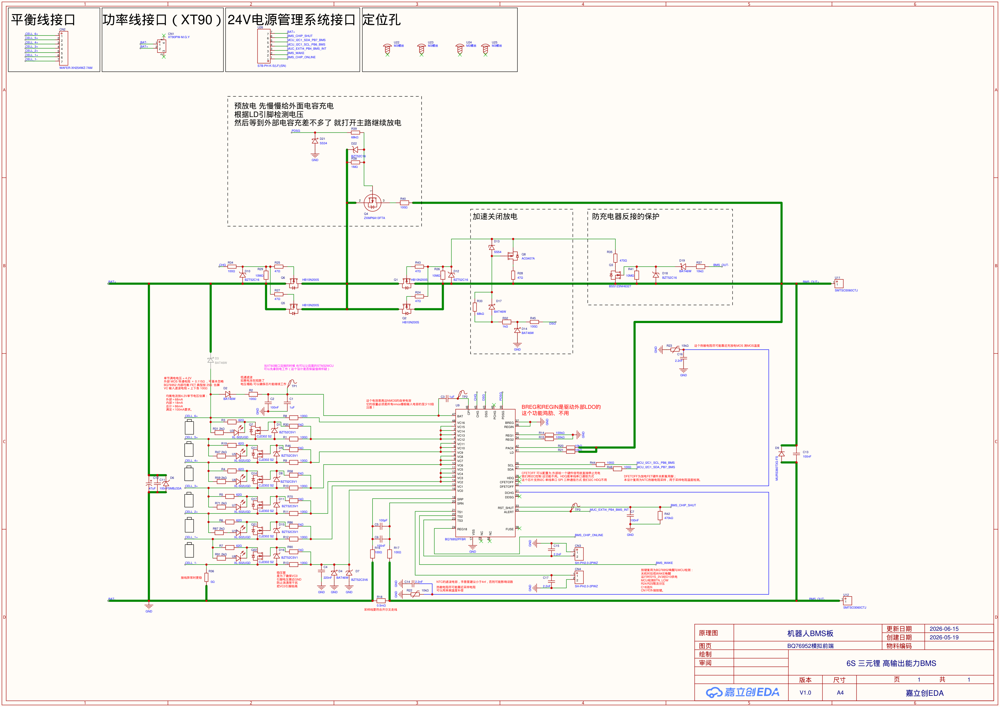{width=6.2}

<!-- PAGEBREAK -->

### C.2 24V电源管理控制板 Page 1：DC输入与SC8815四开关充电功率级

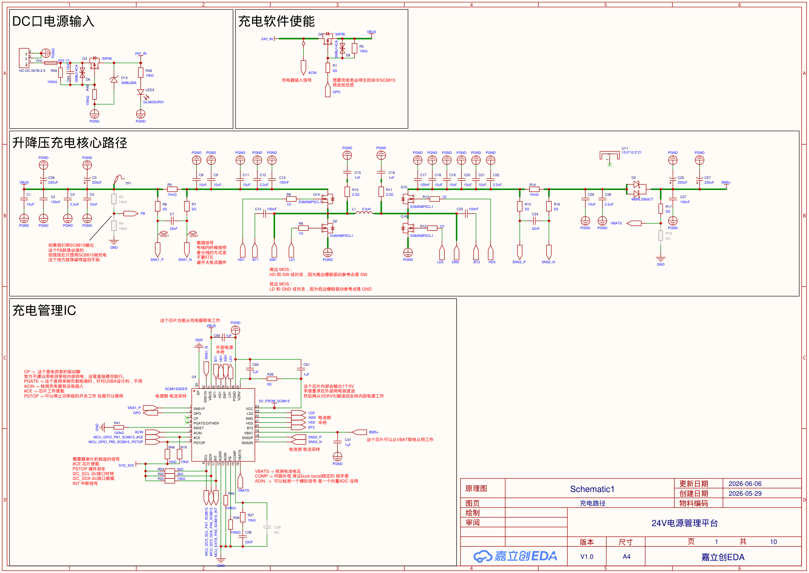{width=6.2}

<!-- PAGEBREAK -->

### C.3 24V电源管理控制板 Page 2：双LM74800-Q1、背靠背MOS与VOUT汇流

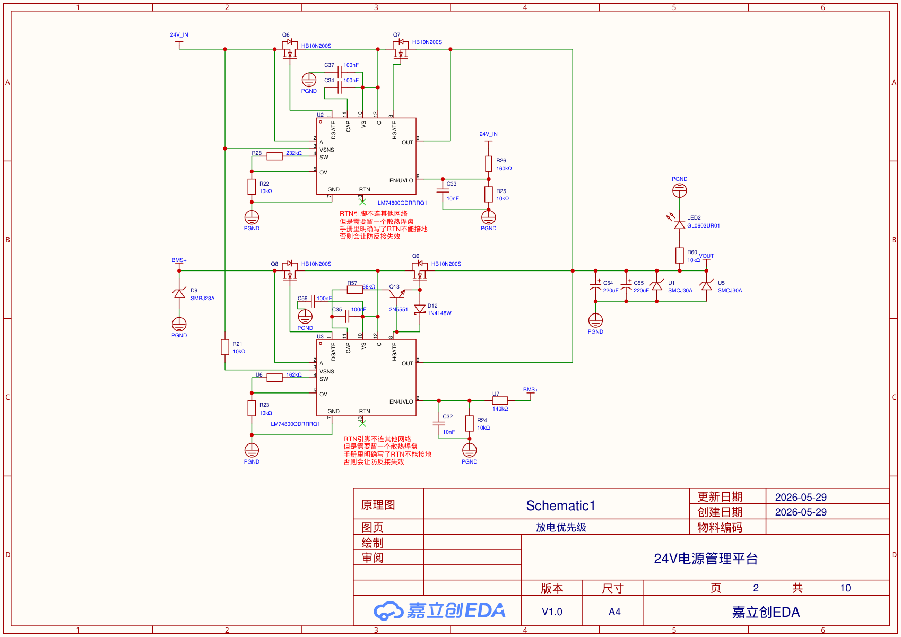{width=6.2}

<!-- PAGEBREAK -->

### C.4 24V电源管理控制板 Page 3：BMS跨板接口、唤醒按键与强制关断

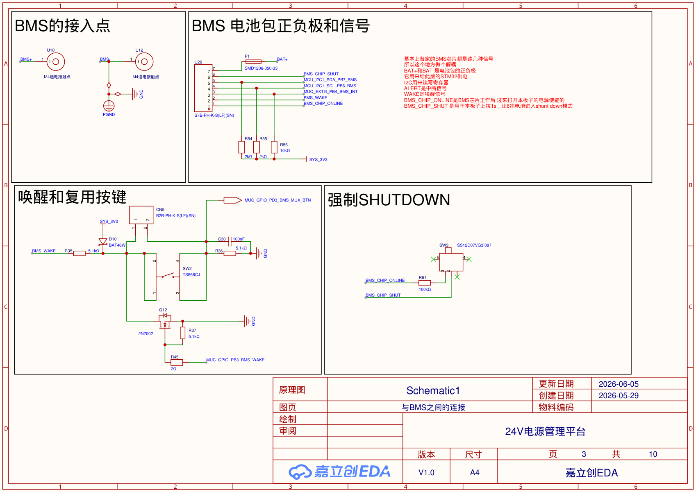{width=6.2}

<!-- PAGEBREAK -->

### C.5 24V电源管理控制板 Page 4：SYS_VIN、5V Buck与3.3V LDO

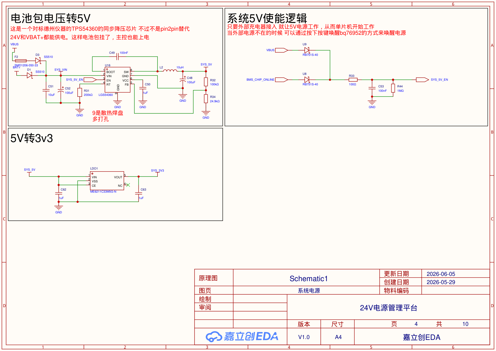{width=6.2}

<!-- PAGEBREAK -->

### C.6 24V电源管理控制板 Page 5：STM32G0B1最小系统、时钟、复位与调试

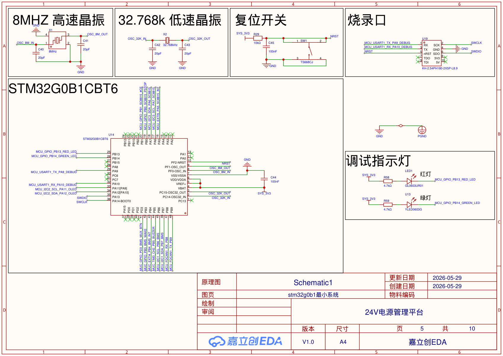{width=6.2}

<!-- PAGEBREAK -->

### C.7 24V电源管理控制板 Page 6：TJA1051T/3 CAN FD物理层与可选终端

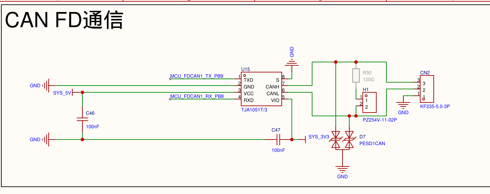{width=6.2}

<!-- PAGEBREAK -->

### C.8 24V电源管理控制板 Page 7：OLED、蜂鸣器与人机接口

为提高 Word 100% 缩放下的可读性，本图版将 Page 7 的 OLED 与蜂鸣器两个原始矢量裁块上下排列；只改变两个裁块的页面排布，裁块内部器件、网络、文字和连线像素均未重绘。原始页内相对位置仍以 H03 为准。

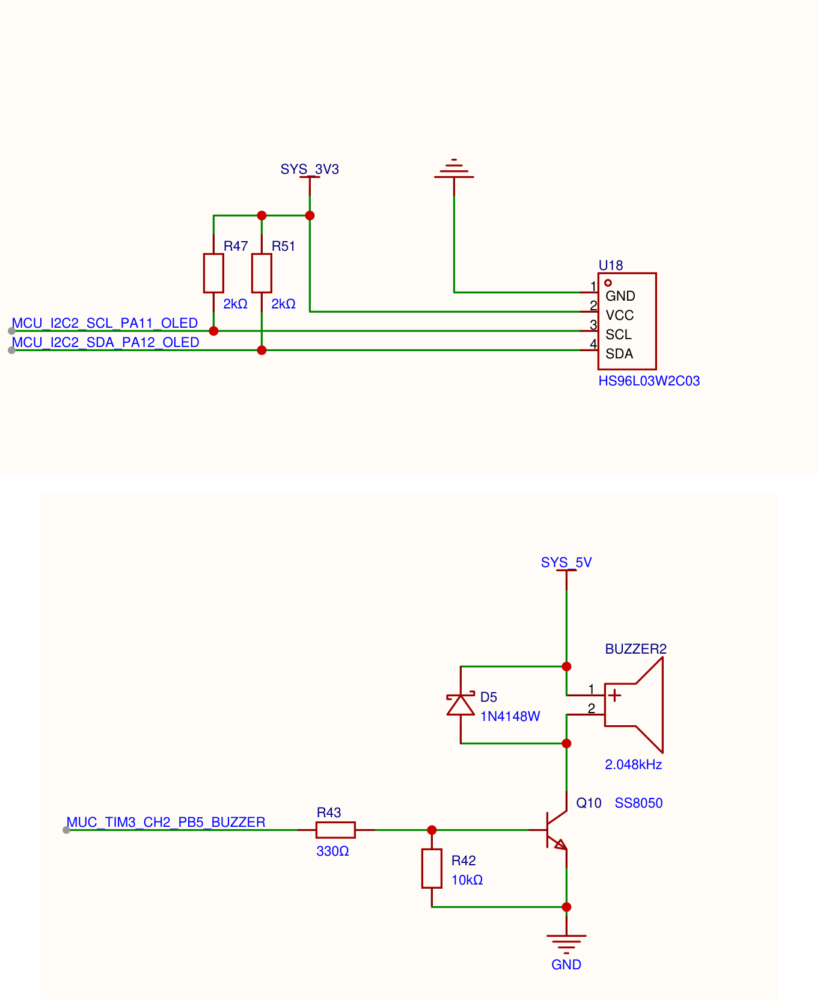{width=5.0}

<!-- PAGEBREAK -->

### C.9 24V电源管理控制板 Page 8：M3机械定位件

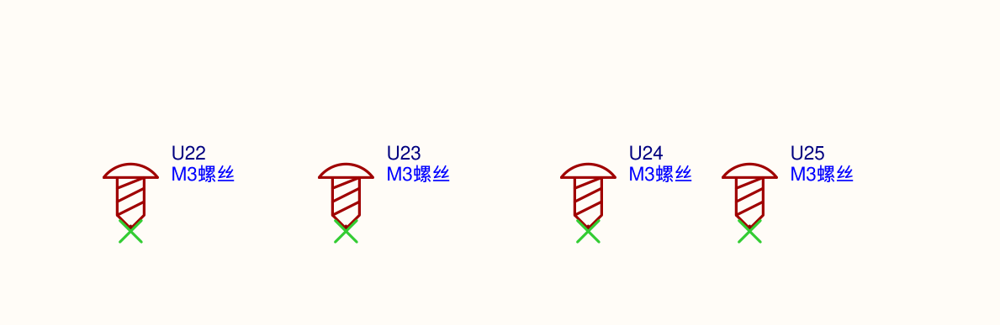{width=6.2}

<!-- PAGEBREAK -->

### C.10 24V电源管理控制板 Page 9：两个并联VOUT输出接口

{width=6.2}

<!-- PAGEBREAK -->

### C.11 24V电源管理控制板 Page 10：M24C64 EEPROM与I2C2连接

{width=6.2}
